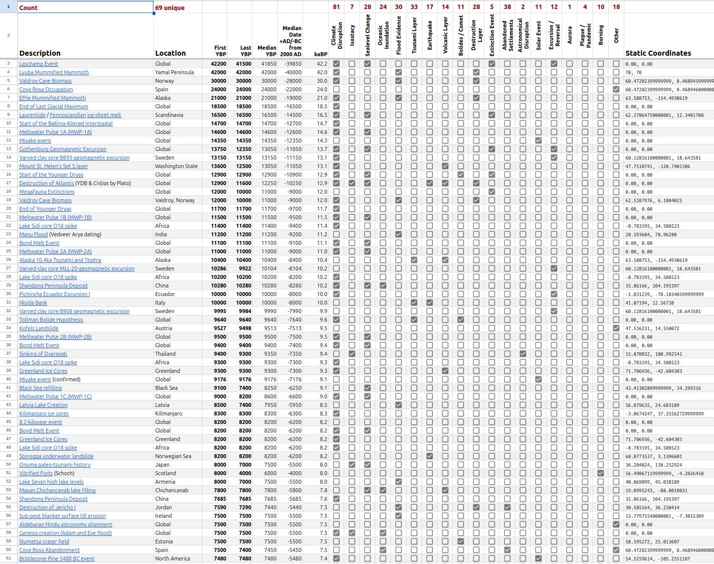
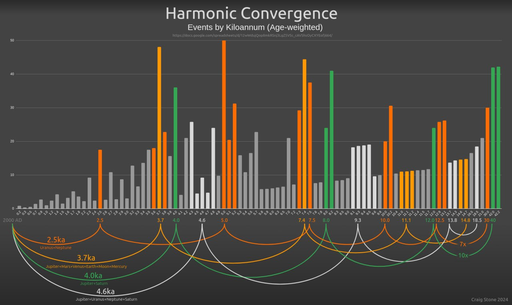

# Holocene Mega Timeline

A "mega timeline" of all the evidence in this folder. So far, the timeline implies 4-5 ECDO-like cataclysms during the Holocene, starting with the end of the Younger Dryas.

Almost certainly ECDO-like cataclysms:
- ~2000 BC, Gun-Yu, Exodus, Ogyges, Crete, Mohenjo-Daro
- ~3000 BC, Noah's flood, recorded cataclysms from all cradles of civilization

High-likelihood ECDO cataclysms:
- ~5500 BC, Biblical Creation, 6200 BC climate change event, black sea refilling
- 7400 BC, Tollman impact hypothesis, sinking of Dvaravati, Tower of Jericho buried
- ~9700 BC, end of Younger Dryas, Atlantis

Unlikely:
- 550 AD, Baillie comet debris hypothesis, tree ring anomalies (might genuinely be a comet debris event, see paper in `biology`)
- 400 BC, alexander the great flood, paleomagnetic anomalies
- 1200 BC, Late Minoan 2 collapse, Egypt, paleoclimate anomalies

Highly unlikely:
- 1200 AD

The scale is key here. We aren't looking for droughts, or floods, or famines. We are looking for a convergence of the land burning, decade and century long famines, water flowing over mountains, civilizations wiped out, all at once.

## Google spreadsheet event database

A Google spreadsheet of all these events has been compiled [here](https://docs.google.com/spreadsheets/d/12wWdujQop8mkRSnj3LgZ5VSc_cAVShsOyCXYEofj664/edit?usp=drive_link).

Snapshot peek of the spreadsheet (links to the spreadsheet):

## Harmonic Visualization [2]

## Human timelines vs physical marker dating

Obviously we are looking for a great convergence of both, but in terms of preference I would say I have to prefer human timelines. When well-kept, they are more trustworthy than reconstructions from physical markers.

## Evaluating physical markers

One of the things we should do is be consistent with physical markers - evidence for a physical marker should not be selectively applied to convenient dates, but rather fit into the entire timeline, and more specifically, ALL hypothesized events in the timeline.

For example if we hypothesize 4 events in the Holocene and an ice core shows 2 anomalies that match up with 2 of the events, this should actually be taken as evidence against the hypothesized timeline because the ice core only shows 2 events instead of 4. If 2 events are recorded in the ice cores why aren't the other 2?

Of course there could be inconsistencies, variations, or undermining of the data that wipes out evidence for certain events while leaving evidence for others. But this should be treated as an edge case.

## Fine-Tuning

Detailed human accounts can be very useful in fine-tuning the timeline by aligning with accounts from other places in the world:
- time of the year (ex: Exodus in spring)
- contemporary events, or events with a known temporal distance from each other
- specific anomalic paths of the Sun (ex: Joshua)

Historical continuity of significant continued human activity without a recorded account of a flood may be the easiest way to "disprove" an ECDO event. Still, the ensuing chaos may have made it difficult to document the event properly.

## Non-exact cataclysm accounts

- Ancient Egypt, Herodotus: 341 generations of men up till 1290 BC (10k-4.7k years) 4 Sun changes (2 flips?)
- Plato: "Many great deluges" since Athens and Atlantis, a significant "third great flood before Deucalion" that washed away most of Athens' fertile soil
	- indicates there should be at least 3 floods after the Atlantis one.

## Other

Nobulart's planetary harmonic and cataclysm chronology timeline in `timeline.xls`.

## Citations

1. https://en.wikipedia.org/wiki/4th_century_BC
2. Craig Stone

# TODO

I still think there's so much work that can be done here. So many "if => then" ECDO implications that can be researched and fleshed out. The repo is turning into a proper goldmine but it's only the seeds for a proper refinement. Each lead could probably take a month to research properly.
