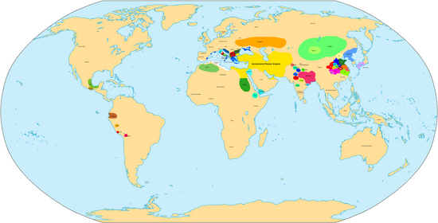

# 400 BC Event

This date is recent enough where it should be obvious if there was a global cataclysm. Based on the lack of obvious convergence from all over the world, despite the compelling deluge accounts and physical markers, I have to bucket this one as unlikely. The lack of accounts of Sun changing trajectory, solar burning, and clouds of ash from Alexander the Great's time make me confident in this verdict. Still, further investigation is justified.

Wikipedia has a nice "world map" on this century:

## Overview

Historical events:
- 340 BC: Alexander the Great Turkey deluge myth
- 373 BC: Helike Greek city-state submerged by Tsunami in winter
- 400 BC: La venta, Veracruz, Mexico, abandoned
- east Asia lacks history from this time

Physical markers:
- 200 BC potential tree ring anomalies
- 300 BC ice core anomaly
- 300 BC Mayan Chichancanab lake filling
- paleomagnetic anomalies (North America, Levantine Iron Age, 500 BC Russia peat deposit)
- 500 BC Antarctic tephra

Historical continuity during this period:
- Roman Republic
- Scythians

New additions:
- MANY earthquakes in the Middle East during this period

## China History

You have the latter stages of the Zhou dynasty, and the Warring States period from 481 - 221 BC. [1]

Look at these Zhou dynasty population estimates:
• 273 BC, 30,000,000
• 230 BC, 38,000,000

I don't see evidence of a major cataclysm during this period. There's a lot of drama going on during the Warring States period that shouldn't be possible during a cataclysm. The events during this time seem *very* well documented. [2]

## India History

In India you have the Maurya empire around this time. [3]

## Citations

1. https://en.wikipedia.org/wiki/Zhou_dynasty
2. https://en.wikipedia.org/wiki/Warring_States_period
3. https://en.wikipedia.org/wiki/Maurya_Empire#History