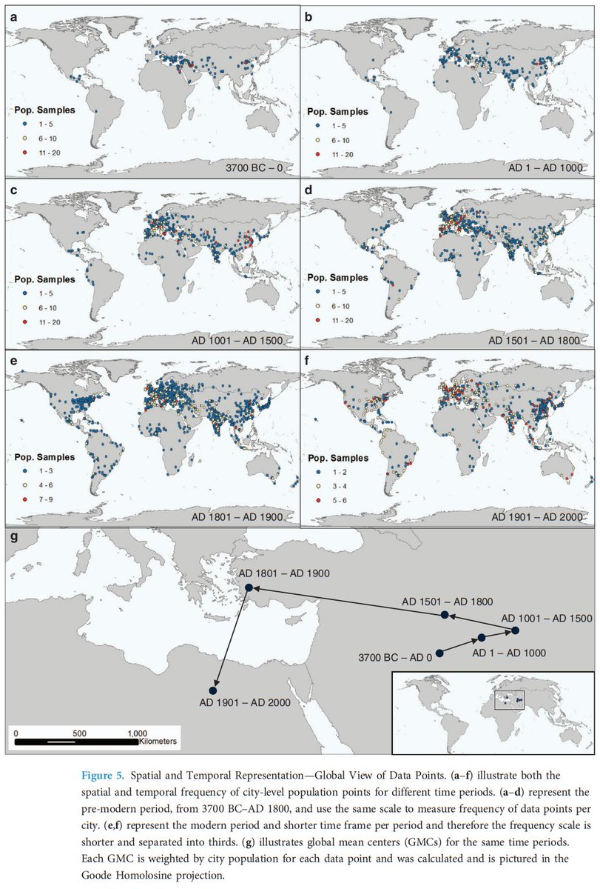

# 1400-1200 BC Event

This period is far enough away from 2000 BC to warrant its own investigation as a potential cataclysm. There is evidence from many domains pointing to a possible cataclysm in this time.

- 1400 BC: Minoan Crete's third and final cataclysm
- traditional dating of Exodus/Deucalion to approximately this period
- 1400-1200 BC Egyptian dark age (see Barbara Bell)
- 1159 BC Narrow Irish tree rings
- 1416 BC Antarctic tephra
- 1200 BC Mediterranean cooling climate change event

New additions:
- 1350 BC Palaikastro tsunami deposits
- 1300-1200 BC Gramalote food rationing and abandonment (Source: The Early Initial Period Fishing Settlement of Gramalote, Moche Valley: A Preliminary Report (`EVIDENCE/civilization-remnants/ancient-cities`))
- 1200 BC destruction of Ugarit (Middle East)

While the physical markers are compelling, I have to initially bucket this event as unlikely due to lack of easily-found cataclysm records from China and India during this period. Obviously worth a deeper investigation.

## China - Shang Dynasty (1600 - 1046 BC) [1]

The Shang dynasty existed in China during this period. A cursory search doesn't seem to show any major cataclysm recorded during this dynasty.

## India - Early Vedic Period (1500 - 1000 BC) [2]

Cursory search not turning up major recorded cataclysms during this period.

## The Greek Dark Ages (c....

The Greek Dark Ages (c. 1200–800 BC) "At the beginning of the Postpalatial Bronze Age, the so-called Late Bronze Age collapse of civilisation in the Eastern Mediterranean world in c. 1200–1150 BC took place, as the great palaces and cities of the Mycenaeans were destroyed or… https://t.co/qYYEvjgoZF https://t.co/iaPp5UyE2N

## Citations

1. https://en.wikipedia.org/wiki/Shang_dynasty
2. https://en.wikipedia.org/wiki/Vedic_period