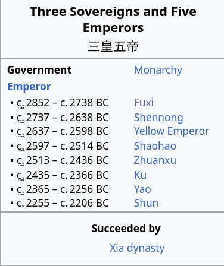

# 3200 - 2800 BC event

This 400-year period is filled with extensive evidence that points to a global cataclysm. Most notably, multiple accounts of ECDO-like cataclysms (megafloods, Sun changing direction, land sinking) from all cradles of civilization, dated to approximately the same time, gives us a high certainty there was an ECDO-like event during this period.

Cataclysm accounts:
- China Nu Wa: 2810 BC
- Eridu Genesis (Middle East): 3000 BCE
- India, Sinking of Dwaraka: 3031 BC
- Peruvian Timeline: 2900 BC **Year 0** (Montesino assumed to be "The Deluge")
- Biblical Noahic deluge: 3500 - 2500 BC

Physical markers:
- 3000 BC: Black Sea refilling that outpaces sea level rise
- 3200 BC: Compton's comet mega-compilation of physical markers
    - Babylonian, Mesoamerican, Egyptian floods, flash freeze events
- 3200 BC: climate change event (Staubwasser, Weiss)
- narrow Irish tree rings
- Antarctic tephra
- Skara Brae 3000 BC "sand deposits"
- Kilimanjaro 3200 BC ice core anomaly
- Camp Century 2800 BC ice core anomaly

## Chinese Nu Wa Myth Dating

"It is of some interest to note that Chinese myths indicate that the Flood event occurred at the end of the life of Nu Wa, consort of first Chinese emperor Fsu Hsi (2953 - 2838 BC according to standard chronologies), and who herself allegedly lived until about the year 2810 BC." - Bruce Masse

"The legendary emperor Fuxi was believed to be the First Sovereign of the creation myth of Chinese civilization. Fuxi was the twin brother of Nuwa and, after escaping a great flood, the siblings lived together on Mount Kunlun. Fuxi and Nuwa are believed to be the progenitors of the human race." [1]

Regarding the dates of his rule, it's still not clear what exactly these dates are based off of.

"Fu Xi is part of the "Three Sovereigns and Five Emperors" (三皇五帝) mythology, a group of semi-divine, legendary figures said to have ruled before China's first historical dynasty, the Xia." [2]

### Three Sovereigns and Five Emperors

"There are six to seven known variations on which people constitute the Three Sovereigns and the Five Emperors, depending on the source. Many of the known sources were written in much later dynasties.

Groupings of the Three Sovereigns consist of some combination of the following: Fuxi, Nüwa, Shennong, Suiren, Zhu Rong, Gonggong, the Heavenly Sovereign, the Earthly Sovereign, the Human Sovereign (in two varieties), and the Yellow Emperor.

Groupings of the Five Emperors consist of some combination of the following: the Yellow Emperor, Zhuanxu, Emperor Ku, Emperor Yao, Emperor Shun, Shaohao, Taihao, and the Yan Emperor." [3]

## Eridu Genesis (Sumerian Creation Myth)

The Eridu Genesis is an old creation myth, with physical tablets containing the myth dating back to 1600 BC, indicating that the event was likely much older. A "great flood" is incorporated into the Sumerian historical timeline, and the dating also lines up with radiocarbon dating of flood sediments in the area.

"The people called Sumerians, whose language became the prevailing language of the territory, probably came from around Anatolia, arriving in Sumer about 3300 BCE... An extant document, The Sumerian King List, records that eight kings reigned before the great Flood. After the Flood, various city-states and their dynasties of kings temporarily gained power over the others. The first king to unite the separate city-states was Etana, ruler of Kish (c. 2800 BCE)."

"Some modern scholars believe the Sumerian deluge story corresponds to localized river flooding at Shuruppak (modern Tell Fara, Iraq) and various other cities as far north as Kish, as revealed by a layer of riverine sediments, radiocarbon dated to c. 2900 BCE, which interrupt the continuity of settlement. Polychrome pottery from the Jemdet Nasr period (c. 3000–2900 BCE) was discovered immediately below this Shuruppak flood stratum. None of the predynastic antediluvian rulers have been verified as historical by archaeological excavations, epigraphical inscriptions or otherwise, but the Sumerians purported them to have lived in the mythical era before the great deluge."

See Middle Eastern cataclysm chronology folder.

## Compton 3200 BC Comet Impact Hypothesis

Compton's 3200 BC comet impact hypothesis is pretty much a killshot for ECDO dating as far as we currently understand the ECDO. He proposes a massive world-wide event including flooding and possibly massive rainfall taking place during this time. I still need to verify his sources. There's too much to paste in here but I'll list the key evidence he provides, the most compelling of which is the ancient calendar timelines and the flash freeze events:

- 2-3 ancient calendars that mark a flood event as the start of their new calendric era
	- Babylonian flood at 3189 BC indicated by Atrahasis Epic
	- Ancient Indian texts (Sataptha Brahmana, Mahabharata, several Puhanas) indicate a last world flood at 3102 BC bringing the start of the current Kali Yuga age
	- Mayan/Aztec (Mesoamerica-based) calendars count time from 3114 BC, decmarcating a flood that ended the fourth of four ages
	- Egyptian record of a flood with a period of darkness afterwards (no footnote)
- ice cap, stalagmite Oxygen 18 anomalies
- sea floor sediment core temperature-sensitive phytoplankton chemicals
- sediment layer pollen
- monumental surge in precipitation for this time period:
	- sudden dramatic surge in methane at 3200 BC evidenced by ice cap air bubbles
	- pollen
	- ancient lake water level high-precision records indicate increase
	- “In many of these paleoclimate records, this event is the most extreme increase in precipitation and drop in temperature in the more than 10,000 years since the end of the last ice age” and “was also nearly instantaneous.”
- **flash freeze events**:
	- well-preserved, frozen soft-bodied wetland plants still rooted in ancient earth at the Quelccaya Andes ice cap dated to 3188 +- 45 years BC
	- “Unweathered tree still standing with its roots firmly planted in the earth” discovered in Washington State at the base of the receding Cascade Glacier and dated to this same time”
	- 1991 discovery of Ötzi, a human body revealed by a melting glacier in the Italian Alps, which dated to 3225 ± 125 yrs BC.  “The exceptional state of preservation of the Ice-man and of his artifacts requires that he was rapidly entombed at the time of this death and remained so until he was discovered”.  “Thus, the Iceman reveals that at about 5,300-5,050 cal yr BP, a rapid climatic change took place producing a persistent snow cover on previously deglaciated areas . . . . This deterioration in climate marks the beginning of Neoglaciation in the Alps, which induced a glacier expansion.”
- Entire town found buried by a mudslide in the Czech Republic at this exact time.  Excavation revealed a ground gradient so gradual that it would have taken extreme precipitation to mobilize the earth
- volcanic-like effects also induced by large meteors:
	- 3190 BC tree ring dust veil event
	- largest spike in acid and sulfate levels in Greenland ice sheet around 3150 BC, not correlated with volcanic eruptions
	- Alpine stalagmite sulfur spike 3150 BC
- Chevrons from deep ocean sediments on coastlines surrounding Burkle Crater
	- miles long and more than 100m tall, some covering an area as large as Manhattan. It would take a tsunami 600 ft tall to produce them.
	- Dee Breger analzed samples of chevron sediment in October, 2006, using “a scanning electron microscope (SEM) and found deep-ocean microfossils (benthic foraminifera) that had been splashed with molten iron, nickel and chrome in proportions consistent with a chondritic meteor”

## Citations

1. https://study.com/academy/lesson/fuxi-origin-creation-myth-significance.html
2. GPT
3. https://en.wikipedia.org/wiki/Three_Sovereigns_and_Five_Emperors

# TODO

First on my bucketlist is verifying the date of the Nu Wa myth, which specifically references a China rotation in the direction of the ECDO. The dating comes from Bruce Masse's work

I also want to look into Montesino's Peruvian timeline more

volcanic eruptions around this period

we are looking for a great convergence!
