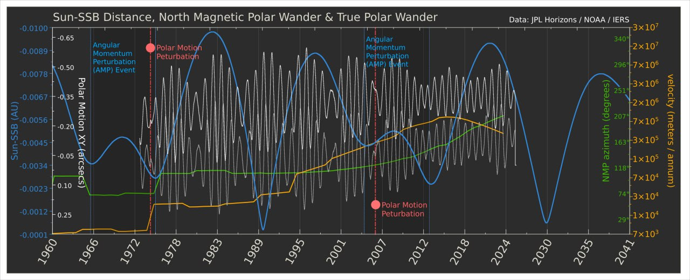

# Data on present climate anomalies

Going to compile all kinds of data in here.

```
Rainfall
Polar nutation
North pole wander
True polar wander
SSB path
Landscheidt minimum/maximum (impulses of torque)
Kp-index
Atmospheric CO2 concentration
Global temperature rise
Mean Sea Level (and variance) increase
Sea surface temperature increase
Rotational speed increase is reversing
Polar sea ice decrease
Mid-ocean seismicity rise
Volcanism rise
```

Further investigation:
- Arctic sea ice
- Auroras
- Heliobiology:
	- Social unrest
	- Health factors

Promising data source: https://www.poleshiftnews.com/

# Poles, Cosmic, Geomagnetic

## Polar nutation (1846 - now)

Polar nutation seems to be narrowing leading up till today.


## North pole wander (1600 - now)

North Pole wander really kicked into high gear around 1975, when it began to SPRINT in a path it hasn't really left https://www.iers.org/IERS/EN/DataProducts/EarthOrientationData/eop.htmlyet.




https://github.com/user-attachments/assets/7e944cb3-9ccd-45a8-a217-8136d9bc2465

Here it is overlaid with true polar wander:


## True polar wander (average rotational axis movement)


## SSB path (1945 - 1994)

A visual of the SSB's path around the Sun in the late 1900s.


## Landscheidt minimum/maximum (900 - now)

A rough graph showing the Landscheidt minimum/maximum's, derived from impulses of the torque.


### AMP (angular momentum perturbations) (1620 - now)

Work by Carl Smith, showing AMPs of the Sun.


## Kp-index trending down, indicating less geomagnetic disturbances (1930 - now)

Kp-index, used to measure disturbances in the geomagnetic field, and also used for aurora sightings, over the last century.


Data trend verified by the same institute the data is from:


Might just be a long-term trend of weakening solar activity occurring at the same time geomagnetic field is weakening. Quoting from something I'm writing: Based on these relationships, Landscheidt predicted a “phase inversion” in the relation between the torque of the Sun around the SSB and solar activity to occur in 1976. After another maximum in 1984, this was to be followed by, “a long period of cool climate with its coldest phase around 2030” corresponding to a longer-wavelength Gleissberg solar minima, a shift in direction in the torque of the Sun around the SSB. This would be followed up by a Gleissberg maxima around 2069.

This could also be consistent with the greator aurora displays we're seeing - lessening solar activity accompanied by a weakened geomagnetic field could produce greater aurora displays despite the weaker solar activity.

## Solar cycle

Consistent with the Kp data.


Source: https://swpc.noaa.gov/products/solar-cycle-progression

## Rotational speedup trend is reversing; slowing down


# Weather

## Rainfall (1950 - now)

A study I did across more than 100k original stations, reduced to 4375 stations spread worldwide, suggests that aggregate global rainfall is increasing slightly (few percent) over the last several decades.


## Global Temperature Rise, along with CO2 PPM increase


Independently verified through my own studies, which show about 0.7 degrees Celsius increase in daily peak temperature,  and 1.34 degrees Celsius increase for daily low temperature, over 70 years.


## Mean Sea Level Increase, MSL variance increase

I believe this data comes from a single local cluster of stations. In other words, it might not be a good global representation.


## Sea Surface Temperature Rise


## Antarctic Sea Ice Decrease


## Mid-ocean seismicity rise


## Volcanism rise


## More volcanism


