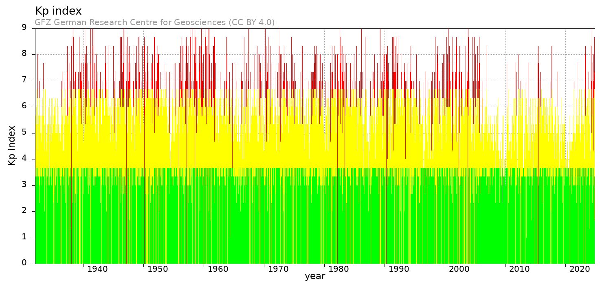
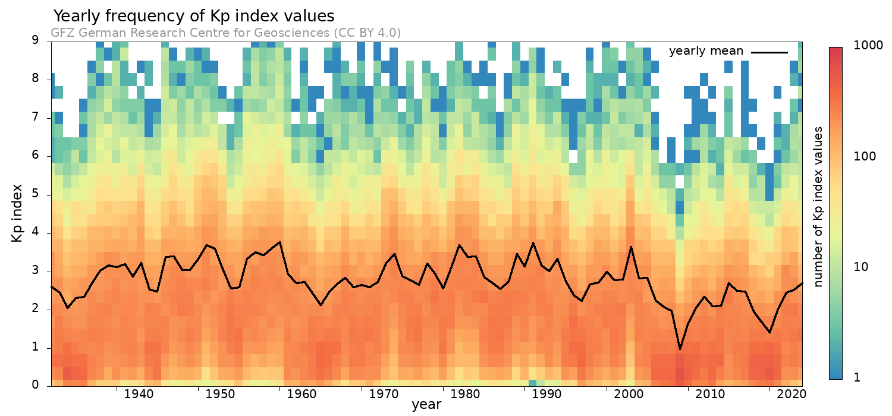

# Kp-index

"The K-index quantifies disturbances in the horizontal component of Earth's magnetic field with an integer in the range 0–9 with 1 being calm and 5 or more indicating a geomagnetic storm. It is derived from the maximum fluctuations of horizontal components observed on a magnetometer during a three-hour interval."

"The Kp index (where "p" stands for "planetary") is a global index of geomagnetic activity. It is calculated by averaging the K indices from a network of geomagnetic observatories around the world, providing a more comprehensive, planet-wide measure of geomagnetic disturbance."

## Ap vs Kp

"The Ap index does not have additional inputs beyond Kp values, but it applies a linear scaling transformation to Kp values to better represent the actual geomagnetic activity intensity. "

### More detail

The K-index is quasi-logarithmic local index of the 3-hourly range in magnetic activity relative to an assumed quiet-day curve for a single geomagnetic observatory site. First introduced by J. Bartels in 1938, it consists of a single-digit 0 thru 9 for each 3-hour interval of the universal time day (UT).

The planetary 3-hour-range index Kp is the mean standardized K-index from 13 geomagnetic observatories between 44 degrees and 60 degrees northern or southern geomagnetic latitude. The scale is O to 9 expressed in thirds of a unit, e.g. 5- is 4 2/3, 5 is 5 and 5+ is 5 1/3. This planetary index is designed to measure solar particle radiation by its magnetic effects. The 3-hourly ap (equivalent range) index is derived from the Kp index as follows:

Kp = 0o   0+   1-   1o   1+   2-   2o   2+   3-   3o   3+   4-   4o   4+

ap =  0    2    3    4    5    6    7    9   12   15   18   22   27   32

Kp = 5-   5o   5+   6-   6o   6+   7-   7o   7+   8-   8o   8+   9-   9o

ap = 39   48   56   67   80   94  111  132  154  179  207  236  300  400

https://www.ncei.noaa.gov/products/geomagnetic-indices

# Sources

### Germany

Potsdam (Germany): https://kp.gfz-potsdam.de/en/data

"The GFZ German Research Centre for Geosciences, also known as GFZ Helmholtz Centre Potsdam or just GFZ, is the national research center for Earth Sciences in Germany, located on the Telegrafenberg in Potsdam, in the German federal state of Brandenburg, and is part of the Helmholtz Association of National Research Centres. "

https://en.wikipedia.org/wiki/GFZ_German_Research_Centre_for_Geosciences

### NOAA

NOAA: https://www.swpc.noaa.gov/products/planetary-k-index

## Data Format

See `wdc_fmt.txt`.

| Column | Format | Description |
| ------ | ------ | ----------- |
| 1-2    | i2     | yy, last two digits of year |
| 3-4    | i2     | mm, month (1-12) |
| 5-6    | i2     | dd, day of month (1-31) |
| 7-10   | i4     | Bartels solar rotation number - a sequence of 27-day intervals counted continuously from February 8, 1832 |
| 11-12  | i2     | Number of day within the Bartels 27-day cycle |
| 13-28  | 8i2    | 3-hourly Kp indices (0-3, 3-6, 6-9, 9-12, 12-15, 15-18, 18-21, 21-24 UT) |
| 29-31  | i3     | Daily Kp sum rounded to thirds; Ap is recommended for scientific purposes instead of the daily Kp sum (supplied only for tradition, use Ap for scientific purposes!) |
| 32-55  | 8i3    | 3-hourly ap indices (0-3, 3-6, 6-9, 9-12, 12-15, 15-18, 18-21, 21-24 UT) |
| 56-58  | i3     | Ap equivalent daily amplitude, the arithmetic mean of the day's eight ap values rounded to integer |
| 59-61  | f3.1   | Cp or Planetary Daily Character Figure - a qualitative estimate of overall magnetic activity level for the day, determined from the sum of the eight ap amplitudes. Cp ranges from 0 (quiet) to 2.5 (highly disturbed) in steps of one-tenth |
| 62     | i1     | C9 - a conversion of the 0 to 2.5 range of the Cp index to one digit between 0 and 9 |

# Method

I'll use Ap for now (Kp is 1-9 log scale, Ap is linear 0-400, more granularity). Obviously it shouldn't really matter. But Ap values are already sitting there on daily granularity nicely for me.

`sampler-viz.py`, tested to correctly parse the values, average, and perform a linear regression on them, on local manufactured test cases.

## Sampler

```
python3 sampler-viz.py 
Year 2014: Average Value = 7.72
Year 2016: Average Value = 10.48
Year 1950: Average Value = 18.04
Year 1987: Average Value = 10.94
Year 1949: Average Value = 15.42
Year 1945: Average Value = 10.37
Year 1982: Average Value = 22.41
Year 1983: Average Value = 18.52
Year 1936: Average Value = 9.08
Year 1997: Average Value = 8.41
Year 1941: Average Value = 16.85
Year 1968: Average Value = 13.49
Year 1933: Average Value = 10.07
Year 1937: Average Value = 12.44
Year 2011: Average Value = 7.48
Year 2015: Average Value = 12.24
Year 2012: Average Value = 9.06
Year 1951: Average Value = 22.27
Year 1961: Average Value = 14.39
Year 2002: Average Value = 13.11
Year 1944: Average Value = 10.83
Year 1932: Average Value = 11.46
Year 1989: Average Value = 19.46
Year 1994: Average Value = 18.11
Year 2019: Average Value = 6.06
Year 1938: Average Value = 15.24
Year 2010: Average Value = 5.96
Year 2009: Average Value = 3.93
Year 2007: Average Value = 7.48
Year 1967: Average Value = 11.98
Year 1985: Average Value = 13.72
Year 2004: Average Value = 13.38
Year 1966: Average Value = 10.26
Year 2023: Average Value = 10.82
Year 1934: Average Value = 7.25
Year 1962: Average Value = 12.25
Year 2003: Average Value = 21.75
Year 1943: Average Value = 16.98
Year 1973: Average Value = 17.03
Year 1977: Average Value = 11.88
Year 1979: Average Value = 14.47
Year 2008: Average Value = 6.92
Year 1954: Average Value = 10.98
Year 2018: Average Value = 6.86
Year 1964: Average Value = 9.93
Year 1946: Average Value = 18.61
Year 1988: Average Value = 12.71
Year 1971: Average Value = 11.26
Year 1972: Average Value = 12.61
Year 2024: Average Value = 11.54
Year 1975: Average Value = 13.91
Year 2020: Average Value = 5.24
Year 1948: Average Value = 15.40
Year 1942: Average Value = 13.82
Year 1953: Average Value = 15.63
Year 1981: Average Value = 16.29
Year 1959: Average Value = 21.34
Year 1976: Average Value = 12.93
Year 1956: Average Value = 18.05
Year 1963: Average Value = 12.58
Year 2005: Average Value = 13.49
Year 1940: Average Value = 16.08
Year 1995: Average Value = 12.65
Year 1992: Average Value = 16.48
Year 1986: Average Value = 12.47
Year 2006: Average Value = 8.46
Year 1955: Average Value = 11.24
Year 1993: Average Value = 15.04
Year 1952: Average Value = 21.20
Year 1958: Average Value = 19.23
Year 1996: Average Value = 9.31
Year 1969: Average Value = 11.37
Year 2013: Average Value = 7.58
Year 1978: Average Value = 16.92
Year 2022: Average Value = 10.09
Year 1984: Average Value = 18.82
Year 1939: Average Value = 16.56
Year 1965: Average Value = 7.74
Year 1990: Average Value = 16.25
Year 1935: Average Value = 8.88
Year 1991: Average Value = 23.43
Year 2021: Average Value = 7.16
Year 1957: Average Value = 20.10
Year 1980: Average Value = 11.10
Year 1947: Average Value = 18.83
Year 1970: Average Value = 11.98
Year 1974: Average Value = 19.61
Year 1998: Average Value = 12.01
Year 1960: Average Value = 23.65
Year 1999: Average Value = 12.53
Year 2001: Average Value = 12.92
Year 2017: Average Value = 10.33
Year 2000: Average Value = 15.01
Linear Regression: slope = -0.0607, intercept = 133.40, r-value = -0.36, p-value = 3.3641e-04, std_err = 0.0163
```

# Quiet and Disturbed Days

Just seems like a less absolute and granular way of measuring the Kp/Ap, at least for the intents of this study.

## Format

The International Quiet and Disturbed Days are determined from the Kp values of the respective
month based on a combination of criteria like the sum of the Kp values for a day, the sum of their
squares, and the maximum Kp. The 10 quiet days are selected and ordered, with the quietest day 
being labelled Q1 and the least quiet day of these 10 days being labelled Q10.

Any of these days 
can be assigned the letter A if Ap exceeds 6 for this day or the letter K if Ap is smaller or equal 
6, but one Kp value exceeds 3, or two Kp values exceed 2+.

The 5 disturbed days are selected and 
ordered from D1 (the most disturbed day)

to D5. An asterisk (*) is assigned to a disturbed day if 
Ap is smaller 20.

The Kp index was introduced by Bartels (1949) and is produced by Geomagnetic
Observatory Niemegk, GFZ German Research Centre for Geosciences.

# The work's already been done for me!




https://kp.gfz-potsdam.de/en/figures
