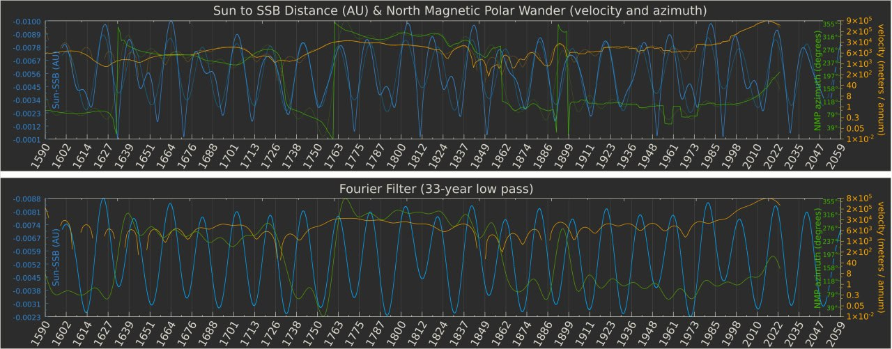
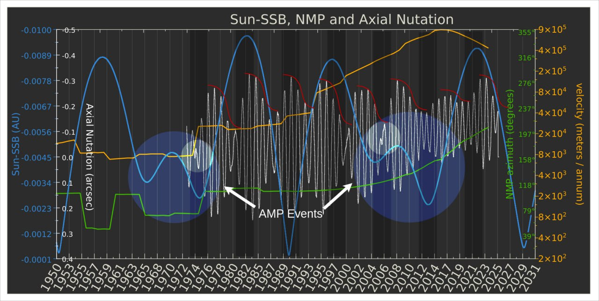

# Recent North Pole Wander

This is just for specific data studies. Generic NPW is in PRESENT-CLIMATE-ANOMALIES/geomagnetic.

## North Pole Wander [1]

A low pass Fourier filter reveals a strong harmonic fit across all three data sets over a 33 year period.

I've overlaid a record of the Earth's axial wobble (x-axis) onto the existing data,  just for the short period spanning the available 'wobble' recordings and a little before. Angular Momentum Perturbation (AMP) events (large circles) are the Neptune/Uranus bumps in the Sun's blue curve. i've circled what appear to be 'microwobbles' in the earth's rotation around the time of the Uranus/Neptune bumps.

Added the other polar rotation axis to this chart. The same anomaly is clearly seen in both the X and Y directions, and its remarkably similar in movement to the Sun's wobble.

For lack of available peer-review, I obtained the dimestore appraisal as a starting point: 

"The Sun-SSB curve seems to exhibit periodicity that correlates with not only the polar nutation data but also the NMP wander and the polar motion perturbations. While it's unclear if these correlations indicate direct causality, they suggest synchronous behavior in the system driven by underlying gravitational influences. The amplified magnetic polar wander seen since the 1990s also coincides with increasing Sun-SSB displacement. This could be interpreted as the Earth experiencing a shift in its internal magnetic field, driven or influenced by gravitational forces." - GPT

I've added the Earth's polar motion (1973-2024) to a sub-period of the previous chart. 

1. https://iers.org/IERS/EN/DataProducts/EarthOrientationData/
2. https://ssd.jpl.nasa.gov/horizons/
3. https://ngdc.noaa.gov/geomag/data/poles/NP.xy

## Citations

1. [Craig Stone](https://nobulart.com)
