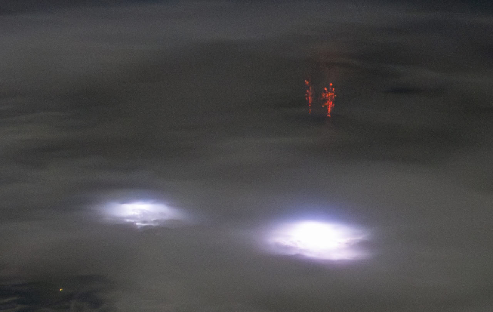
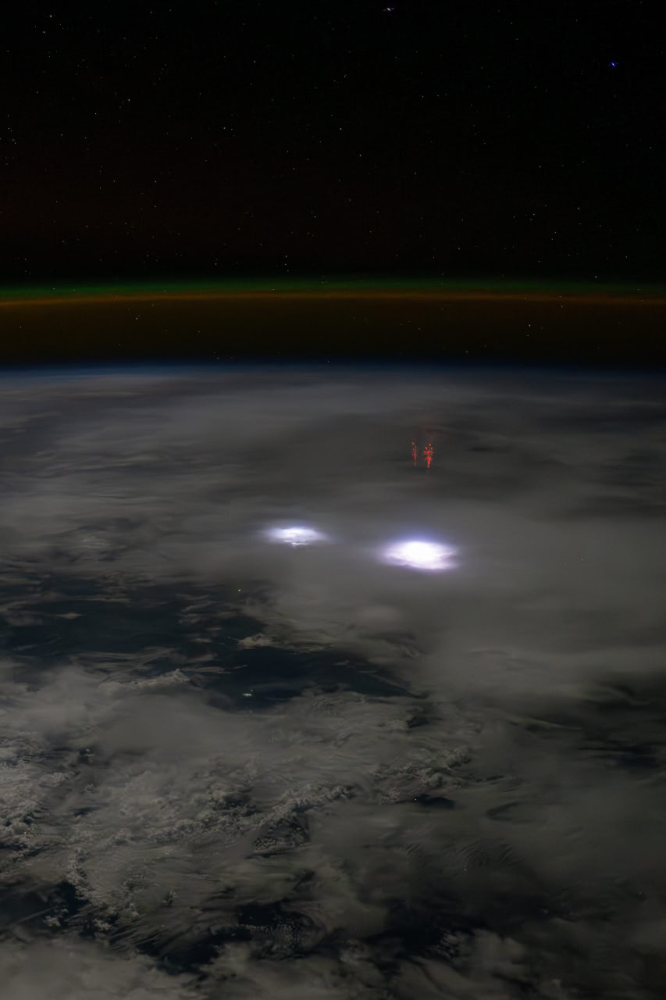

# Recent Geomagnetic Anomalies

All the strong evidence is in subfolders:
- `north-pole-wander`: The wandering of the geomagnetic north pole.
- `south-atlantic-anomaly`: An area of weak geomagnetic field strength over the South Atlantic Ocean.
- `dipole-strength`: The weakening of Earth's geomagnetic dipole.
- `schumann-resonances`: Global atmospheric electromagnetic resonances.

## Magnetic field getting weaker

See https://iswa.gsfc.nasa.gov/.

Relevant papers
- https://x.com/NoVaxForMePal/status/1659529838221295622
- https://x.com/NoVaxForMePal/status/1682913085265248256
- https://x.com/NoVaxForMePal/status/1618641550237634561
- https://x.com/NoVaxForMePal/status/1621465149872766976
- https://x.com/NoVaxForMePal/status/1620468069624868864
- https://x.com/NoVaxForMePal/status/1620468069624868864

## NOAA December 2023 State of the Geomagnetic Field (hard copy here)

The WMM (World Magnetic Model) gets updated once every 5 years, with the last time being in 2020. More up-to-date data is not easily found.

However, NOAA has [published a report in December 2023](https://www.ncei.noaa.gov/sites/g/files/anmtlf171/files/2023-12/WMM_Annual_Report_2023.pdf) called "State of the Geomagnetic Field" with some analysis on the current state of the geomagnetic field. Following is a quote from the paper:

*"This suggests that nonlinear changes in the Earth’s magnetic field have remained small over the past three years. Since 2020, the north magnetic dip pole has moved at an average speed of 41 km/yr, and the south magnetic dip pole at 9 km/yr. Neither underwent any noticeable change in direction."*

## State of the geomagnetic field [1]

NOAA have not updated the publicly available magnetic pole data [1] since 2020. The December 2023 State of the Geomagnetic Field report [2] does, however, contain some clues as to how things are progressing: "Since 2020, the north magnetic dip pole has moved at an average speed of 41 km/yr [~36.8° per century], and the south magnetic dip pole at 9 km/yr  [~8.1° per century]. Neither underwent any noticeable change in direction. /// The South Atlantic Anomaly, where the geomagnetic field intensity is lowest, has continued to deepen (by about 25 nT at surface level) and move westward (its center moved by about 20 km at surface level) in the past year. /// In the SAA the intensity of the field is about one-third of that near the magnetic poles." By this account, the current geomagnetic excursion continues unabated.
[1] https://ngdc.noaa.gov/geomag/data/poles/pole_locations.txt
[2] https://ngdc.noaa.gov/geomag/data/WMM/WMMReports/WMM_Annual_Report_2023.pdf

## St. Elmo's Fire, Blue Jets and Red Sprites are indicative of ground-ionosphere field reversals. Visible evidence of the ongoing geomagnetic excursion. 

See elmo3.mp4 and elmo4.mp4 in img.

1. Red Sprite, Central Africa. https://x.com/dominickmatthew/status/1847994957878927418
2. St. Elmo's fire, Jabal Al Nour, Saudi Arabia https://x.com/gunsnrosesgirl3/status/1740306315841589668
3. Blue Jets, South Pacific https://x.com/nobulart/status/1802694357952168221
4. https://chatgpt.com/share/671775d5-dc9c-8005-800d-1d8a043ae0c7

## Earth's Magnetic Anomalies

Earth’s Magnetic Anomalies
“It is accepted that the geomagnetic field resembles that of a dipole (or bar magnet) located at the earth’s center. This theoretical representation accounts for about 90% of the geomagnetic field and provides geophysicists with the familiar diagram showing magnetic lines of force exiting one polar region and entering the other. This neat portrait of the geomagnetic field is marred in practice by several important anomalies that cast doubt upon the almost universally accepted view that the geomagnetic field is a product of dynamo action.”
https://nobulart.com/earths-magnetic-anomalies/

## Citations

1. Craig Stone