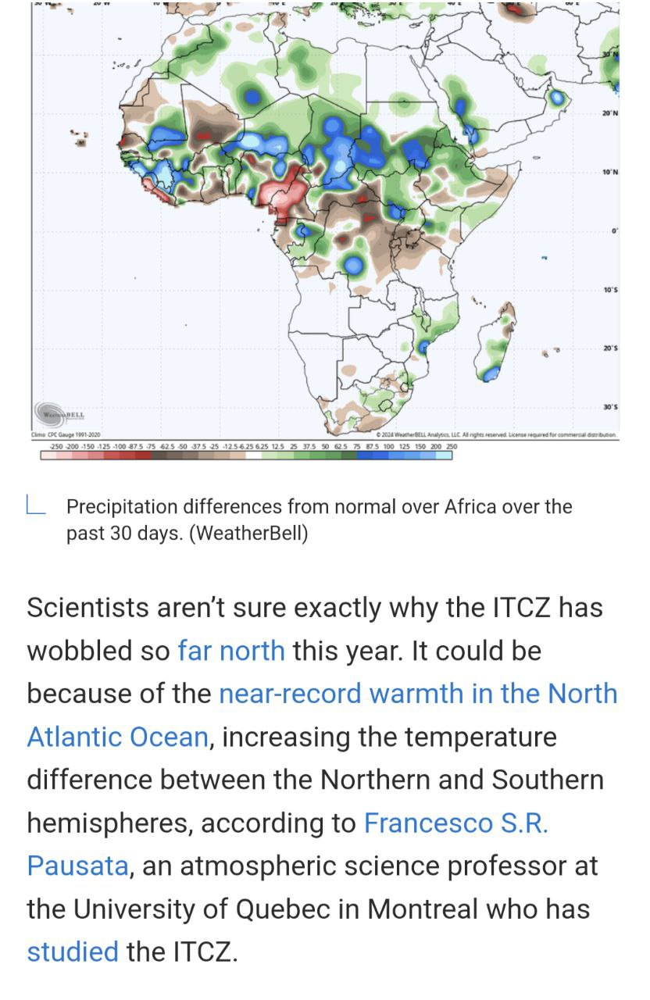
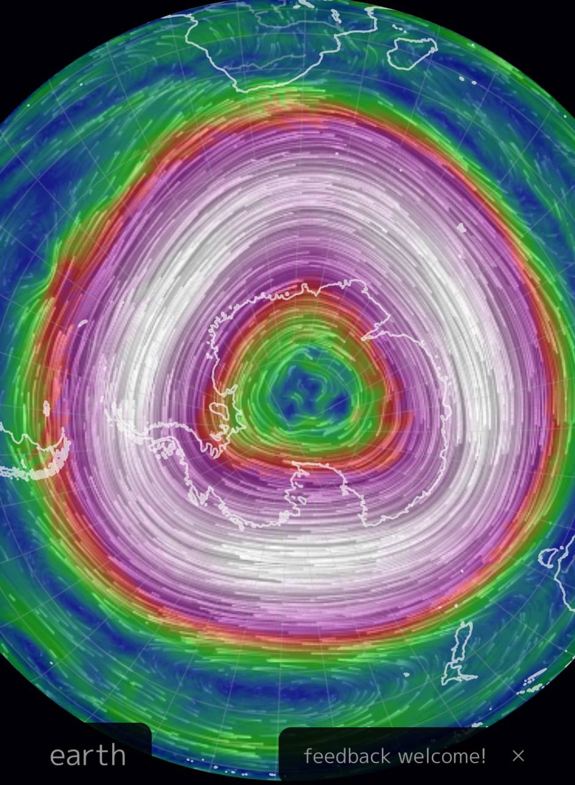
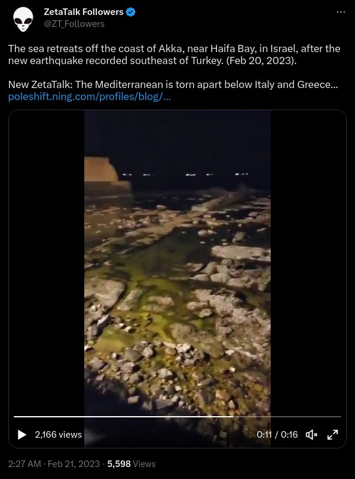
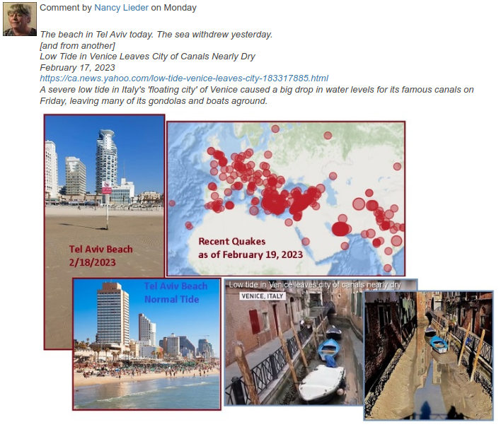
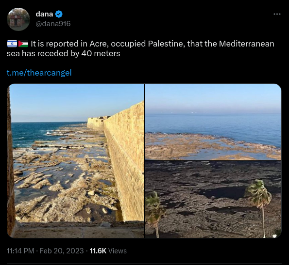

# Recent Climate Anomalies

TLDR - rainfall, storms, earthquakes, auroras, volcanoes.

## Ethical Skeptic

The [first part](https://theethicalskeptic.com/2020/02/16/the-climate-change-alternative-we-ignore-to-our-peril/) of Ethical Skeptic's three-part ECDO thesis is one of the best sources that the climate has been changing recently. I will take some quotes that summarize his points:
- *"Atmospheric CO2 levels follow temperature rises and are accelerating – Man’s carbon-producing activity is linear and of insufficient slope to drive this"*
- *"48% of global ocean sea surface temperature heat content rise from 1995 to 2023 arrived in a mere 3 to 4 weeks of 2023, far too fast for the atmosphere or man to serve as the cause. A record level Antarctic ice melt-off occurred simultaneously to this and during a record cold winter"*
- *"Abyssal and deep oceans at sea bottom are absorbing excessive novel heat content per cubic kilometer of ocean"*

The first four citations from his work may also be good leads:
- Penny Starr; Breitbart News: Politics: Study: Oceans Heating up Like ‘3.6 Billion Hiroshima Atom-Bomb Explosions’; 15 Jan 2020; https://www.breitbart.com/politics/2020/01/15/study-oceans-heating-up-like-3-6-billion-hiroshima-atom-bomb-explosions/
- Cheng, Abraham, et. al.; Record-Setting Ocean Warmth Continued in 2019; Advances In Atmospheric Sciences, Vol. 37, Feb 2020, 137–142 https://link.springer.com/content/pdf/10.1007%2Fs00376-020-9283-7.pdf
- Durack, Gleckler, et.al.; Ocean Warming: From the Surface to the Deep in Observations and Models; Oceanography; 9 Dec 2018; https://tos.org/oceanography/article/ocean-warming-from-the-surface-to-the-deep-in-observations-and-models
- Desbruyeres, D.G., S.G. Purkey, E.L. McDonagh, G.C. Johnson, and B.A. King. 2016. Deep and abyssal ocean warming from 35 years of repeat hydrography. Geophysical Research Letters 43(19):10,356–10,365, https://doi.org/​10.1002/2016GL070413.

## ITCZ Weakening

## 2024 state of the climate report (hard copy here)

## Polar vortex

## July 7 2024

Past 24 hours:

Saudi Arabia : https://x.com/volcaholic1/status/1809243698149949688

Russia : https://x.com/volcaholic1/status/1809301919338205337

Poland : https://x.com/volcaholic1/status/1809944664327299426

Indonesia : https://x.com/volcaholic1/status/1809901128823234697

Turkey : https://x.com/volcaholic1/status/1809714361365045272

China : https://x.com/volcaholic1/status/1809286983975665843

## Yellowstone (July 23 2024)

Yellowstone getting a bit uppity (filmed today).
https://x.com/US_Stormwatch/status/1815824286562558358

Aftermath https://x.com/justin_hart/status/1815835457315561715?s=46

## RT An unusually large eruption...

RT An unusually large eruption of one of Yellowstone’s geysers occurred at Biscuit Basin moments ago. https://t.co/b8Ya4iW1…

## RT Ebeko on the northern...

RT Ebeko on the northern end of Paramushir Island, Kuril Islands, Russia today 🌋 📹 S. Lakomov https://t.co/LrfgF1A4fS https:…

## Etna last night https://t.co/748O21xosM

Etna last night https://t.co/748O21xosM

## RT Jeeze!!! Tlapa in Guerrero,...

RT Jeeze!!! Tlapa in Guerrero, Mexico last night...🌊👀😱 Via: Guerrero Information Focus https://t.co/XHRbwdBN05

img/1812125617640411249-y-fhoWABy7gmoT47.mp4

img/1812125617640411249-WS6ETRyyLodRtyLS.mp4

## RT More video of Stromboli's...

RT More video of Stromboli's explosive eruption this afternoon....👀 📹 Raffa Bazine Via: https://t.co/ISo9Fb…

## Devastating Floods and Landslides Strike Swiss Alps and Northern Italy

Upticks are everywhere. This is looking pretty severe. https://t.co/rudhwpMg9r Recommended:

## Reversed polarity. Upwards from the...

Reversed polarity. Upwards from the volcano. Not down into it. https://t.co/nmhYtAFQBz

"An epic thunderstorm in Guatemala began simultaneously with the eruption of Mount Fuego

Footage taken by eyewitnesses shows lightning striking directly into the mouth of the volcano."

## RT On Wednesday morning, the...

RT On Wednesday morning, the port of Ciutadella in Menorca experienced at least five large rissagas (meteotsunamis) with sea…

## Multiple reports of water levels...

Multiple reports of water levels dropping in the Mediterranean. https://t.co/hlL9R0w0e8

## ENLIL prediction on yesterdays X4.5....

ENLIL prediction on yesterdays X4.5. https://t.co/mDyIGoPghI

See img/1835317117987463268-S8iOpgan2GIDOlM2.mp4.

## RT Ridiculous Solar Storm Effect,...

RT Ridiculous Solar Storm Effect, Shocking Mantle Action: https://t.co/S18OkqDSeF

See img/1802608421755085038-Tt0afcynx60wVrHI.mp4.

# TODO

Adding to TES's thesis part 1:
- North pole movement
- schumann resonance; magnetic pole strength weakening
- rainfall increase
- more auroras
- murders (due to lower magnetic field)

https://watchers.news/2024/09/26/swarm-of-over-100-earthquakes-hits-hanford-nuclear-site-near-tri-cities-in-washington-u-s/