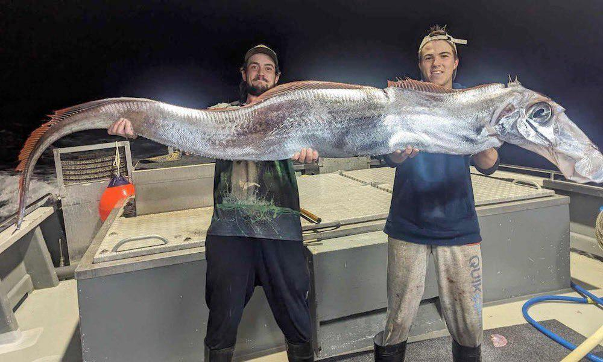

# Animals

## "Judgment Day" is near. Australian fishermen have caught a herring king.

What does "doomsday" have to do with it? Explain - the herring king rises to the surface of the water before a terrible catastrophe. Fish are sensing the slightest fluctuations in the Earth's crust and rising from the depths of the sea.

2024 never ceases to amaze.

