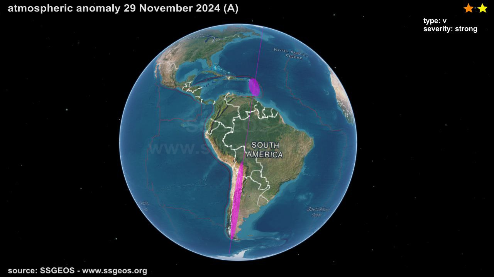
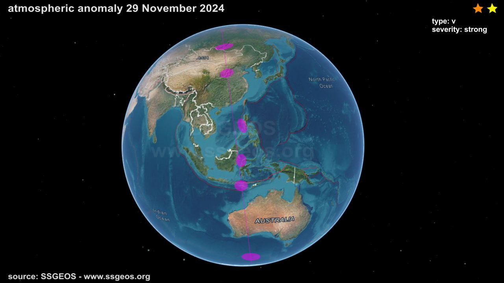
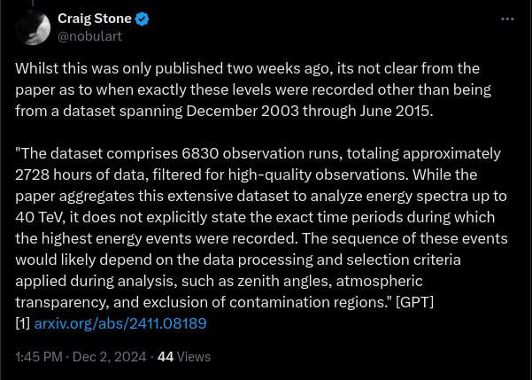

# Atmospheric Anomalies

## Atmospheric Anomalies

Marked regions are approximations. Estimated potential severity is strong.

Right through the Eulers

Pink denotes possible seismic activity in the coming days

## MYSTERIOUS COSMIC RAYS BLAST EARTH WITH RECORD-BREAKING ENERGY

Scientists have detected record-breaking cosmic rays with energies of 40 teraelectronvolts (TeV), observed by Namibia's HESS observatory. These particles, 40,000 times more energetic than visible light, produce Cherenkov radiation when they interact with Earth's atmosphere, but their exact origins remain unknown. Potential sources include supernova remnants, pulsars, or active galactic nuclei. The discovery raises questions about the mechanisms behind such high-energy events. Speculative claims suggest these cosmic rays could impact Earth's core, possibly triggering increased seismic activity, though this remains unproven.

https://halturnerradioshow.com/index.php/news-selections/world-news/mysterious-cosmic-rays-blast-earth-with-record-breaking-energy

I've been digging into the paper a little deeper. This data seemes to be from years ago even though the paper is new. Who knows what might be pummeling us at the moment.
https://arxiv.org/abs/2411.08189

Being a ground-based observatory, the increase would also be due, in part at least, to the weakening of the geomagnetic field, especially the migration and expansion of the SAA which extends to southern Africa where the observatory is sited. Knowing this component would allow for the isolation other other parts of the signal.

# Extremely energetic electrons strike Earth from a strange nearby source

Dated:     By Michael Irving
November 29, 2024            https://newatlas.com/physics/highest-energy-electrons-pulsar/

Could something be approaching earth??

I would think that may be the case.