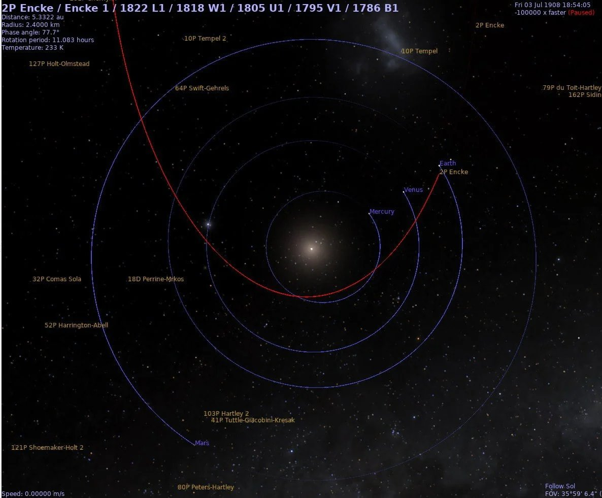
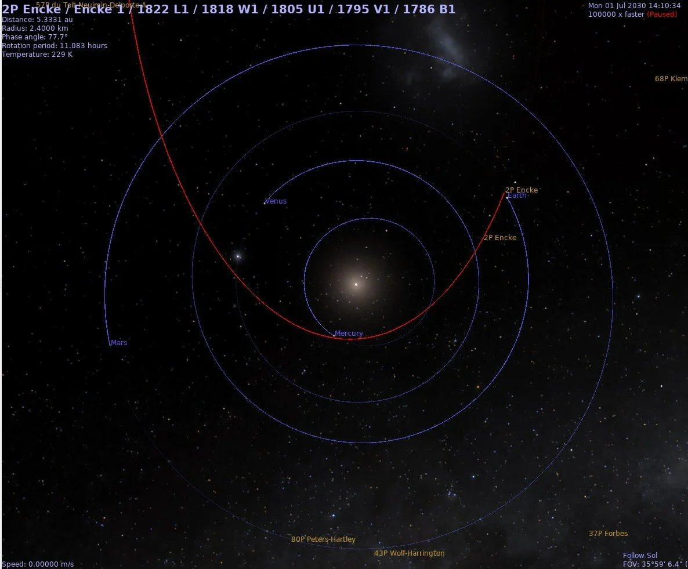

# Comets

## Note that "cometary interactions" are...

Note that "cometary interactions" are specifically mentioned. If we pass through the tail of Encke in 2030, and there is no gravitational offset from the gas giants, what effects might that have on the solar wind and Earth's electromagnetic environment during the traversal?

## Meteor strike fudging

Did you know there was a meteorite strike on march 28, 2020 that struck Nigeria and left an uncomfortable crater? Did you also know we had another extremely near miss of an asteroid on November 12 of the same year? No one reported them.

The 2 ships that were moored on ny harbor supposedy for Covid were actually floating hospitals designed for trauma patients (as in those who would be victims of a traumatic event-asteroid strike) and not for infectious disease treatment. Not a single Covid patient was treated onboard either of them. Uncanny don’t you think?

UK built a load of temporary hospitals too. Called Nightingale hospitals. Never had a patient.

## Having watched every calculated orbit... [1]

Having watched every calculated orbit of this comet over the past several hundred years, this upcoming pass is both apparently and mathematically one of the two closest to us in that period, with the 1903 pass being the other.

## Comet 2P/Encke near-earth pass June/July...

Comet 2P/Encke near-earth pass June/July 2030. Encke passes through our neighborhood every 33 years, so why is this time significant? A short thread... https://t.co/ZksVxu6ksB

See img/1798070748332143080-_KGs6-MJMiwUEREI.mp4.

## Perhaps a coincidence, but 2P/Encke...

Perhaps a coincidence, but 2P/Encke and its Taurid companions were unusually close to Earth at the time of the Tunguska event (from which numerous glaze/melt spherules have been retrieved as well). We're due another similar near pass in June/July 2030. https://t.co/wKFnbSNKny

## RT JUST IN: Strange Fireball...

RT JUST IN: Strange Fireball recorded entering the atmosphere over Tampa, Florida… WHAT IS THIS? https://t.co/zkCd2CEl…

## Citations

1. Craig Stone