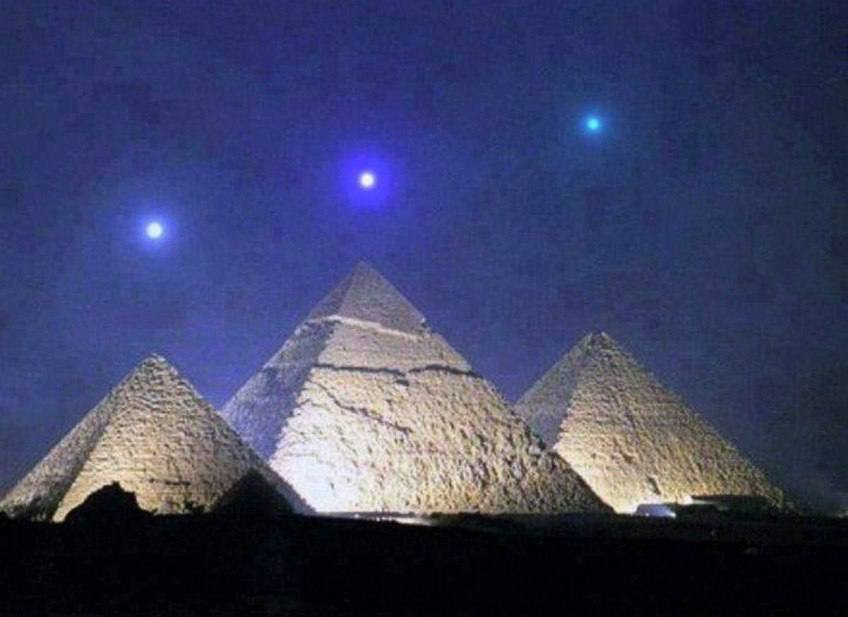

# Cosmic Anomalies

## Pyramid Planetary Alignment

Mercury, Venus and Saturn above the pyramids at Giza (Egypt). 
This happens once every 2373 years. 
And this is happening tonight

The Three Kings

