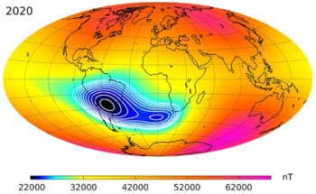
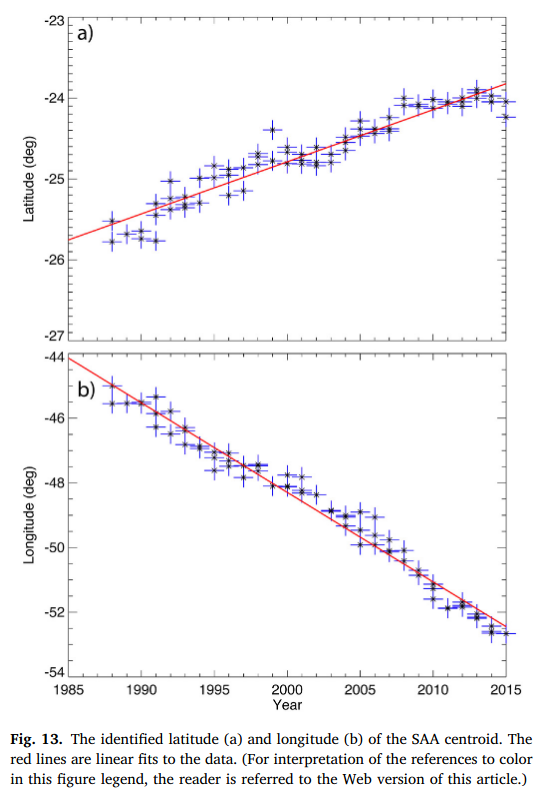
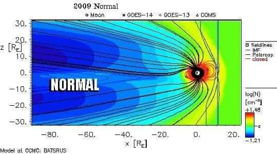
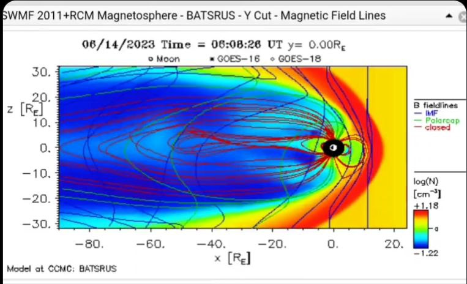
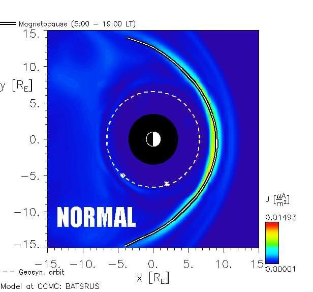
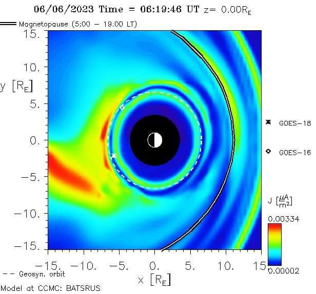

# Recent Geomagnetic Anomalies

## Recent Schumann Resonance band changes; Weaknening of the Earth's magnetic moment

[Ethical Skeptic's thesis](https://theethicalskeptic.com/2020/02/16/the-climate-change-alternative-we-ignore-to-our-peril/) covers these recent geomagnetic changes in depth.

*"Recent Schumann Resonance banding-power (not the frequencies themselves as has been errantly reported by some sources) has ranged upwards through more of the higher frequencies inside the established eight resonance harmonics (six of which manifest in the Exhibit 5A example to the right); indicating a weakening in the Earth’s magnetic moment generated from its solid core."*

He provides plenty of sources, I encourage you to look at his original work.

## Earth's geomagnetic dipole weakening

### Changes in earth’s dipole

"The dipole moment of Earth’s magnetic field has decreased by nearly 9% over the past 150 years and by about 30% over the past 2,000 years according to archeomagnetic measurements. Here, we explore the causes and the implications of this rapid change. Maps of the geomagnetic field on the core–mantle boundary derived from ground-based and satellite measurements reveal that most of the present episode of dipole moment decrease originates in the southern hemisphere. Weakening and equatorward advection of normal polarity magnetic field by the core flow, combined with proliferation and growth of regions where the magnetic polarity is reversed, are reducing the dipole moment on the core–mantle boundary. Growth of these reversed flux regions has occurred over the past century or longer and is associated with the expansion of the South Atlantic Anomaly, a low-intensity region in the geomagnetic field that presents a radiation hazard at satellite altitudes. We address the speculation that the present episode of dipole moment decrease is a precursor to the next geomagnetic polarity reversal. The paleomagnetic record contains a broad spectrum of dipole moment fluctuations with polarity reversals typically occurring during dipole moment lows. However, the dipole moment is stronger today than its long time average, indicating that polarity reversal is not likely unless the current episode of moment decrease continues for a thousand years or more."

https://link.springer.com/article/10.1007/s00114-006-0138-6

### Future Inversion of the Magnetic Field and Possible Changes in the Structure of the Magnetosphere

"IGRF-12 model data have been used to analyze the change in the global structure of internal sources of the Earth’s magnetic field. A decrease in the dipole magnetic moment is accompanied by a rapid growth of multipole moments. This justifies the theoretical model of the magnetic field inversion as a gradual decrease in the dipole field with general conservation of its direction and amplification of multipole moments. Paleo- and archeomagnetic data indicate that this process has already been taking place for almost 2.5 thousand years and has occurred repeatedly many times in the past. A decrease in the dipole magnetic moment leads the magnetopause to approach the Earth to disappear completely in almost 1.5 thousand years."

https://link.springer.com/article/10.1134/S0016793219030101

## South Atlantic Anomaly

The South Atlantic Anomaly (SAA) is an area where Earth's inner Van Allen radiation belt comes closest to Earth's surface, dipping down to an altitude of 200 kilometres (120 mi). This leads to an increased flux of energetic particles in this region and exposes orbiting satellites (including the ISS) to higher-than-usual levels of ionizing radiation.

The effect is caused by the non-concentricity of Earth and its magnetic dipole and has been observed to be increasing in intensity recently.[quantify] The SAA is the near-Earth region where Earth's magnetic field is weakest relative to an idealized Earth-centered dipole field.

In-depth and up-to-date look at it here: https://svs.gsfc.nasa.gov/4840/

There's an excellent paper on this by Laj in `EVIDENCE/physical-material/paleomagnetic`.

### Accounts for geomagnetic north pole wander? An impending geomagnetic transition (South Atlantic Anomaly), Laj

"Gubbins (1987) noted that a patch of flux occurring below the southern tip of Africa had opposite sign to that expected for a dipole field in the Southern Hemisphere, when extrapolated at the core mantle boundary (the South Atlantic Anomaly or SAA). He suggested that “the present fall of the dipole field is directly related to the intensification and southward migration of this and other similar patches and that the fall may occasionally leads to polarity reversal.”"

"More recently, Hulot et al. (2002) have compared the 2002 data from the Danish Oersted Satellite with those obtained from the US satellite Magsat that operated in 1979/1980 and interpreted variations of the magnetic field over this 20 years period down to previously inaccessible length scales. Hulot et al. (2002) showed that growth and poleward migration of these reversed flux patches account almost entirely for the decrease in the dipole field in the last two centuries. They postulate “that the present magnetic state of the Earth may be one in which the geodynamo operates before reversing,” consistent with, but with a much better spatial resolution than Gubbins’ (1987) suggestion."

### Small-scale structure of the geodynamo inferred from Oersted and MAGSAT satellite data (hard copy here)

This is the one that is mentioned above as the one that shows the "poleward migration of these reversed flux patches account almost entirely for the decrease in the dipole field in the last two centuries".

It's very hard to read this one.

### Mapping the South Atlantic Anomaly continuously over 27 years (hard copy here)

It's nice data; I just wish it went back further. From what's given, there isn't much that can be gleaned from a linear trend outside of the small blip around 1999.

"At present the strength of the Earth's magnetic field is decreasing by about 5% every hundred years (Merrill and McElhinny, 1983); in the SAA, the strength of the magnetic field is decreasing ten times as fast."

## Magnetic field getting weaker

See https://iswa.gsfc.nasa.gov/.

Relevant papers
- https://x.com/NoVaxForMePal/status/1659529838221295622
- https://x.com/NoVaxForMePal/status/1682913085265248256
- https://x.com/NoVaxForMePal/status/1618641550237634561
- https://x.com/NoVaxForMePal/status/1621465149872766976
- https://x.com/NoVaxForMePal/status/1620468069624868864
- https://x.com/NoVaxForMePal/status/1620468069624868864

## NOAA December 2023 State of the Geomagnetic Field (hard copy here)

The WMM (World Magnetic Model) gets updated once every 5 years, with the last time being in 2020. More up-to-date data is not easily found.

However, NOAA has [published a report in December 2023](https://www.ncei.noaa.gov/sites/g/files/anmtlf171/files/2023-12/WMM_Annual_Report_2023.pdf) called "State of the Geomagnetic Field" with some analysis on the current state of the geomagnetic field. Following is a quote from the paper:

*"This suggests that nonlinear changes in the Earth’s magnetic field have remained small over the past three years. Since 2020, the north magnetic dip pole has moved at an average speed of 41 km/yr, and the south magnetic dip pole at 9 km/yr. Neither underwent any noticeable change in direction."*