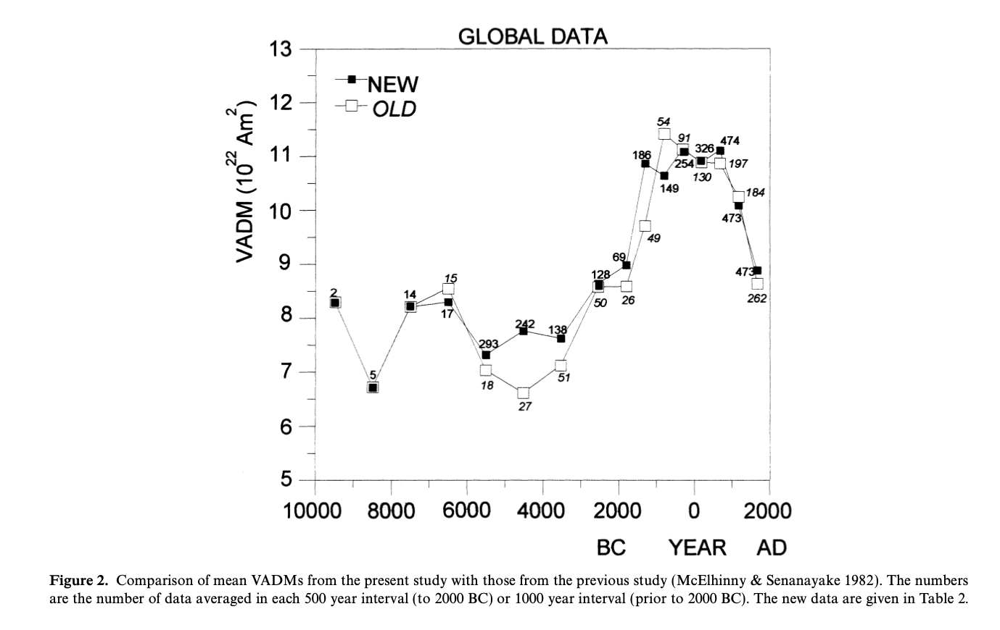
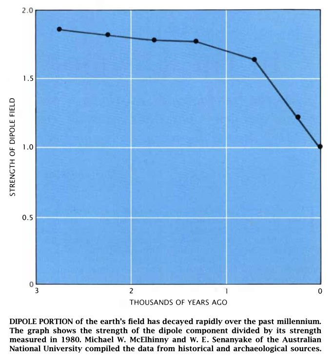
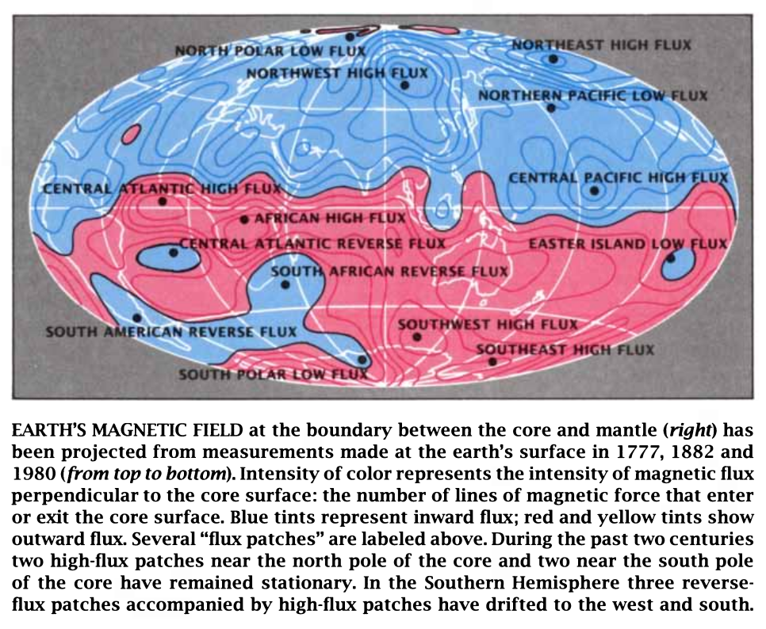
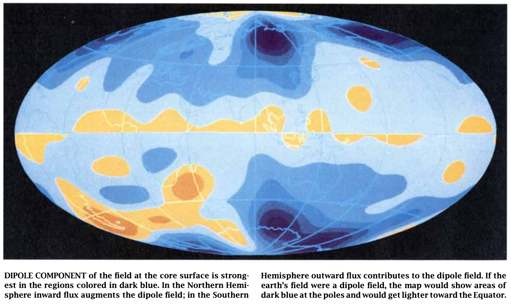
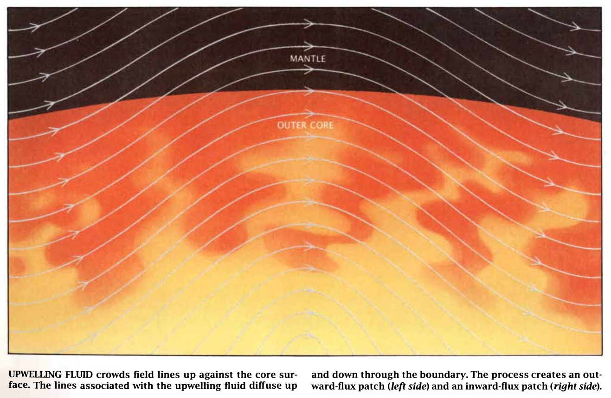
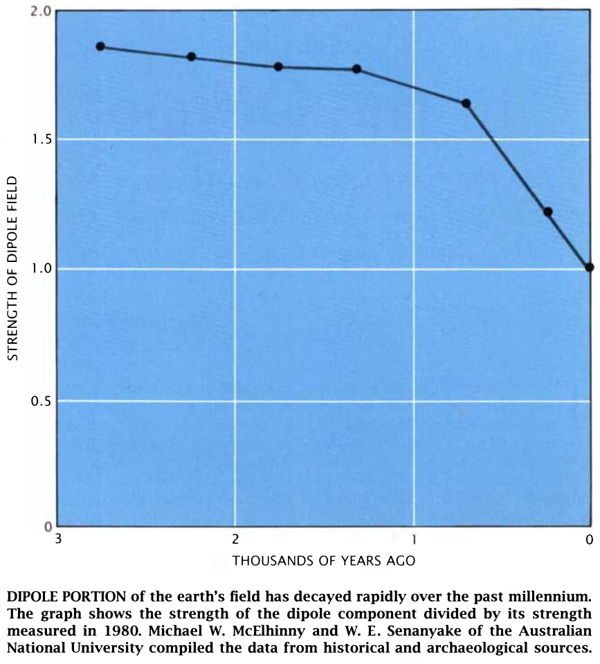
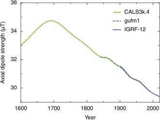
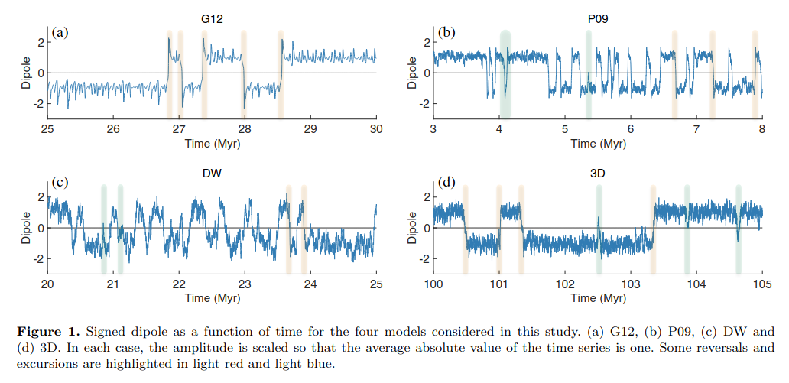

# Dipole Strength

Geomagnetic field strength only began to be measured directly in 1830 by Carl Friedrich Gauss. However, the weakening of the dipole field is well established on much longer timeframes, going back multiple millenia, through archaeomagnetic measurements.

## Variations in the geomagnetic dipole moment over the last 12 000 years

Shows a definite weakening of the geomagnetic field over the last 2000 years.

One thing I'm curious about - why don't we see a multi kiloannum decrease leading up to the 2000 BC event? Is the data trustworthy going back that far in time even? Did the most recent flip mess up all the data preceding it? 

So, there is only a bit over 3000 data points for 12,000 years, which means the dataset must be very sparse. If you look at the paper you'll see it gets sparser further back in time.

"An analysis has been made of archaeointensity data for the past 12 000 years. There
are 3243 results from different areas of the world covering the past 12 000 years. Of
these, 2203 are from the European region and 1040 are from the rest of the world. The
archaeointensity data set analysed in the present study is almost three times larger
than that used by McElhinny & Senanayake (1982). Although there is no major
difference between our global data and the earlier data, the data for the non-European
region have been improved and we now have a data set for Asia"

Hard copy here.

## Depletion of Earth's Magnetic Field (total energy remains constant??)

"The field has been weakening since Carl Friedrich Gauss measured it around 1836, by about 5% per century, recently accelerating to 7%/century. The total energy of the field however is nearly constant, as shown by the late Ned Benton. This means that the field is not really weakening, only reshuffling its energy, reducing the "main dipole" (=north-south bar-magnet pattern, declining as noted by about 7% per century) and reinforcing the more complicated parts."

https://pwg.gsfc.nasa.gov/earthmag/magnQ&A1.htm

https://pwg.gsfc.nasa.gov/earthmag/gauss.htm

## The Evolution of the Earth's Magnetic Field: Falling since 700 AD

"The magnetic field has reversed polarity at different intervals during different geological periods. During the Cretaceous period 90 million years ago and the Permian period 170 million years ago, we know that no reversals occurred because the rocks that formed during those periods share the same polarity. During the past 90 million years reversals have steadily become more frequent. The core changes too rapidly to account easily for such long-term behavior. /// Some features of the field move and form at a rapid pace whereas others remain stationary. This phenomenon suggests some external influence. ///  If the temperature increased in the deep mantle, particularly beneath southern Africa or Indonesia, the formation of the reverse-flux features could accelerate, thereby precipitating reversals."

Hard copy here: https://sci-hub.ru/10.1038/scientificamerican1289-68

### Quotes

If the magnetic field at the core
were a simple dipole aligned with the
earth's rotational axis, the map would
become bluer toward the North Pole
and redder toward the South Pole.
Such a coloring would indicate that
the most intense flux is at the geo­
graphic poles. In addition, the equator
of the core surface would coincide
with the boundary between red and
blue shades, because the magnetic
equator would coincide with the geo­
graphic equator.

Our group found that the great­
est contribution to the dipole
field comes from four patches
on the core surface [see illustration
below). These patches are symmet­
rically displaced about the Equator.
( Their centers lie at the intersection
of the lines 60 degrees north, 60
degrees south, 120 degrees east and
120 degrees west.) 1:he locations of
the patches have not changed much
throughout historical time, which
suggests that they have a long-term
role in shaping the earth's magnet­
ic field.

Some features of the field move and
form at a rapid pace whereas others
remain stationary. This phenomenon
suggests some external influence. As
long ago as 1967, Hide proposed that
inverted mountains protruding from
the mantle into the core could affect
fluid flow at the core surface. Hence,
the inverted mountains could influ­
ence the magnetic field in a manner
similar to the way that mountains at
the earth's surface affect the weather.

Evidence is mounting that the
present dramatic fall in the di­
pole component of the field is
caused by the growth and propagation
of the reverse-flux features beneath
Africa and the Atlantic Ocean. It seems
that the present reduction in the di­
pole component of the field is caused
by the growth of the African core spot
and the southward movement of the
Atlantic core spot.

## Earth's geomagnetic dipole weakening

This seems fairly well documented in the literature.

"Over the last two centuries the dipole strength has been decreasing at a rate of about 6.3% per century. At this rate of decrease, the field would be negligible in about 1600 years. However, this strength is about average for the last 7 thousand years, and the current rate of change is not unusual."

https://en.wikipedia.org/wiki/Earth%27s_magnetic_field

## Paper: Changes in earth’s dipole (hard copy here)

"The dipole moment of Earth’s magnetic field has decreased by nearly 9% over the past 150 years and by about 30% over the past 2,000 years according to archeomagnetic measurements. Here, we explore the causes and the implications of this rapid change. Maps of the geomagnetic field on the core–mantle boundary derived from ground-based and satellite measurements reveal that most of the present episode of dipole moment decrease originates in the southern hemisphere. Weakening and equatorward advection of normal polarity magnetic field by the core flow, combined with proliferation and growth of regions where the magnetic polarity is reversed, are reducing the dipole moment on the core–mantle boundary. Growth of these reversed flux regions has occurred over the past century or longer and is associated with the expansion of the South Atlantic Anomaly, a low-intensity region in the geomagnetic field that presents a radiation hazard at satellite altitudes. We address the speculation that the present episode of dipole moment decrease is a precursor to the next geomagnetic polarity reversal. The paleomagnetic record contains a broad spectrum of dipole moment fluctuations with polarity reversals typically occurring during dipole moment lows. However, the dipole moment is stronger today than its long time average, indicating that polarity reversal is not likely unless the current episode of moment decrease continues for a thousand years or more."

https://link.springer.com/article/10.1007/s00114-006-0138-6

## Paper: Future Inversion of the Magnetic Field and Possible Changes in the Structure of the Magnetosphere

"IGRF-12 model data have been used to analyze the change in the global structure of internal sources of the Earth’s magnetic field. A decrease in the dipole magnetic moment is accompanied by a rapid growth of multipole moments. This justifies the theoretical model of the magnetic field inversion as a gradual decrease in the dipole field with general conservation of its direction and amplification of multipole moments. Paleo- and archeomagnetic data indicate that this process has already been taking place for almost 2.5 thousand years and has occurred repeatedly many times in the past. A decrease in the dipole magnetic moment leads the magnetopause to approach the Earth to disappear completely in almost 1.5 thousand years."

https://link.springer.com/article/10.1134/S0016793219030101

## Can one use Earth’s magnetic axial dipole field intensity to predict reversals? (hard copy here)

