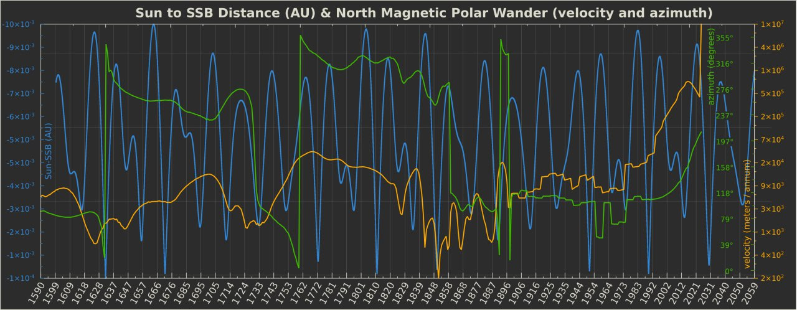
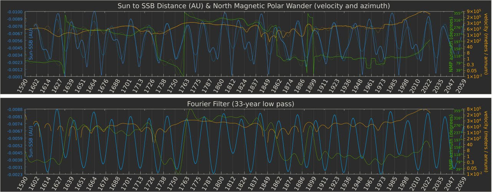
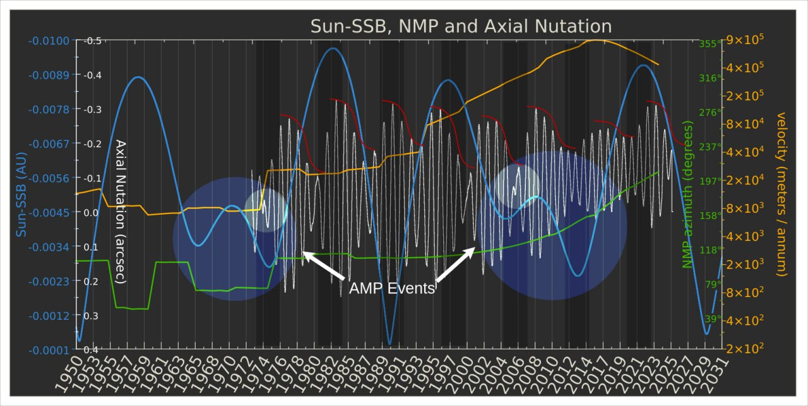
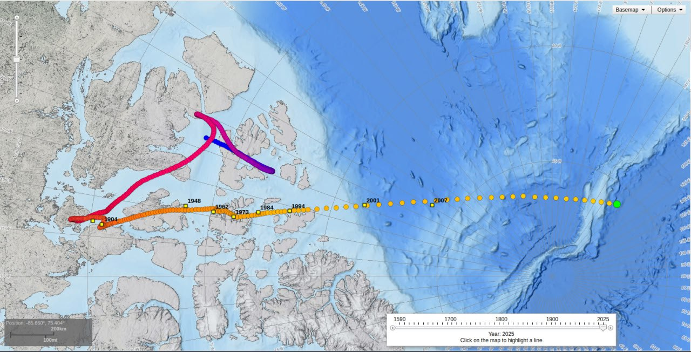
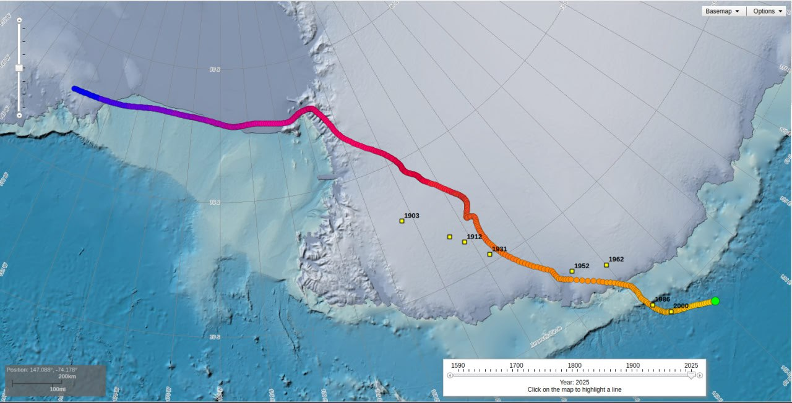

# Recent North Pole Wander

## North Pole Wander [1]

A low pass Fourier filter reveals a strong harmonic fit across all three data sets over a 33 year period.

I've overlaid a record of the Earth's axial wobble (x-axis) onto the existing data,  just for the short period spanning the available 'wobble' recordings and a little before. Angular Momentum Perturbation (AMP) events (large circles) are the Neptune/Uranus bumps in the Sun's blue curve. i've circled what appear to be 'microwobbles' in the earth's rotation around the time of the Uranus/Neptune bumps.

Added the other polar rotation axis to this chart. The same anomaly is clearly seen in both the X and Y directions, and its remarkably similar in movement to the Sun's wobble.

For lack of available peer-review, I obtained the dimestore appraisal as a starting point: 

"The Sun-SSB curve seems to exhibit periodicity that correlates with not only the polar nutation data but also the NMP wander and the polar motion perturbations. While it's unclear if these correlations indicate direct causality, they suggest synchronous behavior in the system driven by underlying gravitational influences. The amplified magnetic polar wander seen since the 1990s also coincides with increasing Sun-SSB displacement. This could be interpreted as the Earth experiencing a shift in its internal magnetic field, driven or influenced by gravitational forces." - GPT

I've added the Earth's polar motion (1973-2024) to a sub-period of the previous chart. 

1. https://iers.org/IERS/EN/DataProducts/EarthOrientationData/
2. https://ssd.jpl.nasa.gov/horizons/
3. https://ngdc.noaa.gov/geomag/data/poles/NP.xy

## North Magnetic Pole and Planetary Harmonics (1600-2024) [1]

https://github.com/user-attachments/assets/7e944cb3-9ccd-45a8-a217-8136d9bc2465

North Magnetic Pole and Planetary Harmonics (1600-2024). Could the planets be influencing Earth's magnetic dipole? Observed NMP path deviations are marked in white. Deviations >270° in pink. Significant velocity changes are in green. I've also marked several key events during the last century on this timeline which may have been catalyzed by observations of the rapidly accelerating magnetic reversal (or excursion). Preparing for pole shifts requires a lot of money. Wars are extremely profitable, both financially and technologically. Having the freedom to print cash out of thin air even more so.

1. https://ngdc.noaa.gov/geomag/data/poles/NP.xy
2. https://ssd.jpl.nasa.gov/horizons/
3. https://nobulart.com/the-flip-of-the-earth/
4. https://nobulart.com/report-from-iron-mountain/

## NOAA Data

Courtesy of NOAA, showing that that the Np has traversed more in the past 25 years than it did in the 400 years before that. Sp is more consistent, but has similarly covered over 2000km headed in pretty much one direction.

https://www.ncei.noaa.gov/maps/historical_declination/

## Alternative Magnetic North Pole Wander Video (1840 - 2019)

Alternate magnetic north pole wander video which also shows a comparison to the scale of the Earth. Original video at `img/npw.mp4`. It is compiled from historic observational and SWARM data. Note the apparent >270° deviation that occurred in the mid-1800's.

https://github.com/user-attachments/assets/de8d7eff-800f-4030-b428-2667cd46179e

Source: https://www.esa.int/Applications/Observing_the_Earth/FutureEO/Swarm/Magnetic_north_and_the_elongating_blob

## Citations

1. [Craig Stone](https://nobulart.com)
