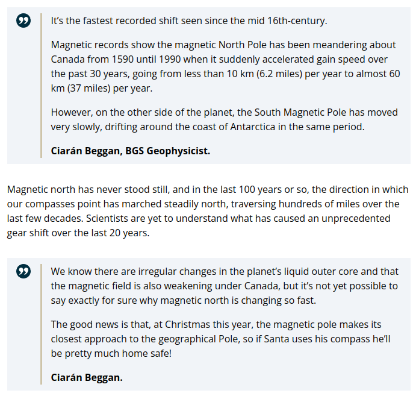

# Magnetic North Pole Wander

## North Magnetic Pole and Planetary Harmonics (1600-2024) [1]

https://github.com/user-attachments/assets/7e944cb3-9ccd-45a8-a217-8136d9bc2465

North Magnetic Pole and Planetary Harmonics (1600-2024). Could the planets be influencing Earth's magnetic dipole? Observed NMP path deviations are marked in white. Deviations >270° in pink. Significant velocity changes are in green. I've also marked several key events during the last century on this timeline which may have been catalyzed by observations of the rapidly accelerating magnetic reversal (or excursion). Preparing for pole shifts requires a lot of money. Wars are extremely profitable, both financially and technologically. Having the freedom to print cash out of thin air even more so.

1. https://ngdc.noaa.gov/geomag/data/poles/NP.xy
2. https://ssd.jpl.nasa.gov/horizons/
3. https://nobulart.com/the-flip-of-the-earth/
4. https://nobulart.com/report-from-iron-mountain/

## NOAA Data

Courtesy of NOAA, showing that that the Np has traversed more in the past 25 years than it did in the 400 years before that. Sp is more consistent, but has similarly covered over 2000km headed in pretty much one direction.

https://www.ncei.noaa.gov/maps/historical_declination/

## Alternative Magnetic North Pole Wander Video (1840 - 2019)

Alternate magnetic north pole wander video which also shows a comparison to the scale of the Earth. Original video at `img/npw.mp4`. It is compiled from historic observational and SWARM data. Note the apparent >270° deviation that occurred in the mid-1800's.

https://github.com/user-attachments/assets/de8d7eff-800f-4030-b428-2667cd46179e

Source: https://www.esa.int/Applications/Observing_the_Earth/FutureEO/Swarm/Magnetic_north_and_the_elongating_blob

## British Geological Survey (2019) https://t.co/xCQNOqlskV...

British Geological Survey (2019) https://t.co/xCQNOqlskV https://t.co/qdb6w3UPqk

## Citations

1. [Craig Stone](https://nobulart.com)
