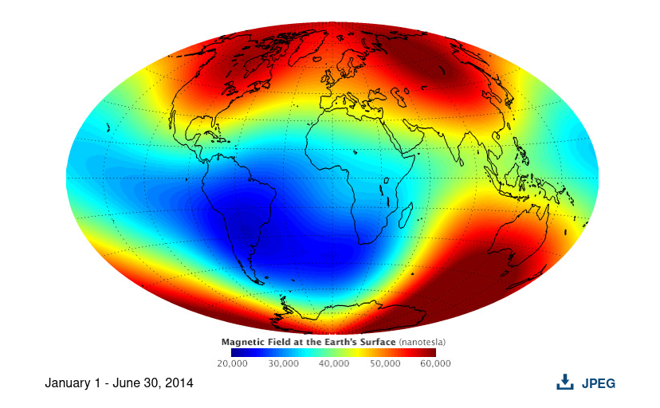
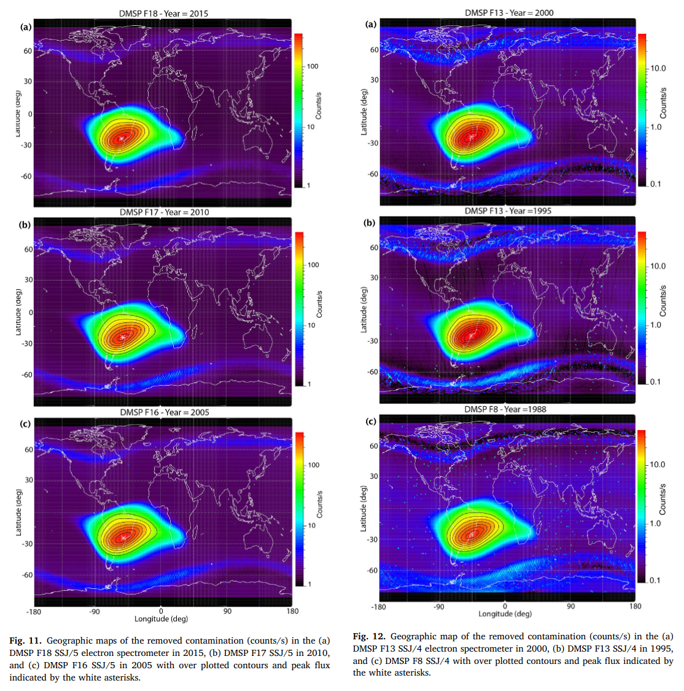
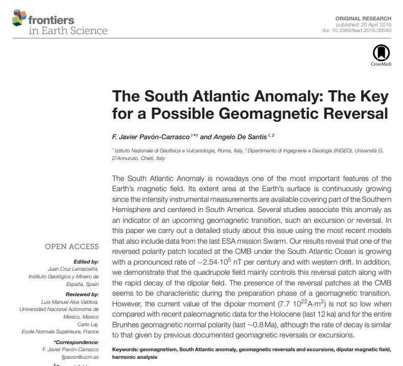

# South Atlantic Anomaly

2014 pic. Nice one as it shows the nanotesla gradient.

https://earthobservatory.nasa.gov/images/84266/measuring-earths-magnetism

## Plotting the size of the SAA from 1590 - 2025

## South Atlantic Anomaly

The South Atlantic Anomaly (SAA) is an area where Earth's inner Van Allen radiation belt comes closest to Earth's surface, dipping down to an altitude of 200 kilometres (120 mi). This leads to an increased flux of energetic particles in this region and exposes orbiting satellites (including the ISS) to higher-than-usual levels of ionizing radiation.

The effect is caused by the non-concentricity of Earth and its magnetic dipole and has been observed to be increasing in intensity recently.[quantify] The SAA is the near-Earth region where Earth's magnetic field is weakest relative to an idealized Earth-centered dipole field.

In-depth and up-to-date look at it here: https://svs.gsfc.nasa.gov/4840/

There's an excellent paper on this by Laj in `EVIDENCE/physical-material/paleomagnetic`.

### Accounts for geomagnetic north pole wander? An impending geomagnetic transition (South Atlantic Anomaly), Laj

"Gubbins (1987) noted that a patch of flux occurring below the southern tip of Africa had opposite sign to that expected for a dipole field in the Southern Hemisphere, when extrapolated at the core mantle boundary (the South Atlantic Anomaly or SAA). He suggested that “the present fall of the dipole field is directly related to the intensification and southward migration of this and other similar patches and that the fall may occasionally leads to polarity reversal.”"

"More recently, Hulot et al. (2002) have compared the 2002 data from the Danish Oersted Satellite with those obtained from the US satellite Magsat that operated in 1979/1980 and interpreted variations of the magnetic field over this 20 years period down to previously inaccessible length scales. Hulot et al. (2002) showed that growth and poleward migration of these reversed flux patches account almost entirely for the decrease in the dipole field in the last two centuries. They postulate “that the present magnetic state of the Earth may be one in which the geodynamo operates before reversing,” consistent with, but with a much better spatial resolution than Gubbins’ (1987) suggestion."

### Small-scale structure of the geodynamo inferred from Oersted and MAGSAT satellite data (hard copy here)

This is the one that is mentioned above as the one that shows the "poleward migration of these reversed flux patches account almost entirely for the decrease in the dipole field in the last two centuries".

It's very hard to read this one.

### Mapping the South Atlantic Anomaly continuously over 27 years (hard copy here)

It's nice data; I just wish it went back further. From what's given, there isn't much that can be gleaned from a linear trend outside of the small blip around 1999.

"At present the strength of the Earth's magnetic field is decreasing by about 5% every hundred years (Merrill and McElhinny, 1983); in the SAA, the strength of the magnetic field is decreasing ten times as fast."

## SAA Frontiers

"Statistical calculations show that the average time between [geomagnetic] reversals is 400 kyear and the last reversal occurred 780 kyear ago.  ...we can conclude that the [observed] patterns agree with an upcoming transition of the Earth’s magnetic field." - The South Atlantic Anomaly: The Key for a Possible Geomagnetic Reversal (2016)
The observations cited in this paper have only intensified since its publication 8 years ago.

[1] https://www.frontiersin.org/journals/earth-science/articles/10.3389/feart.2016.00040/full