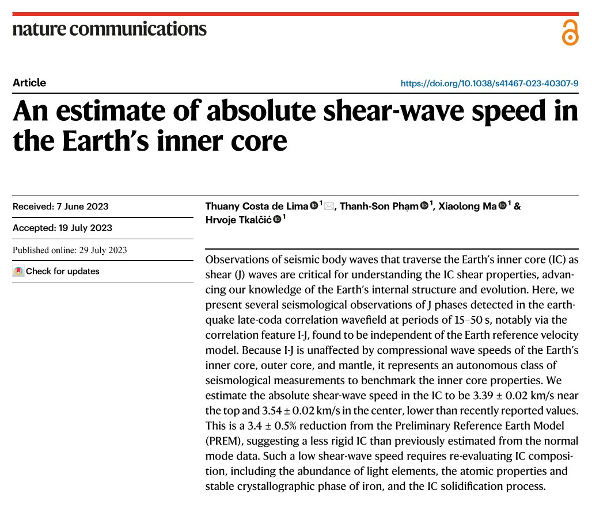
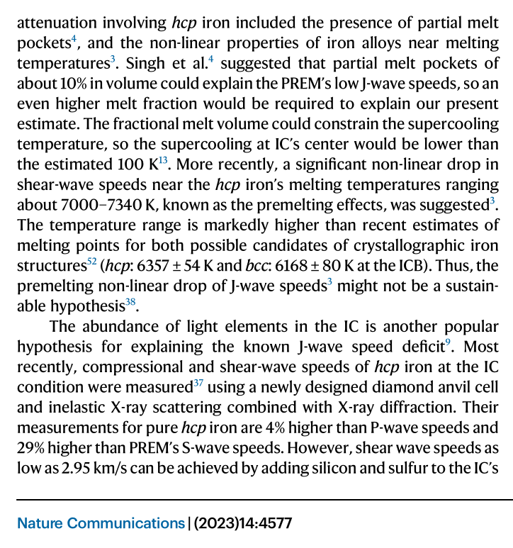

# Inner Core

They’re “stumped” of course. 

https://phys.org/news/2024-06-rotation-earth-core.amp

https://youtu.be/tIpQLg9-faM

## Evidence of a warming core?

Published 19 July, 2023. The chart serves as reference to the observation that the propagation velocity of shear waves traversing the Earth's inner core has an inverse relationship with core temperature. The higher the temperature, the lower the wave velocity.

The authors of this paper observed a 3.4% reduction in shear wave velocity relative to the 1981 Preliminary Reference Earth Model (PREM). Whilst they make mention of increased temperatures as playing a possible role, they favour measurement errors, interpretative calibration discrepancies, and previously incorrect assumptions about the composition of the core in prior art in order to reconcile the observed reduction in wave velocity.

1. https://doi.org/10.1038/s41467-023-40307-9
2. https://annas-archive.org/md5/17ca9353c3b84e99c28d13c255e1cd4c