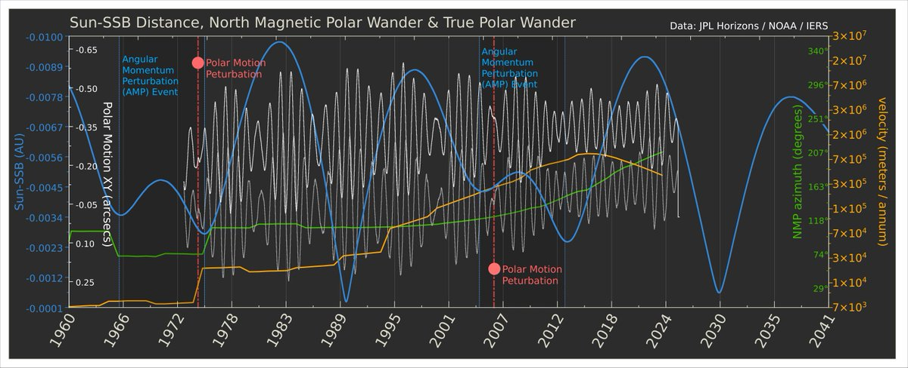
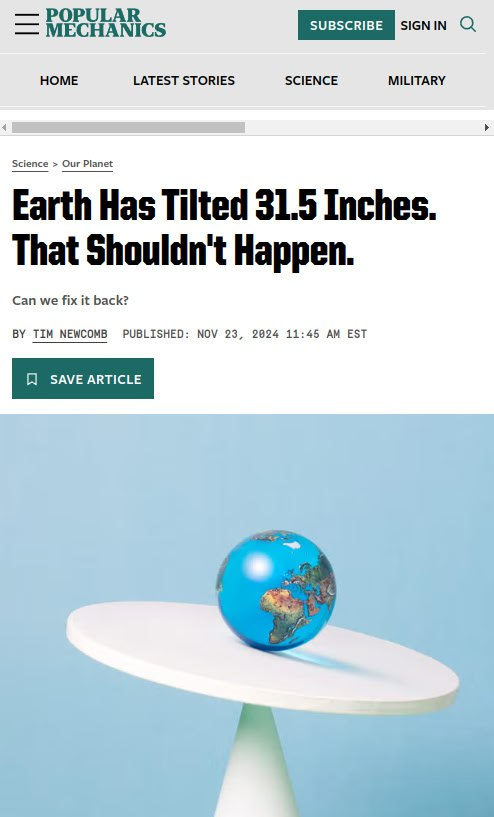

# Recent Earth orbital anomalies

## Overview

"The slow drift, about 20 m since 1900, is partly due to motions in the Earth's core and mantle, and partly to the redistribution of water mass as the Greenland ice sheet melts, and to isostatic rebound, i.e. the slow rise of land that was formerly burdened with ice sheets or glaciers.[2]: 2  The drift is roughly along the 80th meridian west."

https://en.wikipedia.org/wiki/Polar_motion

## Paper: Contributions of core, mantle and climatological processes to Earth’s polar motion [1] (hard copy here)

Potentially relevant paper.

By separately analyzing the various influences and harmonics in the Earth's axial wobble, they were able to construct a fairly good predictive model, which was validated by training it on the first part of the measured data and then checking its predictive power against the later portion of the known data. The visual illustrates how the measured polar motion drift has been progressing perpendicular to the ECDO moment of inertia, which is illustrated on the below chart from the paper:

Note how the observed polar nutation over the past 120 years appears to be following a path congruent with the centrifugal moment of Antarctica's ice mass. The original chart shows a north polar view. This visual is with the Antarctic overlaid and flipped to illustrate the distribution of it's mass at the other pole.

"The ice mass is dragging the crust's rotational axis away from the center as the decoupling progresses further, and more slippage is occurring at the core-mantle boundary." [1]

"The original map in the paper is a north polar view. I added Antarctica as it is positioned at the opposite pole, as though you're looking through the planet to see the ice on the other side. Since its a sphere, if the antarctic wants to pull East (in this view) the north pole is going to tend west. It significant to ECDO because it's showing the effect of Antarctica's mass as the core-mantle coupling continues to degrade." [2]

"If the rotational axis of the core and that of the mantle are diverging, then this could surely lead to induction heating as the core's field traverses that of the outer layers, generating currents just as an electrical generator does - rotating overlapping fields." [2]

A rough view of the axial polar movement overlaid on the magnetic polar movement along the same timeline (1900-2018):

### Data format

"The polar motion is described by the movement of the pole position, with coordinates xp and yp defined positive towards the central Greenwich meridian and 90° W longitude, respectively."

## I've added the Earth's polar...

I've added the Earth's polar motion (1973-2024) to a sub-period of the previous chart and asked GPT to review it: "The Sun-SSB curve seems to exhibit periodicity that correlates with not only the polar nutation data but also the NMP wander and the polar motion perturbations.… https://t.co/eqLt6QrqZ6 https://t.co/PwkCfDQngp

## Length of days growing shorter?

https://youtu.be/7Pz7pSLrI_M?si=yTuEdZ-BwSW13Ceu

## RT Days Growing Shorter -...

RT Days Growing Shorter - Earth Rotation Speeding Up https://t.co/vkc0cteTHT via

## Earth tilted 31.5 inches

Is there anything they can't spin as being induced by human activity?
https://www.popularmechanics.com/science/environment/a62995913/why-has-earth-tilted/

## Citations

1. https://www.nature.com/articles/s41561-024-01478-2
2. [Craig Stone](https://nobulart.com)