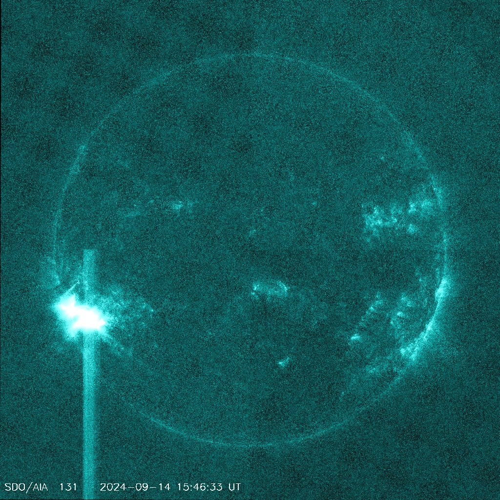
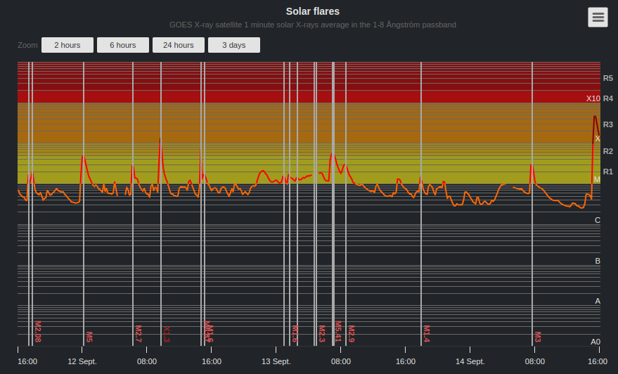
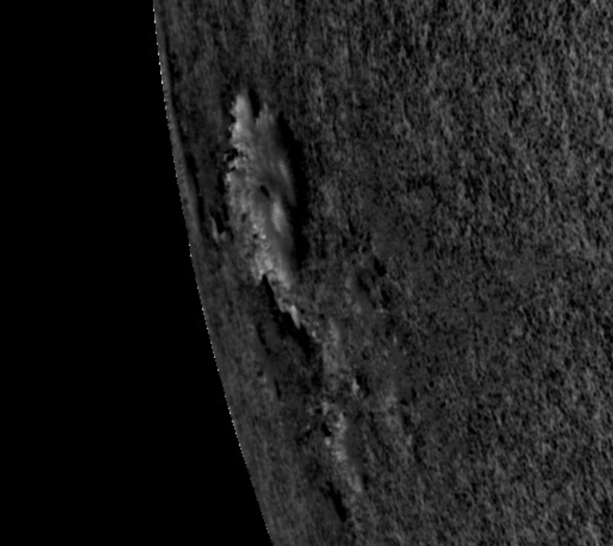
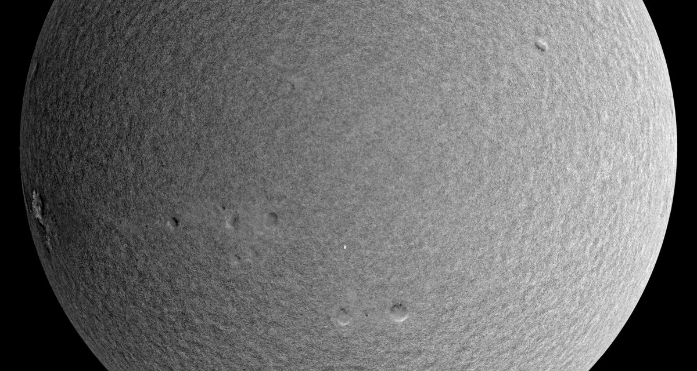

# Solar Anomalies

## RT The Climate Change Psyop...

RT The Climate Change Psyop and the coming micronova event. A thread Let's go 👇👇👇 https://t.co/vGUx3u6DxF

## X4.46
[1] https://t.co/g6rwq8V3ce https://t.co/oMtsjIvszx

X4.46 [1] https://t.co/g6rwq8V3ce https://t.co/oMtsjIvszx

## RT HUGE Sunspot Alert. SDO/HMI...

RT HUGE Sunspot Alert. SDO/HMI Dopplergram is crazy-looking right now. https://t.co/SyB0DrEBo1

## Sunspot cluster 3664 coming back...

Sunspot cluster 3664 coming back for round 2 with a stunning X2.9 this morning. Very fast moving. Luckily not earth-directed. https://t.co/l4oBvT56JW

See img/1795042072740679968-L8djdLhknMRY9O17.mp4.

## RT ALERT - Four Solar...

RT ALERT - Four Solar Blasts Are On Their Way To Earth https://t.co/HvNMEnV6bx

See img/1788586235922915822-ygcD1fTJanYNzzhB.mp4.

## RT Amazing Sunspot Motion &amp;...

RT Amazing Sunspot Motion &amp; Flare Production https://t.co/G7hseKikIm

See img/1763521183910125834-Hb3mRzsQu1tukhBi.mp4.

## Yesterday's magnificent M-class flare from...

Yesterday's magnificent M-class flare from the large incoming sunspot cluster on the western limb. https://t.co/3uUBaI04jr

See img/1623399682016681987-Hxx99uCyJmclmFot.mp4.