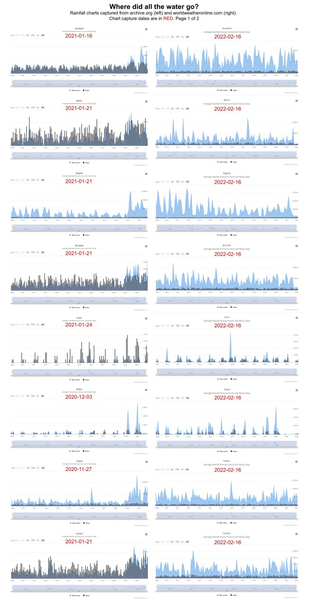

# Storm and Rain Anomalies

## Major data figure

Anthony Watts: https://en.wikipedia.org/wiki/Anthony_Watts_(blogger)
- crowdsourcing weather station pictures so you can see how the surrounding metrotopology changes over time and might be affecting the data

## Flooding

Even the collector of this material is so astounded by the volume of water seen in September that he’s compiled it into a thread. 

https://x.com/volcaholic1/status/1838907698663833874?s=46

August floods: https://x.com/volcaholic1/status/1840775328848810397?s=46

Switzerland: https://uk.news.yahoo.com/switzerland-three-people-missing-once-183200128.html

## RT Henan, China today with...

RT Henan, China today with 711.6 mm of rainfall in 24 hours!.....🌊 https://t.co/2yALZF9dy0

See 1813156539831656464-bTThM8oEoy6TGkQF.mp4.

## Rainfall data fudging [1]

Where did all the water go? Further examples of altered rainfall data from 16 different cities around the world. Unusually high rainfall records for the past three years have been erased from the record.

High resolution images available here:
- https://nobulart.com/media/anti-diluvian-1.jpg
- https://nobulart.com/media/anti-diluvian-2.jpg

## Nepal half-century of "most intense rainfall"

## Florida October 10 2024 Tornadoes and Hurricane

Purple skies: aurora above the cloud?

## Simultaneous upward strikes in Chicago...

Simultaneous upward strikes in Chicago a few hours ago. Atypical polarity between ground and cloud. https://t.co/dBmecNzTWy

## RT Spectacular ground-to-cloud lightning fills...

RT Spectacular ground-to-cloud lightning fills the sky over Burleigh Heads, Australia. 📽: haydenmilne/IG https://t.co…

## RT Another record broken in...

RT Another record broken in China. The flow of the Yalu River in Liaoning Province reached 33,000 m³/s. It looks more like t…

## Linjiang Flood

In China, with the water level more than 6 meters higher than normal, Linjiang in Jilin Province has suffered its largest flood in history.

https://t.co/gdAzv6Qz5B

## At least two tornadoes involved....

At least two tornadoes involved. Many more pics of the aftermath here: https://t.co/5hzDC61VNJ https://t.co/rdj5Tb0hmU

## Some of the aftermath. From...

Some of the aftermath. From other videos it appears that there may have been more than one tornado. https://t.co/VcxPwys40Z

See img/1797681859163492589-zDNaAj3wCXsOIkmu.mp4.

See img/1797681859163492589-oyrDFMYWoIQlSGCG.mp4.

## Not far from where I...

This is a short distance north of Durban, on the east coast of South Africa this afternoon. https://t.co/GXnbcTmDTu

See img/1797658753481011389-OrzU6fonOobulJtx.mp4.

See img/1797658753481011389-Du1McgH58i3QWsDZ.mp4.

## Chad

Devastating floods in Chad’s desert province of Tibesti claim at least 54 lives

https://watchers.news/2024/08/17/devastating-floods-in-chads-desert-province-of-tibesti-claim-at-least-54-lives/