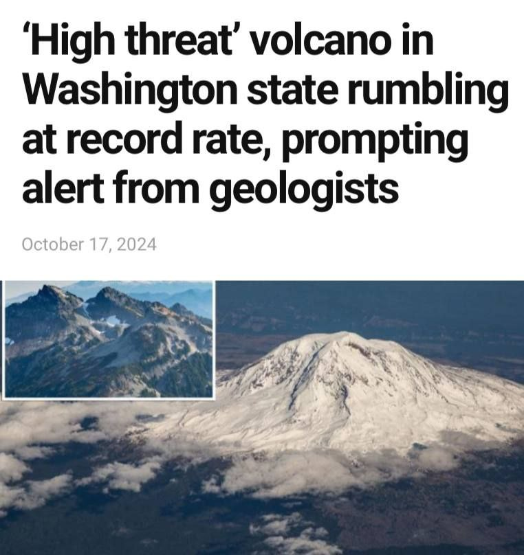
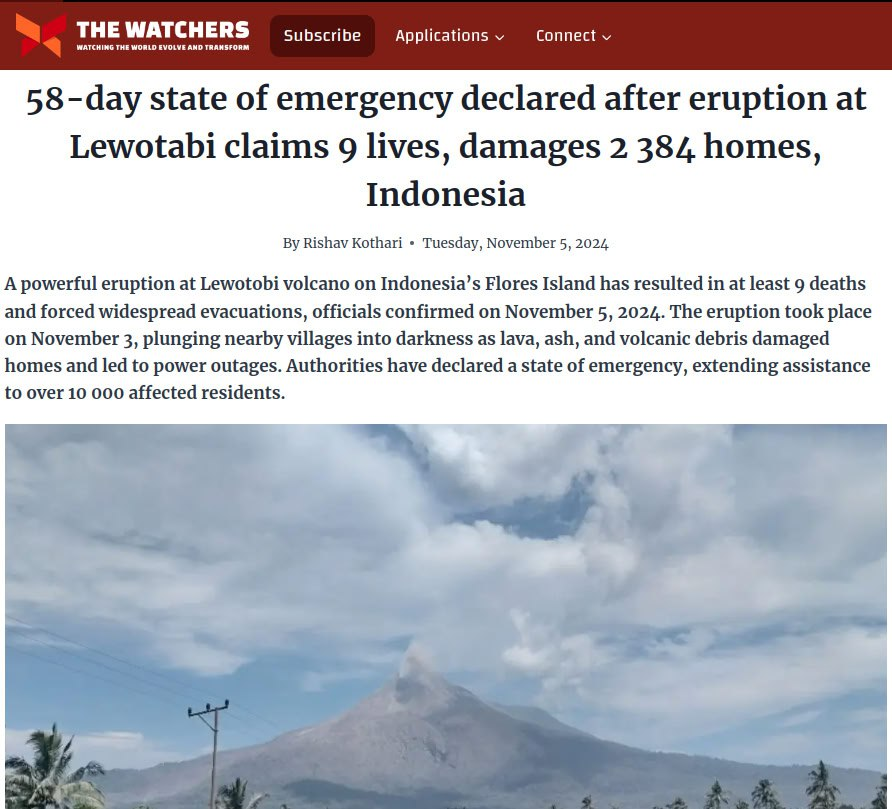
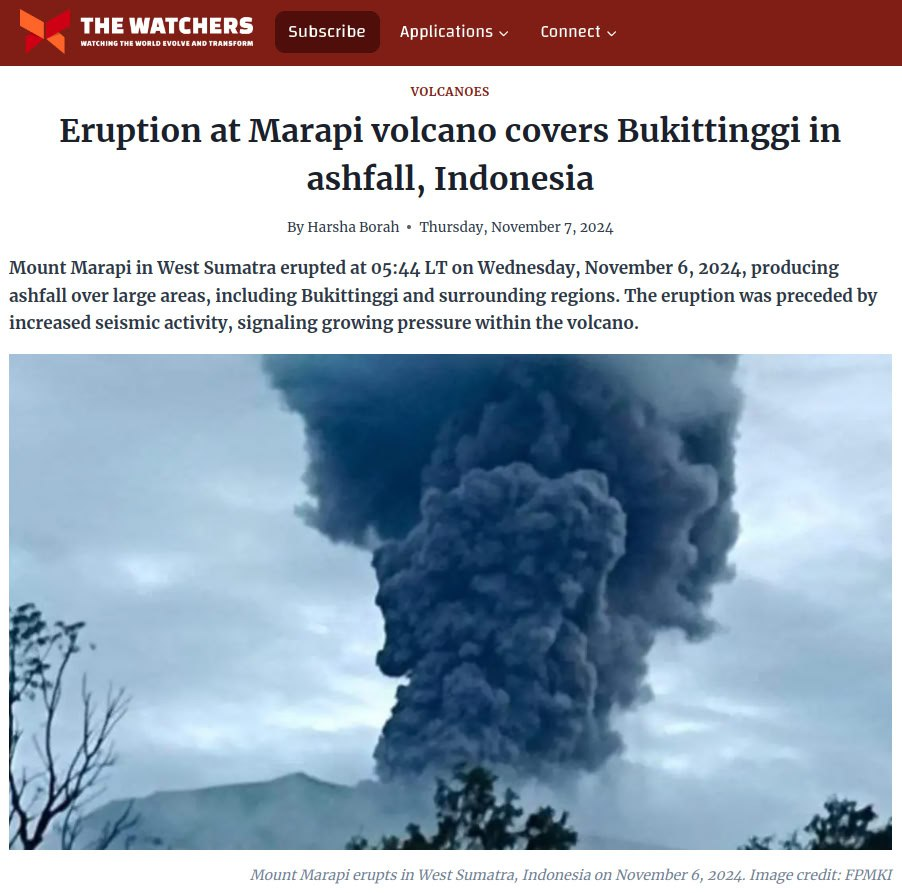
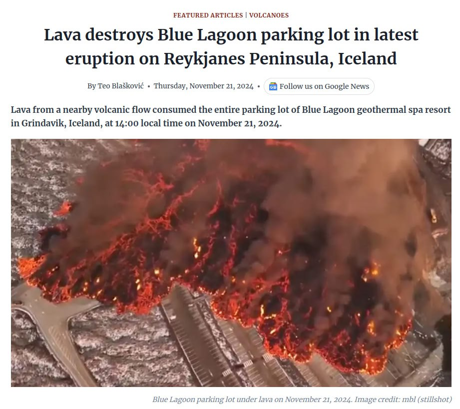

# Volcanoes

## Volcanoes

https://x.com/volcaholic1

## Indonesia July 20 2024

A pyroclastic flow occurred at Mount Merapi in Indonesia on July 20, 2024, at 19:46 WIB.
Video: https://x.com/volcaholic1/status/1814661822965747772?s=46

## Japan July 20 2024

Japan: Today [20 July 2024] at around 1:58 p.m., an eruption occurred at the summit crater of Sakurajima's Minamidake mountain in Kagoshima Prefecture. The explosion sent ash rising to a height of 3,700 meters above the crater.
1. https://x.com/volcaholic1/status/1814597887063433590
2. https://youtu.be/h4X6U9pH26s

## RT Sakurajima in Japan today....

RT Sakurajima in Japan today. You can see the shockwave (video shows multiple angles)🌋👀 https://t.co/1MZ3UE4VjR

img/1817863767876685956-pEpgHXNgV4gycsvN.mp4

## Voragine Crater June 14 2024

RT On 14 June 2024, the Voragine crater, one of the four summit craters of #Etna, surprisingly started erupting after more than…

## Washington

## Lewotabi November 5 2024 Eruption

https://watchers.news/2024/11/05/state-emergency-eruption-lewotabi-damage-indonesia/

## Marapi Volcano 2024 Nov 7

Marapi
https://watchers.news/2024/11/07/marapi-volcano-eruption-ashfall-sumatra-indonesia/

## Mud Volcano

https://x.com/soydeituango/status/1856125429712859390

https://watchers.news/2024/11/12/eruption-cacahual-el-aburrido-mud-volcano-antioquia-colombia-injures-eight-damages-homes/

## Iceland Volcano

https://watchers.news/2024/11/21/lava-destroys-blue-lagoon-parking-iceland-november-2024/

