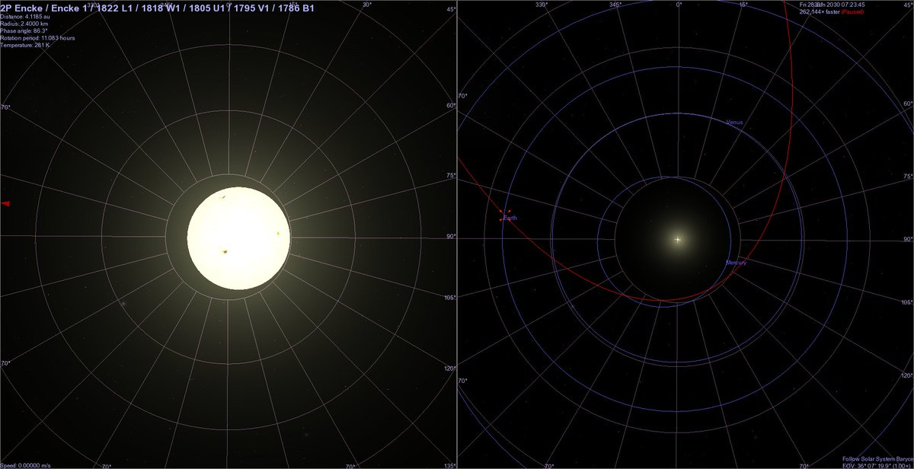

# Encke

## Encke Comet (June 2030)

There will be a historically close pass with Encke in June 2030. ±40 million km.

## In 2030 we will experience...

In 2030 we will experience one of these gravitational lulls at precisely the time that Encke (and the Taurids) will be making one of its closest passes to Earth since the Tunguska event. Chart shows Encke-Earth distance (blue) and Sun-SSB distance (red, scaled). https://t.co/cCm7zy9rje

