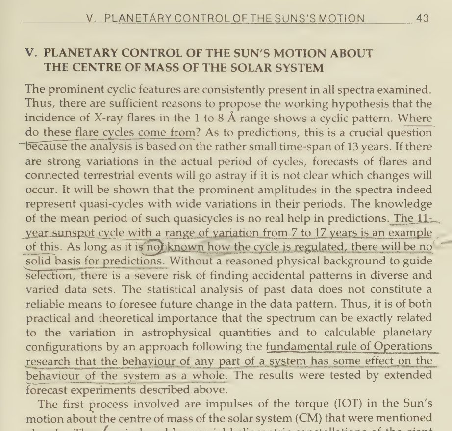
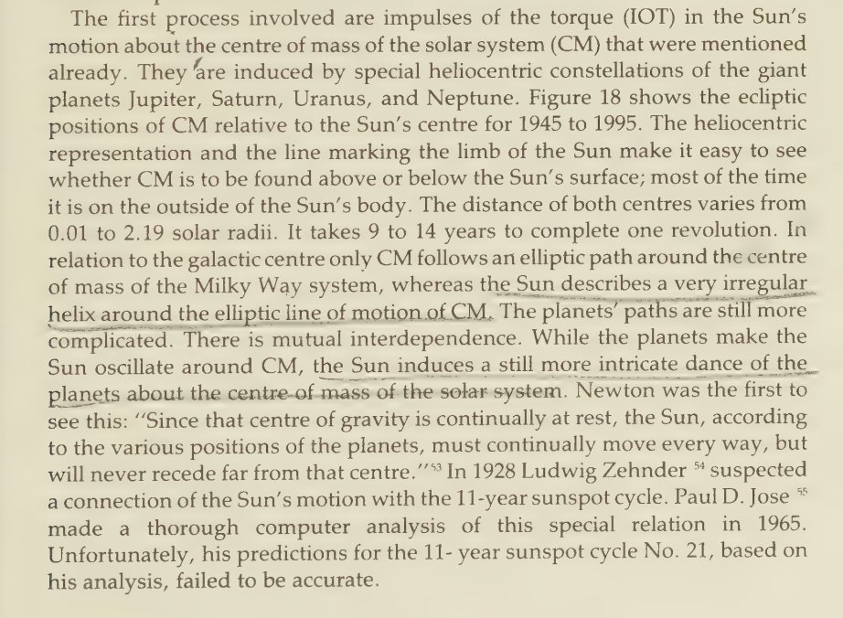

# Solar Alignments

## A prediction from 1988, based...

A prediction from 1988, based in planetary and solar harmonics: "The extrema in the secular wave of IOT [Impulses of Torque on the sun from the gas giants] can be taken to constitute a smoothed supersecular wave with a quasi-period of 391 years. This long wave points to… https://t.co/lCe0HOTmTP

## “In 1989,Landscheidt forecast a period...

“In 1989,Landscheidt forecast a period of sunspot minima after 1990, accompanied by increased cold, with a stronger minimum and more intense cold which should peak in 2030, which he described as the "Landscheidt Minimum"