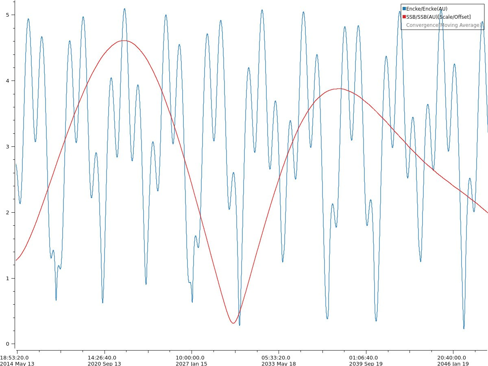
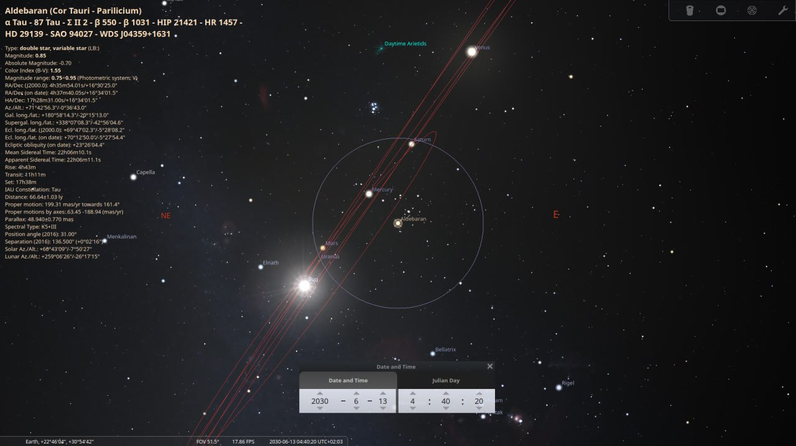
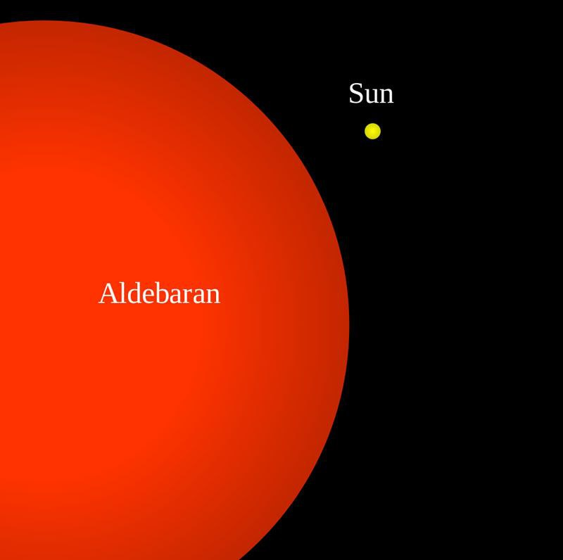

# Future Alignments

This folder focuses on the impending cosmic alignments that may potentially be a trigger for an ECDO event, focusing on January-June 2030.

## Solar system triggers [1]

The steady narrowing of real polar nutation [1] in apparent lockstep with the approaching Landscheidt Minimum [2] in June 2030, and near pass by 2P/Encke in June 2030 [3] whilst we are at solar grand minimum[4]. AgeEnder 2030 courtesy of the Saturnalian maniacs behind it. As a sidenote: When the 360-365 day calendar adjustment around 687BC (See `EVIDENCE/date-anomalies`) is accounted for, the Mayan long-count does not resolve to 2012, but to around 2030-2040 depending on when one determines the calendar adjustment occurred.

1. https://www.iers.org/IERS/EN/DataProducts/EarthOrientationData/eop.html
2. https://landscheidt.info/
3. []
4. https://nobulart.com/360-days/

The data for the fourth chart is obtained from JPL's Ephemeris software: https://ssd.jpl.nasa.gov/horizons/app.html

## Small Planet Alignments

## Solar system triggers v2 [1]

I think there is certainly enough energy involved between the sun and the earth for a field inversion in the sun during a gravitational lull to be the trigger for the decoupling. As we progress towards the slip the progression must manifest as accelerated magnetic polar wander and a narrowing of average real polar nutation (due to the drift occurring between core and mantle). The heat is rising and water is an excellent medium to draw it out.

I think the Sun's regular field inversion during a grand solar minimum may be the trigger for a micronova.

There is a perfect 4/5 harmonic on 4627 years, which is the grand orbital cycle of the four gas giants, which govern all solar cycles.

This shows how the gas giant orbital rhythm is locked to the grand solar minimums.

We have the first of one of those double-taps coming up in June 2030.

## Solar system triggers v3 [1]

The yellow chart is generated from JPL's Horizons data. It shows the Sun's displacement from the Solar System Barycenter (SSB) from 1600-2059 - this is our main proxy for planetary harmonics. The particular Neptune/Uranus disturbances ~172 years apart (marked in blue) are the key marker series in the 4,627-year (IV) cycle identified by Landscheidt et al - they are the precursor to previous Grand Solar Minimums. Note how the gravitational minimum (red circles) after the first disruptions aligns temporally with the mid-1800's Magnetic North Pole path deviation. The minimum after the second disturbance is Landscheidt's 2030 predicted date for the onset of the GSM. The animation provides a timelapse representation of the Sun's "wobble" due to planetary gravitational influences.

1. https://ssd.jpl.nasa.gov/horizons/
2. http://landscheidt.info
3. https://x.com/nobulart/status/1824455551939662016

Mentioned video is `img/SSBwobble.mp4`.

## June 2030 planetary positions, gravitational null?

In June 2030, which is approximately the next Landscheidt minimum, you can see [2] that the gas giants are approximately in line, which is what Landscheidt proposed caused solar perturbations, and is one of the two cases which Geoff Sharp stated are the most important gas giant positions.

In terms of a gravitational null effect, Earth passes around the Sun on the side of Jupiter during May/June 2030, at the same time as Jupiter is opposite the other gas giants (maximum effect of gas giants canceling each other out).

## Aldebaran and Saturn/Mars 2030 Alignment

On Aldebaran's alignment with Saturn/Mars, written in Indian texts as an omen of great catastrophe.

Within 20° of one another (circle) in mid June 2030 (as observed from Earth).

From an Earth perspective, they don't appear that close together again until mid-June 2060.

I was kind of hoping that this wasn't going to be at exactly the same time at the Landscheidt Minimum, the Taurids and Encke. Another hit.

Link for the whole article: https://arvind-bhagwath.medium.com/3000-bce-great-flood-and-rohini-sakata-bhedanam-406f8e810427

### Next one

Next Rohini Sekata Bhednam is around 2031-2032. Corresponds to the earth passing through the thick of the taurid stream sometime around June-July or November-December 2032

## Rohini 2060 Alignment

Cycle a few days either side of this 2060 alignment and I think you’ll find the triangle there. I remember seeing it.

Kataklysmos 2030. Ekpyrosis 2060? Starting to sound like a Crete revival party.

## Encke's visit in 2030 coincides...

Encke's visit in 2030 coincides almost to the day with a rare moment during which Jupiter's gravitational pull is neutralized by the other three giants in opposition, allowing the sun to briefly settle near to the solar system barycenter. https://t.co/zlJv6IXEVH https://t.co/CCPLcwREVK

## Citations

1. [Craig Stone](https://nobulart.com)
2. https://theskylive.com