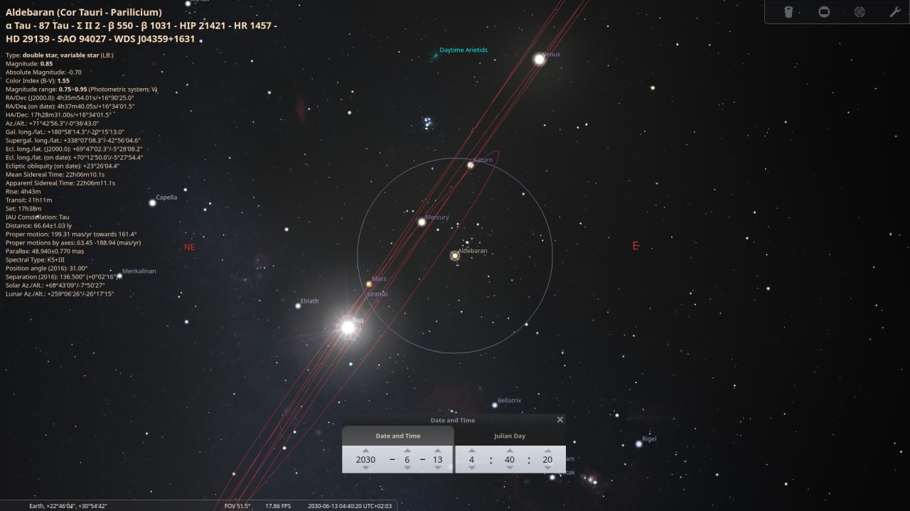
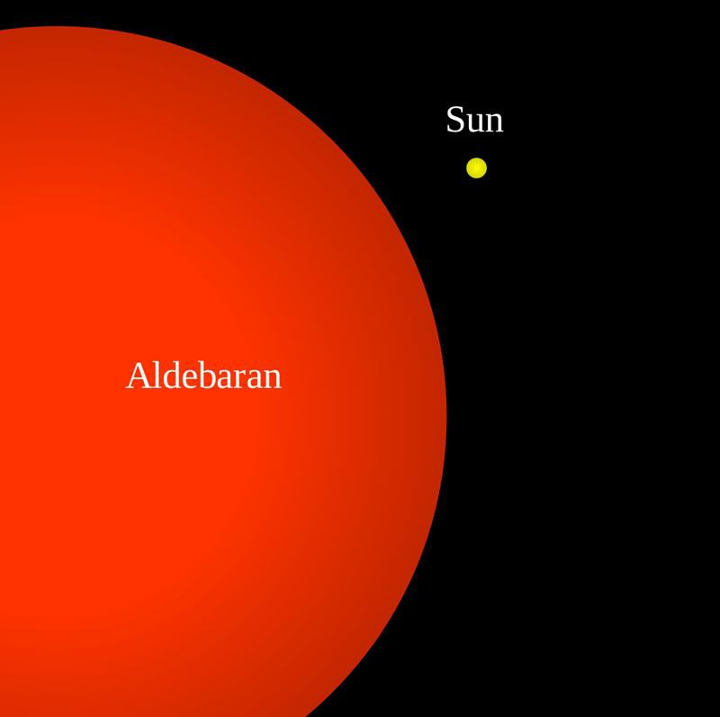
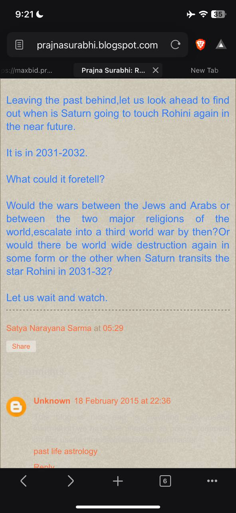

# Indian Astrology

## Aldebaran and Saturn/Mars 2030 Alignment

On Aldebaran's alignment with Saturn/Mars, written in Indian texts as an omen of great catastrophe.

Within 20° of one another (circle) in mid June 2030 (as observed from Earth).



From an Earth perspective, they don't appear that close together again until mid-June 2060.




I was kind of hoping that this wasn't going to be at exactly the same time at the Landscheidt Minimum, the Taurids and Encke. Another hit.

Link for the whole article: https://arvind-bhagwath.medium.com/3000-bce-great-flood-and-r`````					ohini-sakata-bhedanam-406f8e810427

### Next one

Next Rohini Sekata Bhednam is around 2031-2032. Corresponds to the earth passing through the thick of the taurid stream sometime around June-July or November-December 2032

## Rohini 2060 Alignment

Cycle a few days either side of this 2060 alignment and I think you’ll find the triangle there. I remember seeing it.


Kataklysmos 2030. Ekpyrosis 2060? Starting to sound like a Crete revival party.

## Kali Yuga ends in 2025?

Btw the kaliyuga ends next year 2025 and what follows is a set of few hundred years of cleansing and right after that we move up into the next yuga

Check out Bibhu Dev Misra he has authored a book on yuga cycles which I recommend (Amazon). He posits that the long yuga cycle of 4.32 or something million years was an erroneous assumption by the priestly class who purposely misinterpreted and measured human years in Brahma year equivalents. Instead there is a provable repeat of cycles that corresponds with the precession of the equinox (25.7 k years) that measures one full complete circle of a whole yuga cycle. This corresponds with the ancient Greeks and ancient zoroasters who each had their cycles based on 3000 years of a certain age (3k year golden age followed by the same for silver and bronze and then iron…). The math and record of cycles works. 

Every 2700-3k year there is an event that changes civilization into a new form. Then every ~6k years or so there is a civilization reset and then ~9k years and then ~12k years for a bigger reset. 

I’m summarising but what he wrote is very interesting.

## Aldebaran 2031-32 Alignment

Here you go..a blog site of another astrologer mentioning the time period of Aldebaran To Saturn/Mars opposition



