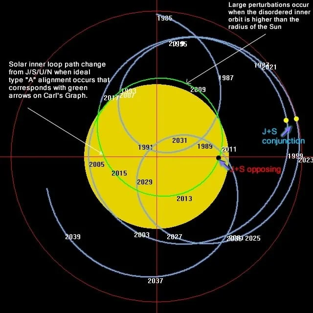

# SSB [1]

## Correlation with sunspot activity

Interestingly, the SSB movements of the Sun seem to be correlated with solar activity. When the Sun is on a wide arc around the SSB, that's when it has a heightened period of solar activity, and when it's a tight arc, there is low solar activity.

## Citations

1. Craig Stone