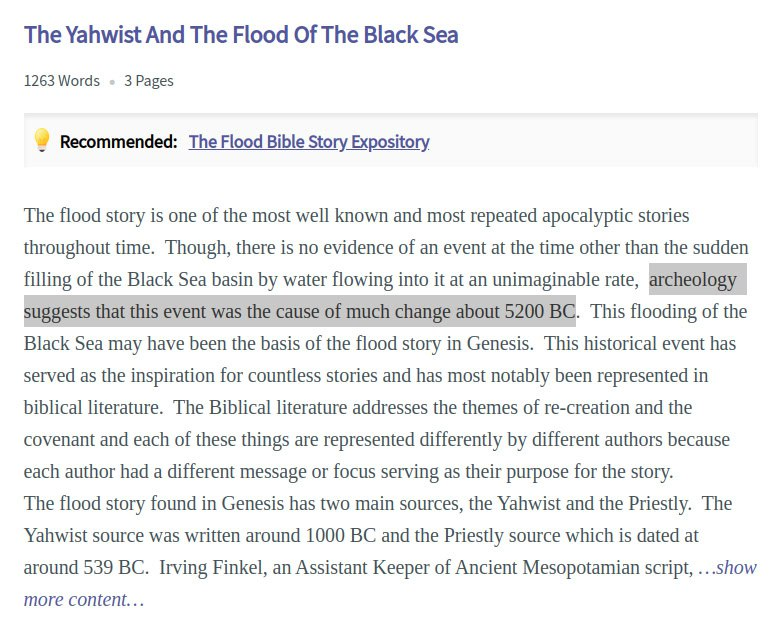
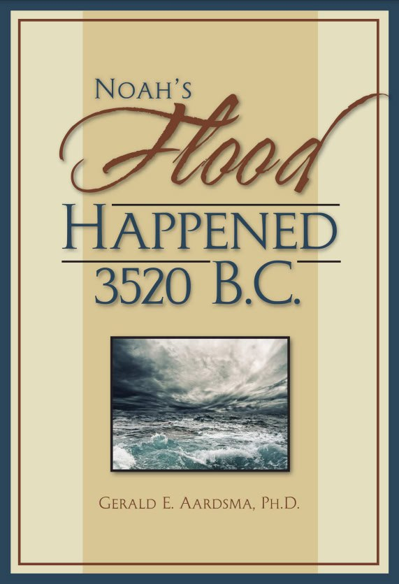

# Bible Myths

Are any past ECDO events recorded in the Bible?

## Chan - 3 cataclysms?

Chan believe there are 3 cataclysms recorded in the Bible: *"Did you understand that there are three cataclysms recorded in the Bible? Noah’s, Adam and Eve’s, and the one before that? If you missed it, check Genesis II."* [2]

See `LITERATURE-MEDIA/chan-thomas`.

## Noaic deluge (Book of Genesis)

### Research paper: 3500 - 3000 BC

See the research paper PDF `Noahs_Flood_WTJ2004_1.pdf` in `hard-copies/` for a very comprehensive source on dating this flood.

### 5200 BC?

https://www.123helpme.com/essay/The-Yahwist-And-The-Flood-Of-The-4C0E4F9453D8E980

The duration of the flood is not clear; 40 days or 150 days depending on the account. [1]

### Noah's Flood investigative book: 3520 BC

https://www.biblicalchronologist.org/products/Noah%27s_Flood_Happened_3520_BC.PDF

### Genesi 7:11

When Noah was 600 years old, on the seventeenth day of the second month, all the underground waters erupted from the earth, and the rain fell in mighty torrents from the sky.

## Uriel's Machine Excerpt

## Adam and Eve Flood

The opening verses of the bible begin with:

"1) In the beginning God created the heavens and the earth. 2) Now the earth was formless and void, and darkness was over the surface of the deep. And the Spirit of God was hovering over the surface of the waters."

The second verse may refer to a cataclysm flood event.

## Isaiah 24

17Terror and the pit and the snared
are upon you, O inhabitant of the earth!
18He who flees at the sound of the terror
shall fall into the pit,
and he who climbs out of the pit
shall be caught in the snare.
For the windows of heaven are opened,
and the foundations of the earth tremble.
19The earth is utterly broken,
the earth is split apart,
the earth is violently shaken.
20The earth staggers like a drunken man;
it sways like a hut;
its transgression lies heavy upon it,
and it falls, and will not rise again.

## Two Bible Floods

Hard copy `TwoFloods_Web.pdf` in `hard-copies`.

## Masoretic vs Septuagint Dating Schemes

https://www.reddit.com/r/UsefulCharts/comments/14bqxtw/biblical_chronology_according_to_the_septuagint/

## Exodus

Could the Exodus out of Egypt and crossing of the red sea occurred during the 1700 BC event? May be the whole of Egypt was washed away just after the Israelites made it safely into Sinai?

Exodus is currently dated to between the 15th and 13th century BC, but even those dates are patchy. 

https://chatgpt.com/share/bde43e37-b063-4b41-8d7f-b25fcb751595

## Four Horsemen of Revelations [3]

I've been pondering the four horseman and that part of Revelation. Could they be representations of the ancient Sumerian gods - the planets? 

https://chatgpt.com/share/66e956f9-6ecc-8005-ac2b-61537acbd613

## Citations

1. https://en.wikipedia.org/wiki/Genesis_flood_narrative
2. https://nobulart.com/the-story-and-the-event/
3. [Craig Stone](https://nobulart.com)

# TODO

Look at:
- Worlds in Collision and Earth in Upheaval

Psalm 104: “The waters stood above the mountains... they go up by the mountains” and Psalm 107 “The waves mount up to the heaven.”

Combining astrology with certain Bible passages
- https://www.die2live.online/asteroid-child-and-the-great-sign-t-w-tramm/

Podcast discussing Noah's flood dating: https://www.biblicalchronologist.org/store/archives/BCM_April_2023.html