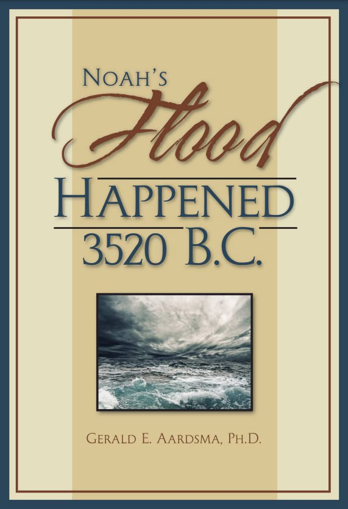
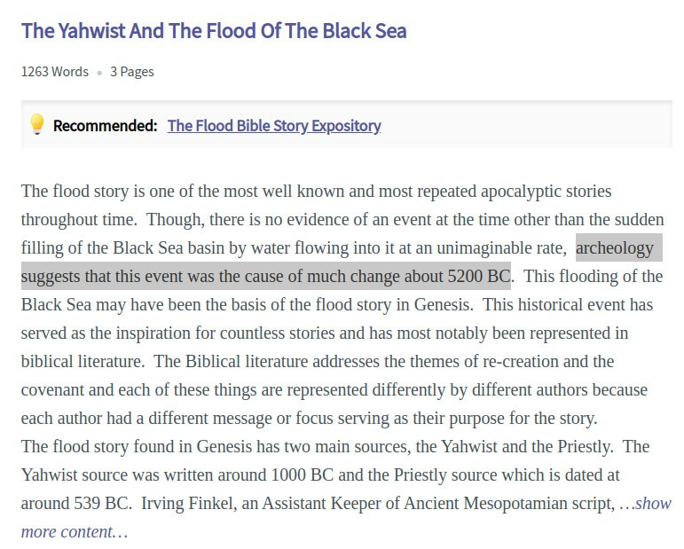

# Noahs Flood (Book of Genesis)

Two date ranges:
- around 3500 BC - 3000 BC
- around 5500 BC

## Research paper [1]: 3500 - 3000 BC

Conclusion of the paper: Suggests 3500 BC - 3000 BC, with hard caps of 4000 BC to 2300 BC.

Hard copy at `Noahs_Flood_WTJ2004_1.pdf` in `hard-copies/`.

## Noah's Flood investigative book: 3520 BC

https://www.biblicalchronologist.org/products/Noah%27s_Flood_Happened_3520_BC.PDF

## 5200 BC?

https://www.123helpme.com/essay/The-Yahwist-And-The-Flood-Of-The-4C0E4F9453D8E980

The duration of the flood is not clear; 40 days or 150 days depending on the account. [1]

## Genesi 7:11

When Noah was 600 years old, on the seventeenth day of the second month, all the underground waters erupted from the earth, and the rain fell in mighty torrents from the sky.

## Citations

1. https://www.academia.edu/7883319/_Noahs_Flood_WTJ2004_1_