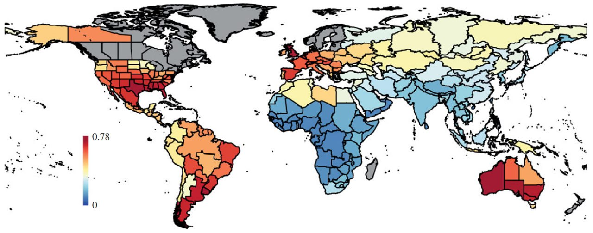
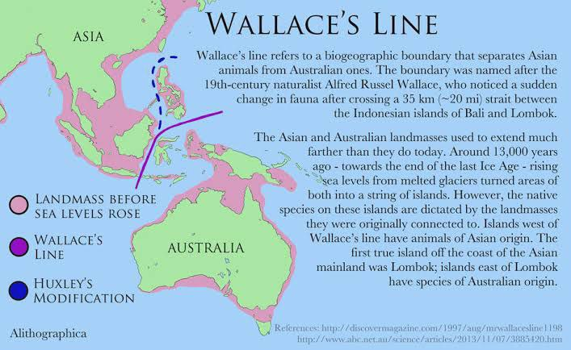
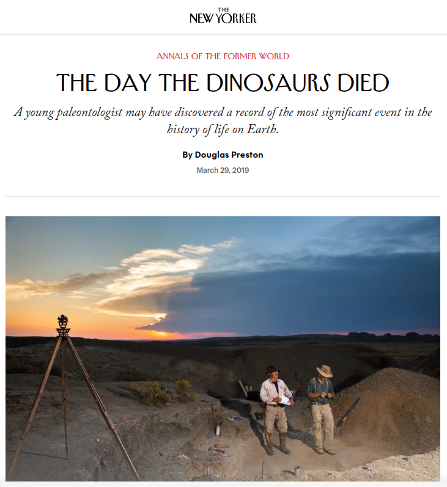

# Biology

## Contents

- `animal-plant-remains`: Remains of non-human living things, bio-floodmass.
- `tree-rings`: Tree rings!
- `biodiversity-hotspots`: Biodiversity hotspots.

Speculative:
- `soil-organic-matter`: Correlations between soil organic matter and ECDO locations.
- `penguins`: How did penguins survive ECDO events?
- `sunflowers`: Are sunflowers affected by ECDO events?

## Extinction Map

The paper this is drawn from stretches the possibilities of assumption in attributing all these extinctions to humans, but the map itself is drawn from an external database:
"The proportion of extinct large mammal species (more than or equal to 10 kg) in each country during the last 132 000 years, only counting extinctions earlier than 1000 years BP." 
[1] https://royalsocietypublishing.org/doi/epdf/10.1098/rspb.2013.3254

## Clam shell analysis - El Nino 3700 year history

"The seasonal variation 3700 years ago was slightly lower than that suggested by modern instrumental data, and the transition between warm and cold seasons was rapid. Higher amplitudes of reconstructed r-monthly and r-annual SST anomalies imply an enhanced climate variability during this warm period. Investigation of the El Ninõ–Southern Oscillation (ENSO) variation (based on the reconstructed SST series) indicates reduced ENSO frequency but increased ENSO-related variability and extreme El Ninõ winter events 3700 years ago."

https://annas-archive.org/scidb/10.5194/cp-16-597-2020

## Wallace's Line

A sea level rise from 13,000 years ago caused this, per the visual.

Q: Can this be explained by ECDO rather than the explanation they gave?

A: The timing agrees - a YD event. The explanation under ECDO is essentially the same. The only variation is the attributed cause - deglaciation vs rotation (which would also precipitate deglaciation in many places).

## The Wallace Line - The Invisible Wildlife Boundary

Alfred Russell Wallace, 1889

During his time in Indonesia, Wallace observed a peculiar division in animal life.

A clear and sudden change in the faunal content of Indonesia's many islands seemed to occur across an invisible border. Through analysis of the distribution of species, both by Wallace and other scientists, a line was drawn that illustrates this divide that splits Indonesia down the middle from north to south. It was named the Wallace Line by Thomas Henry Huxley in honour of its discoverer.

## South America extinction

"It is impossible to reflect on the changed state of the [South] American continent without the deepest astonishment. Formerly it must have swarmed with great monsters now we find mere pigmies, compared with the antecedent allied races. The greater number, if not all, of these extinct quadrupeds lived at a period and were the contemporaries of the existing sea-shells. Since they lived no very great change in the form of the land can have taken place. What, then, has exterminated so many species and whole genera? The mind at first is irresistibly hurried into the belief of some great catastrophe; but thus to destroy animals, both large and small, in Southern Patagonia, in Brazil, on the Cordillera of Peru, in North America, and up to Behring Straits, we must shake the entire frame-work of the globe."

https://en.wikipedia.org/wiki/Charles_Darwin

"It would seem, that one cause destroyed the terrestrial animals of South America, and that this cause is to be found in great dislocations of the ground caused by the upheaval of the Cordilleras. If not, it is difficult to conceive on the one hand the sudden and fortuitous destruction of the great animals which inhabited the American continents, and on the other the vast deposit of Pampan mud. I argue that this destruction was caused by an invasion of the continent by water, a view which is completely en rapport with the facts presented by the great Pampian deposit, which was clearly laid down by water. How otherwise can we account for this complete destruction and the homogeneous nature of the Pampas deposits containing bones?” - Alcide d'Orbigny

https://en.wikipedia.org/wiki/Alcide_d%27Orbigny

"In South America the pleistocene beds are developed on a very large scale. They cover the great plains of the Argentine Republic, in the form of a modified lehm or loess, to which the name of Pampas mud was given by Darwin and 'formation Pampeene' by D'Orbigny. In other places they exist in the form of beds of gravel and clay, and occasionally as beds of tufa. As in Europe and North America, we also meet with caverns of pleistocene age, many of which have been explored in Brazil by Lund, Clausen, Bravard, and Liais. The distribution of these beds is exceedingly widespread over South America. According to Burmeister, they are richest in organic remains in the province of Buenos Ayres, becoming less rich as we travel westward and northward. Eich deposits of this age have also been found in the Banda Oriental, at various points on the river Parana, and at Borrero in Patagonia. Burmeister says, the diluvial deposit containing bones of animals of this age extends over the whole Brazilian plain, from the flanks of the Cordilleras to the borders of the Atlantic.” They have also been found abundantly in Bolivia, on the great plateau ; and also west of the mountains, both in Peru aiid Chili. From Caracas in the north, to the sierra of I'audel in Pata-gonia in the south, they have, in fact, occurred in more or less abundance over the whole continent. In the great Argentine plain they are found close to the sea-level, while in Bolivia they occur, according to M.Orbigny, at a height of 4000 metres, and they are found with a singular similarity if not uniformity of contents in all latitudes.

That the surface beds of the Pampas and the deposits in the caves were synchronous, is admitted by all explorers. The same creatures are found in both, of course in different proportions, as is the case elsewhere. Nor is there any doubt that both sets of beds date from the same horizon as the Mammoth beds of other countries. The fauna of the pleistocene beds of the Southern States of North America is, in fact, largely identical with that from the beds we are now discussing ; the megatherium and mylodon, the tapir and capybara, the mastodon and horse, &c., &c., being found in both, and every observer, from Darwin to Burmeister, is agreed in assigning them to the same horizon." - The Mammoth and the Flood, Henry Howorth (1887)

[1] https://archive.org/details/in.ernet.dli.2015.220742

## Diseases and sunspot correlation

can see dengue fever at the start of that chart at solar max

## Excellent article published in the...

Excellent article published in the New Yorker in 2019 detailing the findings, implications and story behind the DePalma Chicxulub paper. Plenty of stunning photos of their findings. https://t.co/rh3zGx86Me https://t.co/llKM2yWaGe https://t.co/isqhWpfQMK

