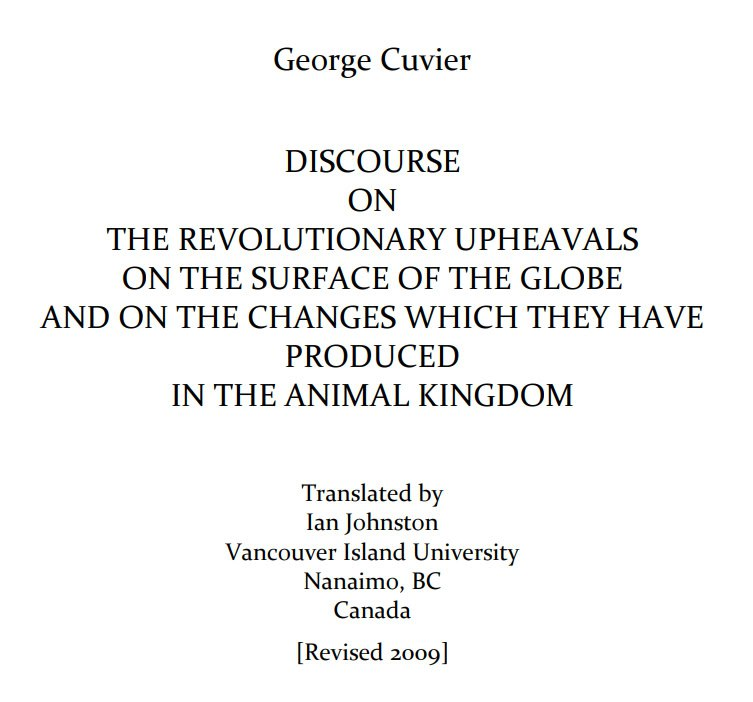

# Animal Remains

This folder is to document old animal remains that can give us clues about how they might have died.

Check `img/` for many records.

## Alaska Frozen Mosquito

Dig at the remains of a sunken prehistoric tropical lake community between Nome and Kotzebue, Alaska. While digging, an archaelogist unearthed a mosquito that flew away after thawing. In order for a mosquito to be revived after being frozen, its freezing would have to be followed by a sharp and permanent drop in temperature. Normal freezing would have caused ice crystals to grow within the creature, rupturing the membranes. So it was freezing in a sudden deep freezing.

Source: https://nobulart.com/the-flip-of-the-earth/

## East Yorkshire Bio-floodmass

Potential for the boulder clay to be deposited not by melting glaciers, but a deluge that buried the old coastline. This is a picture from a book a local geography teacher.

Note on this one that at the base of the buried cliff are bones of hippopotamus, rhinoceros and hyena. These were either deposited by ice sheets our buried there after a production of the lion king. Or smashed by a deluge in the not too distant past.

## Book about deluge

Reliquoæ Diluvianæ (1823)
A 380 page record of an historic deluge, overflowing with findings of numerous species of fauna which had no explicable reason to be found together, scattered across Britain and Europe, buried in layers of 'diluvium' (a term coined by Buckland).
https:// (https://t.co/K4GQDGqcHv)iiif.wellcomecollection.org/pdf/b2201729x (https://t.co/K4GQDGqcHv)

## Cuvier Books

In `LITERATURE-MEDIA/cuvier` you can find the PDFs of several Georges Cuvier's books, from which the following quotes are from.

"By closely examining what has happened to the surface of the earth since it has become dry land for the last time and the continents have taken on their present shape, at least in their somewhat elevated areas, we see clearly that this last revolution and consequently the establishment of our present societies could not be very old. It is one of the most firmly established results and, at the same time, the least attended to in legitimate geology, a result even more valuable because it links up natural and civil history in an uninterrupted chain." - Georges Cuvier, Discourse (1819)

"If we examine with even greater care the remains of these organic creatures, we come to discover in the middle of the marine strata, even the most ancient ones, layers full of animal or vegetable products from land and fresh water. In the most recent layers (i.e., the ones closest to the surface) there are some where land animals are buried under masses of marine creatures. Thus, not only did the different catastrophes which moved the layers gradually make the various parts of our continent rise up from the bosom of the waves and reduce the size of the sea basin, but this basin has been shifted in several directions.

But it is also really important to note that these irruptions and these repeated retreats were not all slow and did not all take place gradually. On the contrary, most of the disasters which brought them on have been sudden. That is especially easy to demonstrate for the last of these catastrophes, which by a double movement inundated and later left dry our present continents or, at least, a great part of the land which forms them today."

https://web.viu.ca/johnstoi/cuvier/cuvierweb.pdf

## 6 forests stacked vertically

In coal mines of Illinois, Indiana, and Kentucky, there are massive fossil forests stacked on top of each other.

https://youtube.com/watch?v=Hrxfq8V6itQ&si=wAszW-e3F2naUp5y

## Falkland Islands Preserved Plants

"Excavators at the site of a new care home in Stanley had cut into a deep peat layer which was filled with large tree trunks and branches. "These were so well preserved, they looked like they'd been buried the day before, but they were in fact extremely old. Our interest was immediately piqued, as finding tree remains here was baffling." For at least thousands, probably millions of years, the Falkland Islands have not been able to sustain trees."

The trees in the Falklands were buried in peat 6m down - a later dating to around 20-30 million years ago. The species and pollen identification matches the period. No C14 date could be obtained so >50ka.

https://www.cambridge.org/core/services/aop-cambridge-core/content/view/B4CFF913DD8F1BB43B570E4086C7CF7B/S0954102024000129a.pdf/evidence-for-a-floristically-diverse-rainforest-on-the-falkland-archipelago-in-the-remote-south-atlantic-during-the-mid-to-late-cenozoic.pdf

https://www.msn.com/en-gb/travel/news/scientists-make-startling-discovery-about-the-falkland-islands-so-well-preserved/ar-AA1qPGn8?ocid=winp2fptaskbarhoverent&cvid=fe8e8c549e754f64cc3cdcc48092a1ca&ei=4

## Citations

1. [Craig Stone](https://nobulart.com)