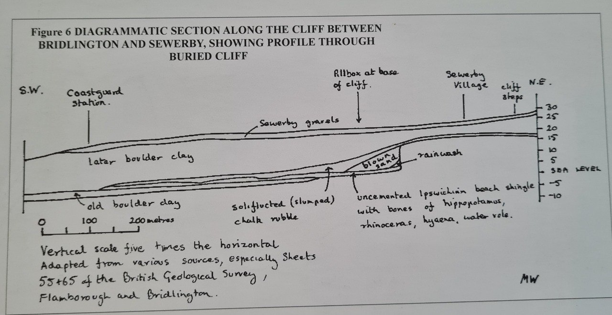
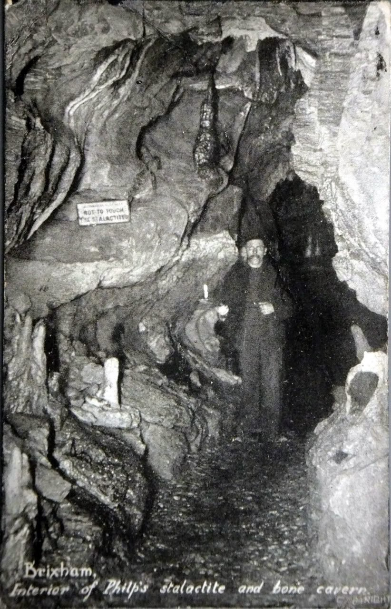

# Animal Remains

This folder is to document old animal remains that can give us clues about how they might have died.

Check `img/` for many records.

## Alaska Frozen Mosquito

Dig at the remains of a sunken prehistoric tropical lake community between Nome and Kotzebue, Alaska. While digging, an archaelogist unearthed a mosquito that flew away after thawing. In order for a mosquito to be revived after being frozen, its freezing would have to be followed by a sharp and permanent drop in temperature. Normal freezing would have caused ice crystals to grow within the creature, rupturing the membranes. So it was freezing in a sudden deep freezing.

Source: https://nobulart.com/the-flip-of-the-earth/

## East Yorkshire Bio-floodmass

Potential for the boulder clay to be deposited not by melting glaciers, but a deluge that buried the old coastline. This is a picture from a book a local geography teacher.

Note on this one that at the base of the buried cliff are bones of hippopotamus, rhinoceros and hyena. These were either deposited by ice sheets our buried there after a production of the lion king. Or smashed by a deluge in the not too distant past.

## Book about deluge

Reliquoæ Diluvianæ (1823)
A 380 page record of an historic deluge, overflowing with findings of numerous species of fauna which had no explicable reason to be found together, scattered across Britain and Europe, buried in layers of 'diluvium' (a term coined by Buckland).
https:// (https://t.co/K4GQDGqcHv)iiif.wellcomecollection.org/pdf/b2201729x (https://t.co/K4GQDGqcHv)

### A selection of plates from...

A selection of plates from Reliquoæ Diluvianæ providing context and scale for some of the caves in which these animals and other debris were found. https://t.co/PAhoBi7UP0

## Cuvier Books

In `LITERATURE-MEDIA/cuvier` you can find the PDFs of several Georges Cuvier's books, from which the following quotes are from.

"By closely examining what has happened to the surface of the earth since it has become dry land for the last time and the continents have taken on their present shape, at least in their somewhat elevated areas, we see clearly that this last revolution and consequently the establishment of our present societies could not be very old. It is one of the most firmly established results and, at the same time, the least attended to in legitimate geology, a result even more valuable because it links up natural and civil history in an uninterrupted chain." - Georges Cuvier, Discourse (1819)

"If we examine with even greater care the remains of these organic creatures, we come to discover in the middle of the marine strata, even the most ancient ones, layers full of animal or vegetable products from land and fresh water. In the most recent layers (i.e., the ones closest to the surface) there are some where land animals are buried under masses of marine creatures. Thus, not only did the different catastrophes which moved the layers gradually make the various parts of our continent rise up from the bosom of the waves and reduce the size of the sea basin, but this basin has been shifted in several directions.

But it is also really important to note that these irruptions and these repeated retreats were not all slow and did not all take place gradually. On the contrary, most of the disasters which brought them on have been sudden. That is especially easy to demonstrate for the last of these catastrophes, which by a double movement inundated and later left dry our present continents or, at least, a great part of the land which forms them today."

https://web.viu.ca/johnstoi/cuvier/cuvierweb.pdf

## 6 forests stacked vertically

In coal mines of Illinois, Indiana, and Kentucky, there are massive fossil forests stacked on top of each other.

https://youtube.com/watch?v=Hrxfq8V6itQ&si=wAszW-e3F2naUp5y

## Falkland Islands Preserved Plants

"Excavators at the site of a new care home in Stanley had cut into a deep peat layer which was filled with large tree trunks and branches. "These were so well preserved, they looked like they'd been buried the day before, but they were in fact extremely old. Our interest was immediately piqued, as finding tree remains here was baffling." For at least thousands, probably millions of years, the Falkland Islands have not been able to sustain trees."

The trees in the Falklands were buried in peat 6m down - a later dating to around 20-30 million years ago. The species and pollen identification matches the period. No C14 date could be obtained so >50ka.

https://www.cambridge.org/core/services/aop-cambridge-core/content/view/B4CFF913DD8F1BB43B570E4086C7CF7B/S0954102024000129a.pdf/evidence-for-a-floristically-diverse-rainforest-on-the-falkland-archipelago-in-the-remote-south-atlantic-during-the-mid-to-late-cenozoic.pdf

https://www.msn.com/en-gb/travel/news/scientists-make-startling-discovery-about-the-falkland-islands-so-well-preserved/ar-AA1qPGn8?ocid=winp2fptaskbarhoverent&cvid=fe8e8c549e754f64cc3cdcc48092a1ca&ei=4

## Egypt Animal Remains

Animal bones of unknown age (all dates stated are pure guesswork) found in vitrified clay in Egypt. Turning clay to glass requires a lot of heat. 

[1] https://sci-hub.ru/10.1006/jasc.1996.0046

## Valdrøy, Norway

In the summer of 1993, Norwegian scientists Rolv Lie and Stein-Erik Lauritzen discovered more than 7,000 bones of mammals, birds and fish in a cave on the island of Valdrøy, Norway, 250 km north of the Arctic Circle, dating to at least 30,000 years ago. Geologists believe the region was covered by an ice cap from 80,000 to 10,000 years ago. How did these animals get here?

62°30'45.41" N   6°07'07.55" E (https://maps.app.goo.gl/W8XooEh74VkVXSAD6)

[1] Cave stratigraphy in western Norway; multiple Weichselian glaciations and interstadial vertebrate fauna 
https://sci-hub.ru/10.1111/j.1502-3885.1987.tb00096.x

## Windmill Hill Cave (paper here)

Such a pity that this is now closed to the public. The trashcan alley is the access.

"Windmill Hill Cavern (also called Windmill Hill Cave, the Brixham Cave, Brixham Bone Cavern and Philp's Cave) is a limestone cave system in the town of Brixham, Devon. It was discovered in 1858 and later excavated by a team led by the geologist William Pengelly, who found proof that humans co-existed with extinct British fauna.

After studying the flint artifacts at the Somme River Valley's gravel terraces, the more sceptical members of Pengelly's team, such as Joseph Prestwich, found the proof that they sought that humans and extinct British animals had once lived amongst each other. Remains of animals found in the cave included those of extinct species such as aurochs and woolly mammoth, as well as still extant taxa now absent from Europe, such as the spotted hyena."

[1] https://en.wikipedia.org/wiki/Windmill_Hill_Cavern

## San Ciro, the Cave of the Giants

"There are several caves in the limestone escarpment a little above the line of junction with the Pliocene plain, but the one which most particularly claims attention, from the extraordinary quantity of Hippopotamus bones found in connection with it, is that of San Ciro, or Mardolce, situated about 2 miles to the south-east of Palermo, at the foot of Monte Grifone."

"This cave is 130 feet long,  10 feet wide at the entrance, 30 feet in centre, and 21 feet high, measured from the surface of the cave deposits. It is situated near the base of the escarpment, with ground sloping from its entrance down to the church of San Ciro, a distance of 266 feet (see fig. 19). But the breccia extends apparently beyond this. 

When first discovered many hundred quintals of bones were dug out by the peasants. According to Scina the breccia was crammed with bones, so fresh that they were cut into ornaments and polished, and that when burnt they gave out ammoniacal vapours. The quantity, however, was so great, that when afterwards exploited for commercial purposes, 20 tons were shipped in the first six months to Marseilles and England, where it is said they were used for the manufacture of lamp black; if this were the case they could have lost very little of their animal matter. The bones were mostly those of Hippopotomi, with a few only of Deer, Ox and Elephant. In a weight of nearly 1.5 tons, all except six were bones of two species of Hippopotamus; amongst them were 300 astragali of that animal. Scina also collected 76 astragali for the Museum of Palermo, together with 14 jaws with teeth, besides numerous single teeth, and specimens of almost all the bones of the body belonging to animals of all ages down to the foetus. 

With respect to the position and condition of the bones, the evidence is conflicting. Scina says that the bones were without order, and those of the different animals were mixed together, that they were broken, shattered, and dispersed in fragments. Speaking of the Elephant remains, he remarks that no entire tusks were found, and that the fangs of the teeth and epiphyses of the vertebrae were gone, whilst some of the bones were so reduced by wear as to be scarcely recognisable. Two teeth of Elephant had been worn down to the state of pebbles. It is evident, however, that these are the exceptions; they may have been derived from the old beach- or cave-beds. Christie merely says that the breccia contains “a prodigious number of fragments of bones with some rolled pieces and blocks of limestone.” Dr. Falconer makes no allusion to the wear of the bones, and the specimens deposited in the College of Surgeons have neither been worn or gnawed. Speaking also of the analogous breccia at the Grotta di Maccagnone, he says that the bones’ were all broken and splintered, and that none of them bore marks of gnawing." - On the evidences of a submergence of Western Europe, and of the Mediterranean coasts, at the close of the glacial or so-called post-glacial period, and immediately preceding the neolithic or recent period, Joseph Prestwich (1893)

This is one of thousands of ossiferous cave and crag deposits such as those first documented by Buckland in Reliquae Diluvianae (1823)[4].

1. https://royalsocietypublishing.org/doi/10.1098/rsta.1893.0018
2. https://archivioepensamenti.blogspot.com/2017/05/gli-archi-di-san-ciro-e-i-giganti-di.html
3. https://lasiciliainrete.it/en/directory-tangibili/listing/grotta-di-s-ciro-o-dei-giganti/
4. https://x.com/nobulart/status/1806360882294804633

ECDO[1] moment of inertia (red line) relative to San Ciro. These deposits may have occurred as a result of direct inundation during S1>S2, or via returning seiche after an S2>S1. Maybe both.

https://x.com/nobulart/status/1821461418257862701

A submergence map from this paper.

## Antarctica petrified forest

https://youtu.be/rRug4jRg0k0?si=VYgwY9EjStuEX9zC

## Kolyma River (Gulag Archipelago, Solzhenitsyn)

## Dogger Bank (excerpt from Submerged Forests, 1913)

"In the middle of the North Sea lies the extensive shoal known as the Dogger Bank, about 60 or 70 miles from the nearest land. This shoal forms a wide irregular plateau having an area nearly as big as Denmark. Over it for the most part the sea has a depth of only 50 or 60 feet; all round its edge it slopes somewhat abruptly into deeper water, about 150 feet in the south, east, and west, but much deeper on the north. 

This peculiar bank has been explained as an eastward submerged continuation of the Oolite escarpment of Yorkshire; or, alternatively, as a mere shoal accumulated through the effects of some tidal eddy; but neither of these explanations will hold, for Oolitic rocks do not occur there, and the bank has a core quite unlike the sand of the North Sea. 

When trawlers first visited the Dogger Bank its surface seems to have been strewn with large bones of land animals and loose masses of peat, known to the fishermen as “moorlog,” and there were also many erratic blocks in the neighbourhood. As all this refuse did much damage to the trawls, and bruised the fish, the erratics and bones were thrown into deeper water, and the large cakes of moorlog were broken in pieces. A few of the erratics and some of the bones were however brought to Yarmouth as curiosities. Now the whole surface of the Dogger Bank has been gone over again and again by the trawlers, and very few of the fossil bones are found; unfortunately no record seems to have been kept as to the exact place where these bones were trawled. 

The species found were:

- Ursus (bear)
- Bison priscus (bison)
- Canis lupus (wolf)
- Equus caballus (horse)
- Hyaena spelaea (hyaena)
- Rhinoceros tichorhinus (rhinoceros)
- Cervus megaceros (Irish elk)
- Cervus tarandus (reindeer)
- Elephas primigenius (mammoth)
- Cervus elaphus (red-deer) 
- Castor fiber (beaver)
- Trichechus rosmarus (walrus)
- Bos primigenius (wild ox)."

[1] Submerged Forests, Clement Reid (1913) https://archive.org/details/submergedforests00reid

Very interesting, had to see some visuals. Searched up this: https://m.youtube.com/watch?v=ieblA-Vf0mo

## "...torn &amp; twisted as though...

"...torn &amp; twisted as though by a cosmic hand in a godly rage... the Alaskan muck blanket is packed with animal bones &amp; debris in trainloads . Mammoth, mastodon, bison, horses, wolves, bears, lions &amp; fauna in the middle of some cataclysmic catastrophe." https://t.co/TxAwBTxutR https://t.co/RUhi8JIJgF

## Citations

1. [Craig Stone](https://nobulart.com)