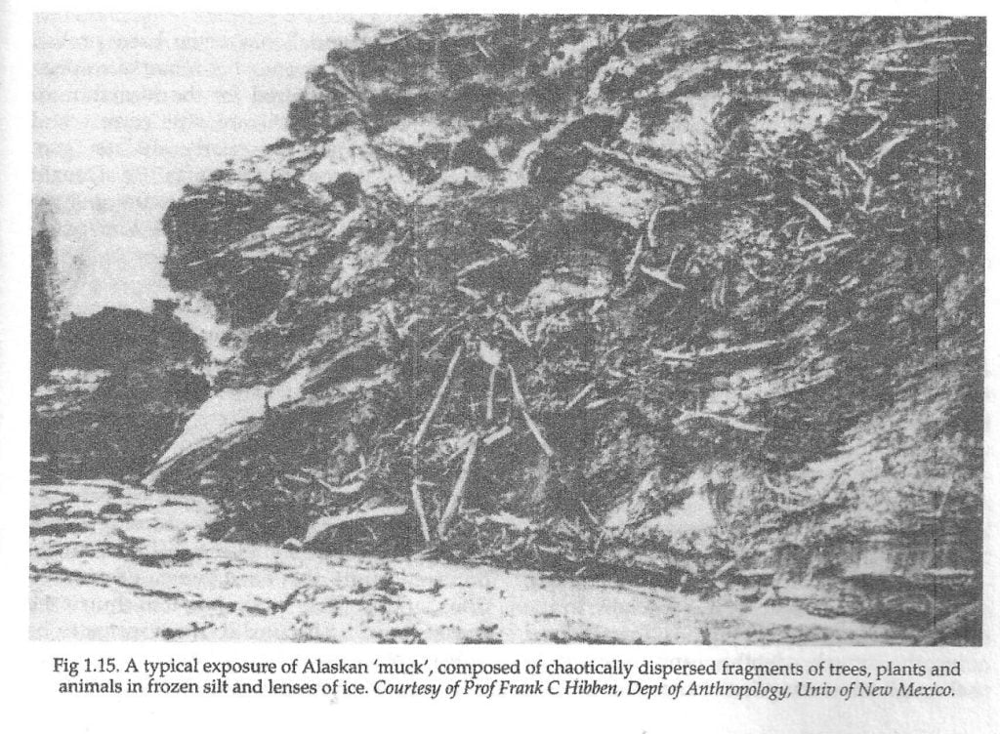
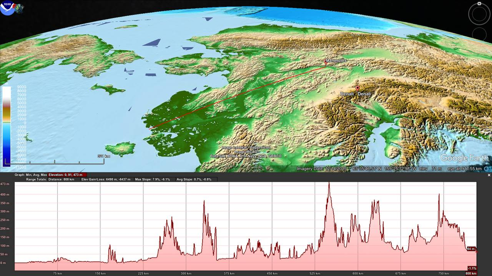
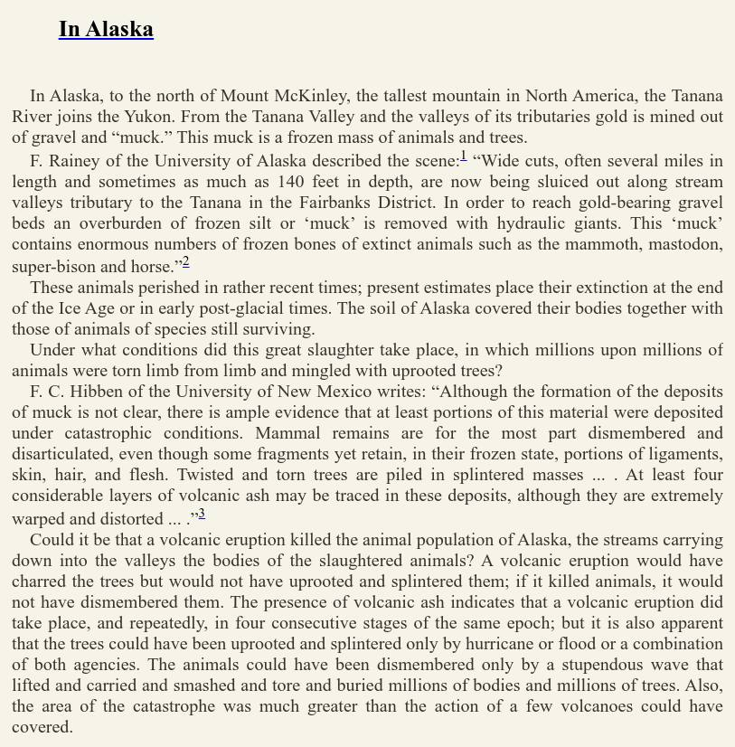
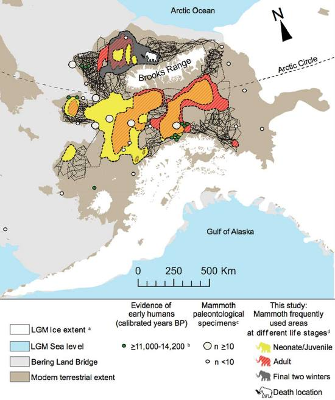
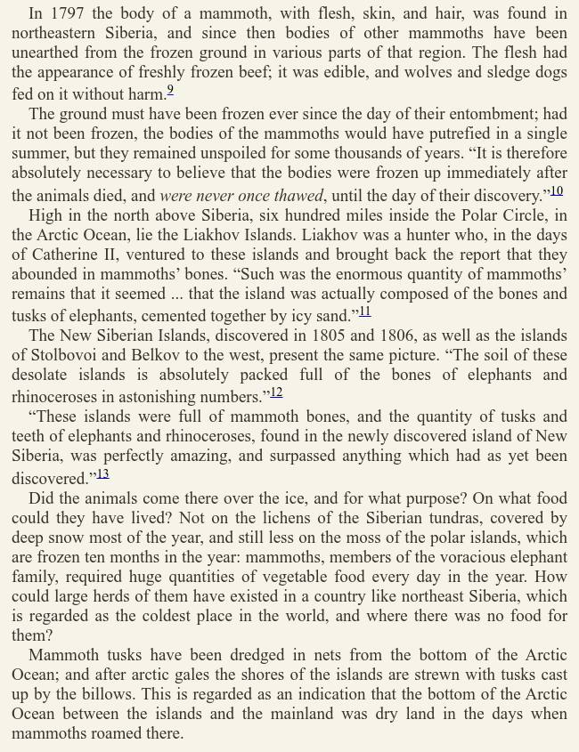
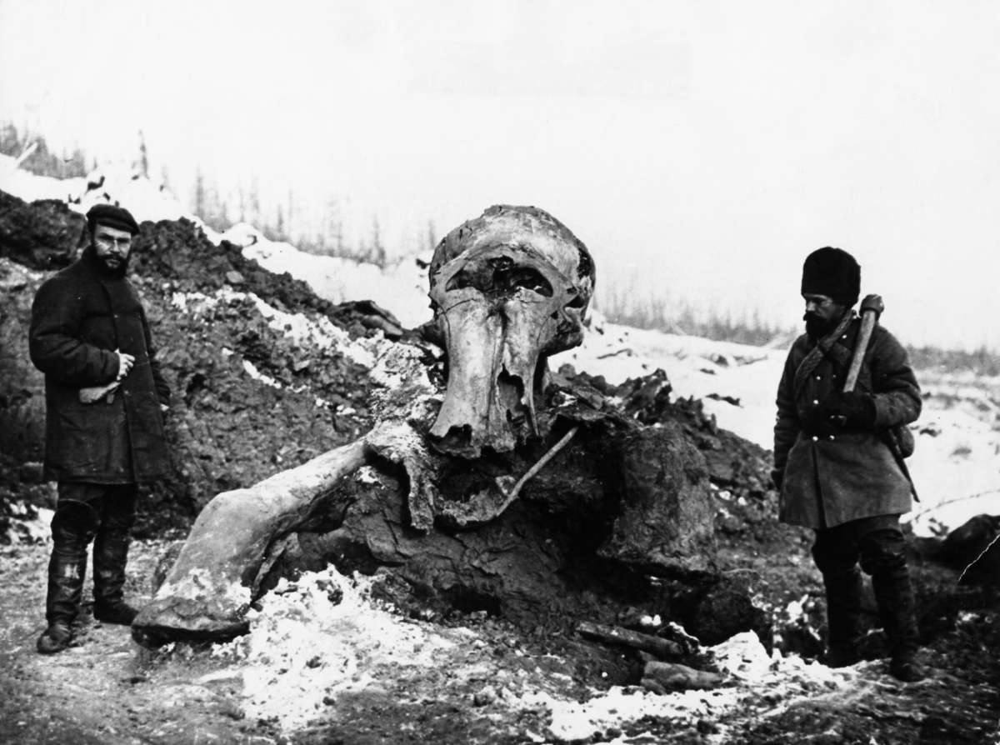
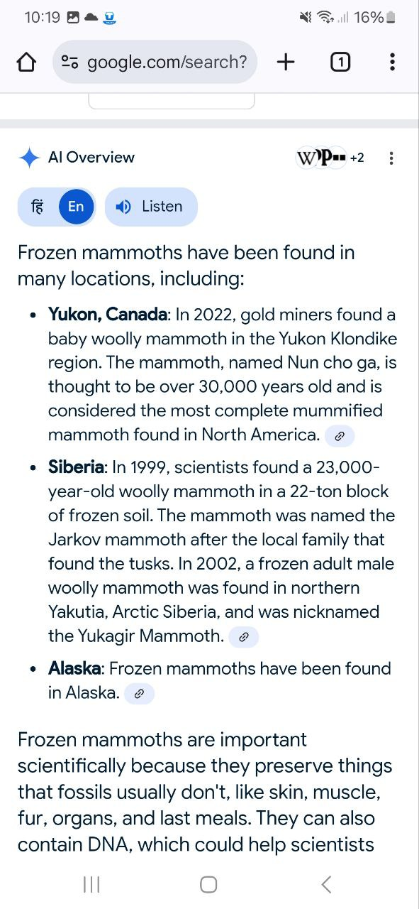
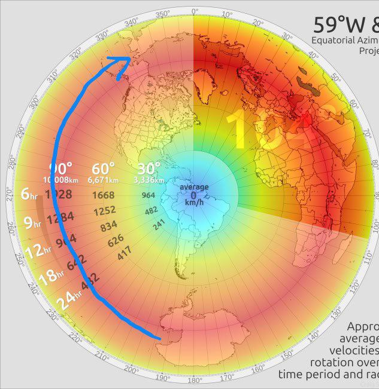

# Mammoths

These things went extinct apparently 4000 years ago, around 2000 BC.

"The last woolly mammoths in mainland Siberia became extinct around 10,000 years ago, during the early Holocene.[50] The final extinction of mainland woolly mammoths may have been driven by human hunting.[49] Relict populations survived on Saint Paul island in the Bering Strait until around 5,600 years ago, with their extinction likely due to the degradation of freshwater sources,[51] and on Wrangel Island off the coast of Northeast Siberia until around 4,000 years ago.[50]" [1]

## Chan Thomas, Cataclysms Revisited

Excellent excerpt from Chan Thomas' book.

https://nobulart.com/cataclysms-revisited/

## Effie: Fairbanks Mammoth 1948, 21,000 years old

Mining team uncovered the frozen remains of a young mammoth in Fairbanks. Lush vegetation in its mouth showed that the animal died during the growing season in an apparently warm climate.

Secondly the animal had been frozen immediately after death, since its flesh was said to be edible.

So a mammoth foraging in the summertime was almost instantaneously frozen and remained so for 20 millenia.

Source:
- https://nobulart.com/the-flip-of-the-earth/
- https://www.amnh.org/exhibitions/permanent/advanced-mammals/mammoth

## Lyuba: 42,000 year old perfectly frozen mammoth

"In 2007, a reindeer herder in Siberia found the body of a baby woolly mammoth that had been washed out from the permafrost along the Yuribei River. Frozen for more than 40,000 years, she was in nearly perfect shape — skin and internal organs intact, taste buds on her tongue, last meal in her stomach."

https://online.kidsdiscover.com/quickread/rare-baby-mammoth-emerges-from-permafrost-intact

## Mammoths with genetic mutations 3700 years ago

It's not clear that the mutations suddenly occurred. But comparing these mammoths with much older specimens revealed genetic differences.

"About 3700 years ago, as Mesopotamian poets were composing the "Epic of Gilgamesh," the last woolly mammoths on Earth were making their last stand on a remote Arctic island. A terminal colony persisted on tiny Wrangel Island north of the Siberian mainland thousands of years after the rest of its kind had disappeared. Now, a new study reveals the mammoths' horrific final days: A series of harmful genetic mutations appears to have led to what authors call a "genomic meltdown" in the population."

"Hoping to learn more about the last lonely days of the Wrangel Island mammoths, bioinformatics researcher Rebekah Rogers of the University of North Carolina in Charlotte and biologist Montgomery Slatkin of the University of California (UC), Berkeley, compared the complete DNA sequence from a 4300-year-old mammoth bone found on Wrangel Island with that of a 45,000-year-old specimen that lived on the Siberian mainland."

"It is unlikely that any single mutation doomed the Wrangel mammoths—it still isn't clear exactly what led to their eventual extinction. Rather, their deteriorating genetics would have made it difficult for them to adapt to new social and environmental conditions, Rogers says. Shapiro sees it as a lesson for modern populations that are dwindling and isolated. "By the end, the Wrangel Island mammoths were genetically screwed. Understanding how that happened might help us figure out which species today are most at risk of the same thing happening.""

https://www.science.org/content/article/last-lonely-woolly-mammoths-faced-genomic-meltdown

## Frozen Mammoth

Viable DNA from the last cataclysm?

https://www.livescience.com/animals/extinct-species/siberian-gold-miners-accidentally-find-ancient-woolly-rhino-mummy-with-horn-and-soft-tissues-still-intact

That was Chan proposed mechanism - flash frozen due to supersonic wind speeds and water due to the rotation.

## The Mammoth and the Flood

[1] https://archive.org/details/in.ernet.dli.2015.220742 (500 pages)

From the preface to The Mammoth and the Flood.

"In making an appeal to my reader therefore, I would ask them to ignore metaphysics and its pernicious a priori theories and to accompany me to the facts. These facts, I claim, prove several conclusions. 

They prove in the first place that a very great cataclysm or catastrophe occurred at the close of the Mammoth period, by which that animal, with its companions, were overwhelmed over a very large part of the Earth’s surface.

Secondly, that this catastrophe involved a widespread flood of water, which not only killed the animals, but also buried them under continuous beds of loam or
gravel. 

Thirdly, that the same catastrophe was accompanied by a very great and sudden change of climate in Siberia, by which the animals which had previously lived in fairly temperate conditions were frozen in their flesh under the ground and have remained frozen ever since.

Fourthly, that this catastrophe took place when man was already occupying the earth, and constitutes the gap which is almost universally admitted to exist between so-called paleolithic and neolithic man.

Fifthly, that this catastrophe is in all probability the same one pointed out in the traditions of so many races as the primeval flood from which their legendary
history begins. 

Sixthly, that while this flood was exceedingly widespread, considerable areas escaped, and from these insular areas man, animals, and plants spread out again and reoccupied those districts which had been desolated. 

Wherever we turn in the temperate regions of the world we seem to be on the track of this great catastrophe, which swept away the greater part of an ancient fauna, and which especially destroyed the larger and more unwieldy animals, allowing the smaller ones alone to escape, and which forms a great dividing line in the recent biological history of Australia as well as Europe, of Siberia as well as America. This vast effort seems from inexorable evidence to have been due to the exertion of some cataclysmic force by which the Earth’s crust was greatly disturbed, not merely locally, but over a large part of its surface.

It was in consequence of this dislocation that the loose watery envelope which covers a large portion of the world was set in motion, and sweeping over the land drowned and then buried deep in gravel, loam and clay, hecatombs of living beings, a vast cemetery of life, causing a deluge apparently unparalleled in extent and completeness in any other geological period; a catastrophe which may well claim therefore to bespoken of as “ the great flood.” For the manifold proof of this portion I must appeal to the following pages, and must ask those who are sceptical to at least do me the favour to read the evidence before pronouncing judgment on the conclusion."

## Alaskan Mammoths

1. 800 km inland, with intervening terrain of over 400m asl. 
2. Earth in Upheaval, Velikovsky (2009 ed.) 
3. TAES, Thomas (1963) 
4. ECDO-derived prediction for North America, State 1 to State 2.

## Siberian Mammoths

1. Siberia (ECDO, State 1 to State 2). Some Arctic Ocean inundation and severe winds.
2. https://canadiangeographic.ca/articles/a-mammoth-journey-how-scientists-traced-a-mammoths-migration/
3. Earth in Upheaval, Velikovsky (2009)
4. Siberian mammoth. TAES, Thomas (1963)

## ECDO continues to provide answers,...

ECDO continues to provide answers, everywhere I look. https://t.co/KGsBYh8aYG https://t.co/ffhzAIko5J

See img/1804438514429211112-7bpYSZkgeCeywLgC.mp4.

## Mammoth Frozen Theory

@junhoBTC frozen mammoths found in very close region. Is this sudden ice age like phenonmenon due to ecdo? And how exactly it happens

I am speculating the antartica winds during flip hits alsaka/siberia causing it to instantly freeze.
Note that antartica is coldest region in planet and also this region lies in red so fastest winds.

## Citations

1. https://en.wikipedia.org/wiki/Mammoth#Extinction

# TODO

Wrangel Island, St. Paul Island mammoths

Investigate youngest "flash frozen" mammoths