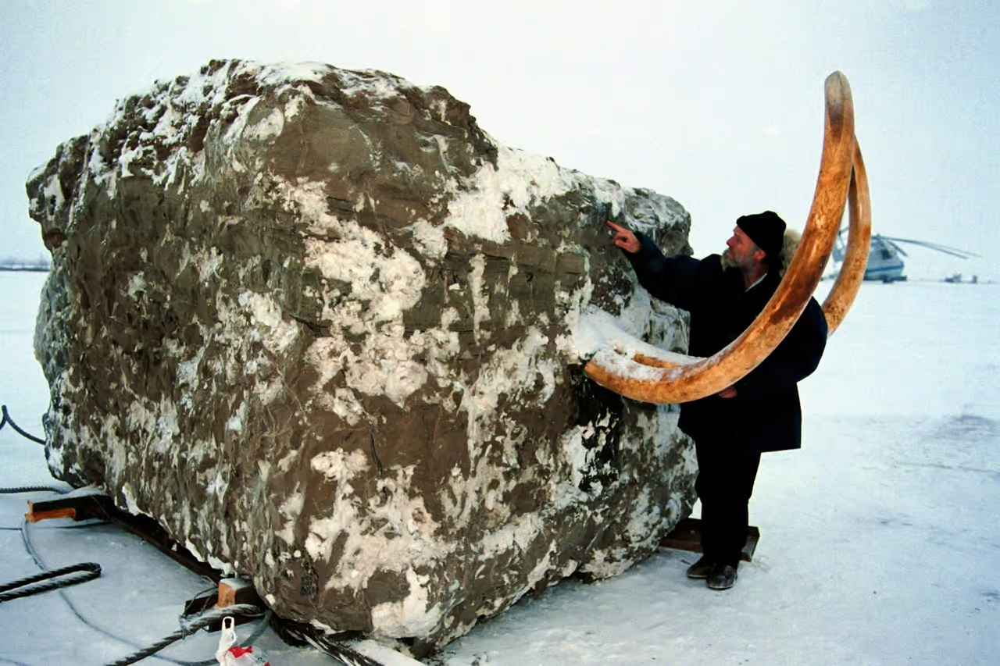

# Jarkov Mammoth

## Jarkov Mammoth

https://www.futura-sciences.com/planete/actualites/mammouth-chasseurs-science-jarkov-23-tonnes-mammouth-helicoptere-podcast-86692/

# GPT Translation: Chasseurs de Science: Jarkov, 23 Tons, a Mammoth by Helicopter - Podcast

In the 19th episode of *Chasseurs de Science*, we delve into a historic scientific expedition in Siberia to recover a mammoth preserved in permafrost for 20,000 years.

## The Mammoth’s History and Discovery

Mammoths, iconic creatures of prehistory, roamed Earth from 4 million to 15,000 years ago. The woolly mammoth (*Mammuthus primigenius*) is particularly well-known, with its fossils studied since the 18th century. This episode recounts an encounter with Jarkov, a woolly mammoth found by a Dolgan nomad. His remains, preserved in the Siberian permafrost, offered an unprecedented opportunity for scientific study.

The discovery took place in 1997, during the spring migration of a Dolgan family. The young family leader, Kostia Zharkov, noticed two large tusks emerging from the ground. Suspecting the mammoth’s body lay intact underground, he reported the find, triggering a remarkable expedition.

## The Mammuthus Expedition

Led by Yves Coppens, a paleoanthropologist, and Bertrand Buiges, head of the Polar Circle Expedition Association, the mission aimed to extract the mammoth in one piece. Rather than removing the animal itself, the team encased it within a large block of frozen earth to protect its remains from damage caused by thawing and re-freezing.

## A Herculean Undertaking

The expedition faced severe challenges, including Siberia's extreme cold (-40°C) and logistical obstacles. Over weeks, the team carved out a 3x2 meter block of frozen earth containing the mammoth. In October 1999, an MI-26 helicopter, among the most powerful in the world, transported the 23-ton block to Khatanga, despite its weight exceeding the helicopter’s capacity.

## Scientific Revelations

Jarkov's well-preserved remains have provided valuable insights. Tests revealed he was a 42-year-old male who died in a crevasse fall approximately 20,380 years ago. The freezing process protected his body from decomposition. Stored in a cold chamber at Khatanga, Jarkov remains available for further research.

## The Mammoth Revival Project

Jarkov’s discovery inspires ambitious scientific goals, such as Harvard’s "Woolly Mammoth Revival" project, which aims to use CRISPR-Cas technology to introduce mammoth DNA into Asian elephants. Although initially projected for 2019, no mammoths have yet emerged from the experiment.

## Final Note

This episode of *Chasseurs de Science*, narrated by Julie Kern, captures the remarkable story of Jarkov and the scientific feats required to preserve his legacy.
