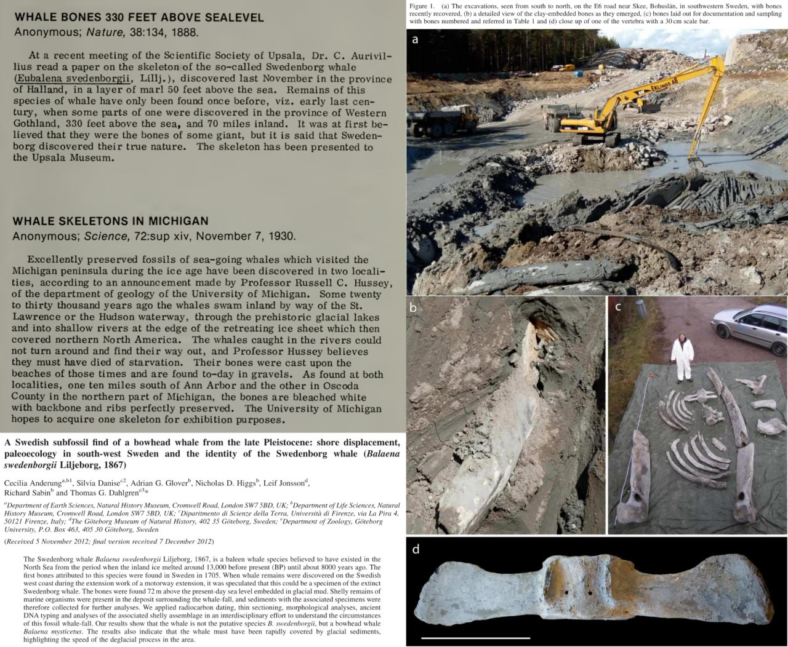
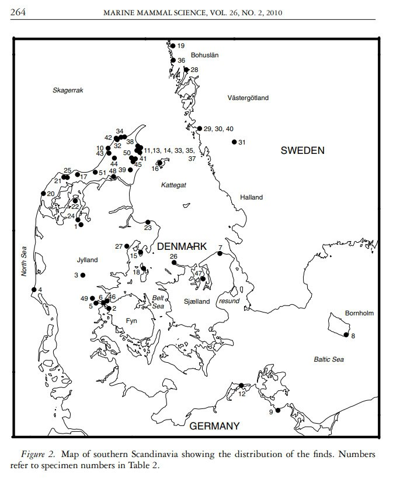
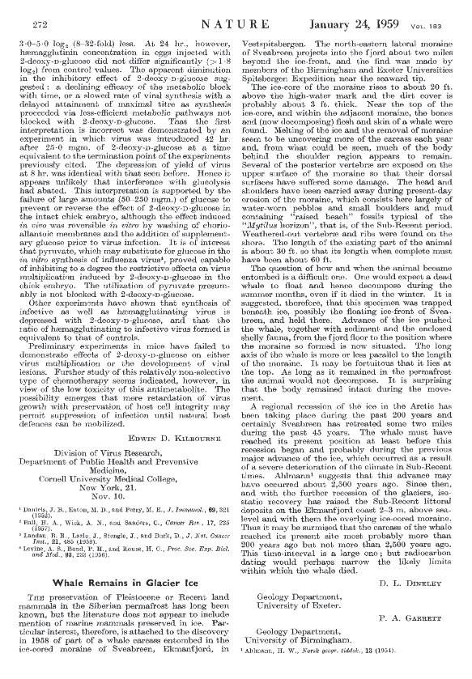
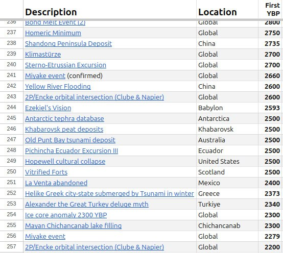

# Whales

## Mountain Whales (aka "erratic whales").

1. Earth in Upheaval, Velikovsky (1977)
2. https:// (https://t.co/siKpmHPJlG)creationconcept.info/michwls.html (https://t.co/siKpmHPJlG)
3. Elevation profile: Hudson Bay > Michigan Whales
4. ECDO answers. North America, State 2 to State 1

C14 testing came back with such ludicrously short ages for all samples that the assumption is that it must have been due to sample contamination.

Following the moment of inertia more precisely along the 31st meridian suggests that these errant whales may have been carried SW from the Labrador sea (S2 -> S1). Vast portions of this land exhibit significant striation parallel to the the predicted flow direction.

## Michigan whales

Mountain Whales (aka "erratic whales").
1. Earth in Upheaval, Velikovsky (1977)
2. https:// (https://t.co/siKpmHPJlG)creationconcept.info/michwls.html (https://t.co/siKpmHPJlG)
3. Elevation profile: Hudson Bay > Michigan Whales

## Whales

Dead whale bones in Egypt.

Whale skeletion in Osa Peninsula, Costa Rica.

## Swedonborg Whales

Swedonborg Whales. Emanuel Swedonborg thought that he'd discovered the bones of a giant in Bohuslän, Sweden in 1705 - the remains of the Bowhead whale were discovered 100m above sea level and over 110km inland. Similar finds have been made in both Sweden and Michigan[2]. "When whale remains were discovered on the Swedish west coast during the extension work of a motorway extension, it was speculated that this could be a specimen of the extinct Swedenborg whale. The bones were found 72m above the present-day sea level embedded in glacial mud. Shelly remains of marine organisms were present in the deposit surrounding the whale-fall." [1]
[1] https://www.academia.edu/2548805/A_Swedish_subfossil_find_of_a_bowhead_whale_from_the_late_Pleistocene_shore_displacement_paleoecology_in_south_west_Sweden_and_the_identity_of_the_Swedenborg_whale_Balaena_swedenborgii_Liljeborg_
[2] https://x.com/nobulart/status/1805713737934053885

## Scandinavia Whales

Aaris-Sørensen et al (2010) list 25 whale species found across 52 finds distributed across southern Scandinavia. "The oldest group (five dates) range from ca. 33.0–21.0 cal. kyr BP corresponding to a period during the Weichselian with prevailing interstadial conditions beginning in the late Middle Weichselian and ending with the Last Glacial Maximum (LGM) (Fig. 3a). The next group (18 dates) covers the deglaciation period between the LGM and the Pleistocene/Holocene boundary, ca. 17.0–11.7 cal. kyr BP (Fig. 3c). Finally, the youngest group (24 dates) range between ca. 8.0 cal. kyr BP and the present time corresponding to the time after the Early Atlantic transgression and the formation of the Danish islands." 
[1] https://findresearcher.sdu.dk/ws/files/6081/Aaris-Soerensen_et_al_2010_Whales.pdf

## Frozen Whale

Dineley and Garret reported in Nature (1959) on the peculiar discovery of a preserved whale carcass found entombed in glacial ice. "The question of how and when the animal became entombed is a difficult one. One would expect a dead whale to float and hence decompose during the summer months, even if it died in the winter. // it may be surmised that the carcass of the whale reached its present site most probably more than 200 years ago but not more than 2, 500 years ago. This time-interval is a large one; but radiocarbon dating would perhaps narrow the likely limits within which the whale died." 2.5ka BP is close to the Sterno-Etrussian geomagnetic excursion and a number of other notable events [2]. I have not been able to ascertain whether dating was ever carried out on this specimen.
[1] https://sci-hub.ru/10.1038/183272a0https://pbs.twimg.com/media/Gdd_vQZXwAA8N9x?format=png&name=900x900
[2] https://x.com/nobulart/status/1857363821288890423

## Wadi-Al-Hitan (Whale Valley)

Swedonborg Whales reminds me of:

https://youtu.be/q553LpBWaVM?si=rLje3OvVFYSwKR5v

These are still fascinating to me. They’re very old. Completely mineralized and embedded in stone along with many other extinct species from their era. They’re not victims of a recent event, but it sure is interesting that the 40 million year old strata they are in lies exposed at the surface. Earths missing pages. Where did the Sahara’s last 40Ma of pages go?