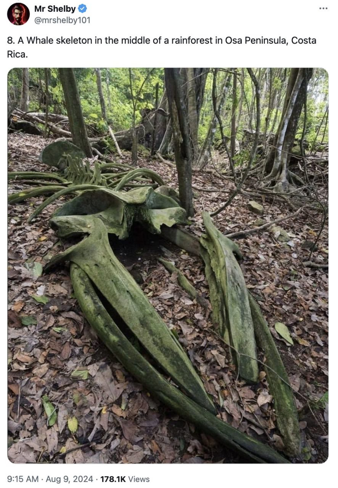

# Whales

## Mountain Whales (aka "erratic whales").

1. Earth in Upheaval, Velikovsky (1977)
2. https:// (https://t.co/siKpmHPJlG)creationconcept.info/michwls.html (https://t.co/siKpmHPJlG)
3. Elevation profile: Hudson Bay > Michigan Whales
4. ECDO answers. North America, State 2 to State 1

C14 testing came back with such ludicrously short ages for all samples that the assumption is that it must have been due to sample contamination.

Following the moment of inertia more precisely along the 31st meridian suggests that these errant whales may have been carried SW from the Labrador sea (S2 -> S1). Vast portions of this land exhibit significant striation parallel to the the predicted flow direction.

## Michigan whales

Mountain Whales (aka "erratic whales").
1. Earth in Upheaval, Velikovsky (1977)
2. https:// (https://t.co/siKpmHPJlG)creationconcept.info/michwls.html (https://t.co/siKpmHPJlG)
3. Elevation profile: Hudson Bay > Michigan Whales

## Whales

Dead whale bones in Egypt.

Whale skeletion in Osa Peninsula, Costa Rica.

