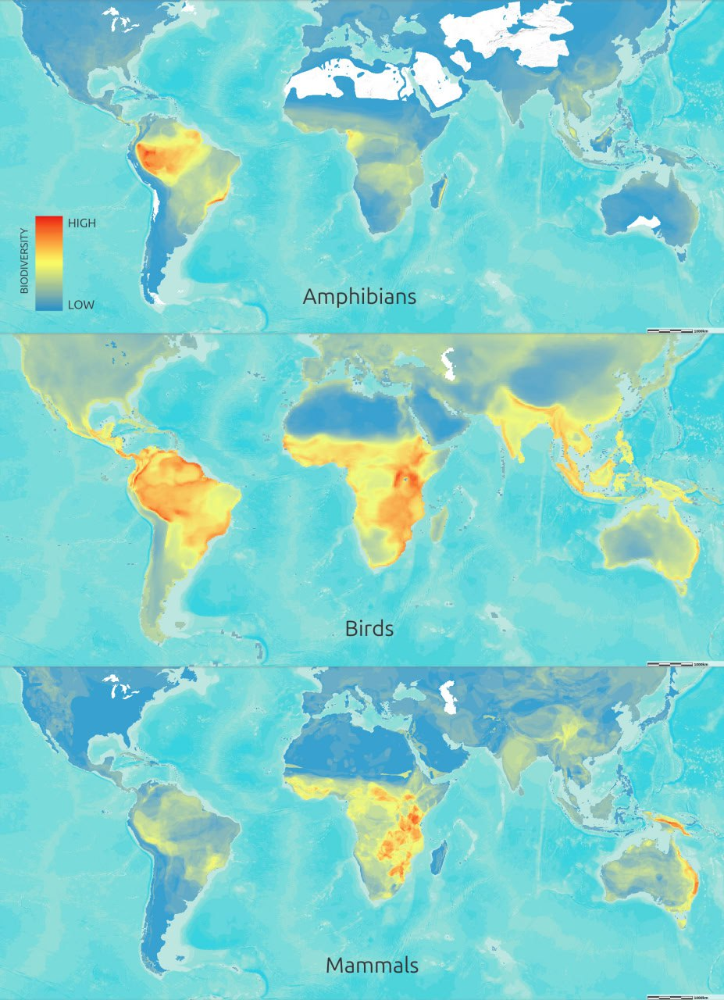

# Biodiversity

If you look at the map of biodiversity hotspots, there's a lot of overlap with high-elevation locations. It may be that this is another factor hinting at safe spots during the ECDO event.

## Fish

## Marine Plants

## Old Biodiversity Data

## Unexplained phenomena

The timing agrees - a YD event. The explanation under ECDO is essentially the same. The only variation is the attributed cause - deglaciation vs rotation (which would also precipitate deglaciation in many places).

## End of the World Biodiversity Atlas

https://atlas-for-the-end-of-the-world.com/hotspots_main.html

What is the Atlas for the End of the World? The Atlas for the End of the World is a collection of maps and infographics covering two important subjects: the first is the amount of protected area in the world's biodiversity hotspots and how these regions are tracking in regard to meeting 2020 United Nations (Aichi) protected area targets; the second is an assessment of which cities in these hotspots are growing on collision courses with remnant habitat and endangered species.

Why is it an Atlas for the End of the World? Because, for much of the world's biodiversity it is in fact the end of the world. Also, since the first modern atlas was composed in 1570, the dominant paradigm has been that nature is a resource to be exploited without consequence. That world is over.

## Citations

- https://www.researchgate.net/figure/A-Species-density-map-for-4-967-freshwater-fish-species-Density-was-calculated-as_fig3_366847384