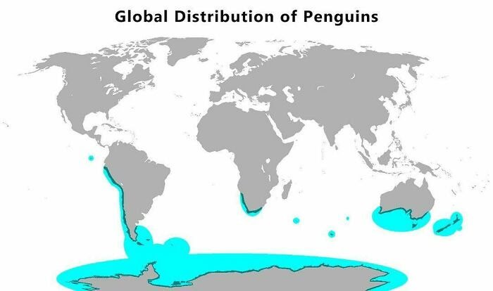
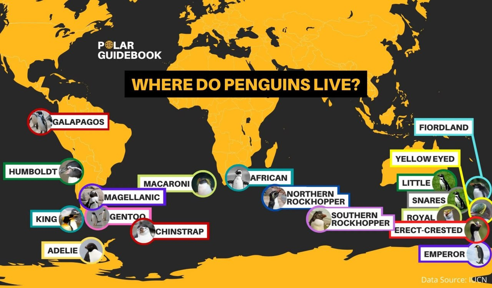
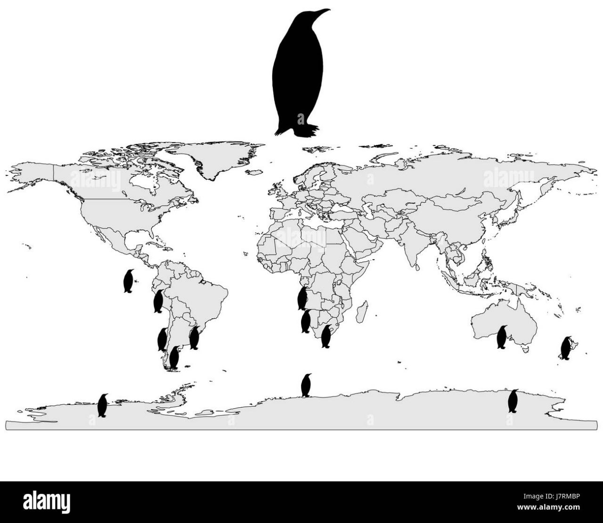

# Penguins

"What do the existence of penguins in Antarctica tell us about the flip? There is no good reason for these birds to have evolved the life cycles they have on this unforgiving continent. They are compete outliers of mainstream science unless they are able to survive the flips and survive and prosper in Antarctica in stages 1 and 2.""

They seem to be concentrated on non-polar coasts which are closest to Antarctica.