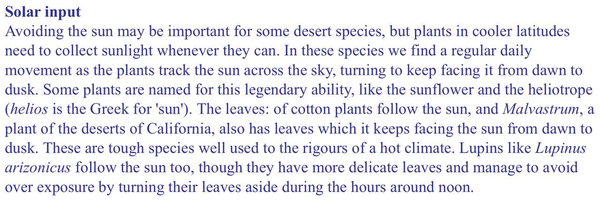
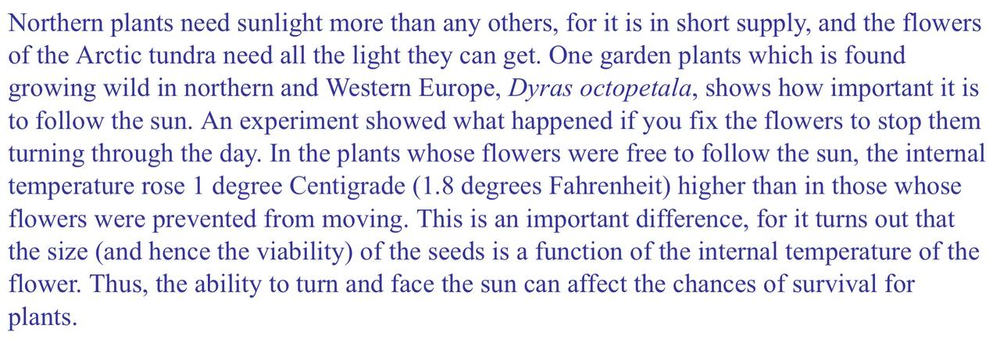
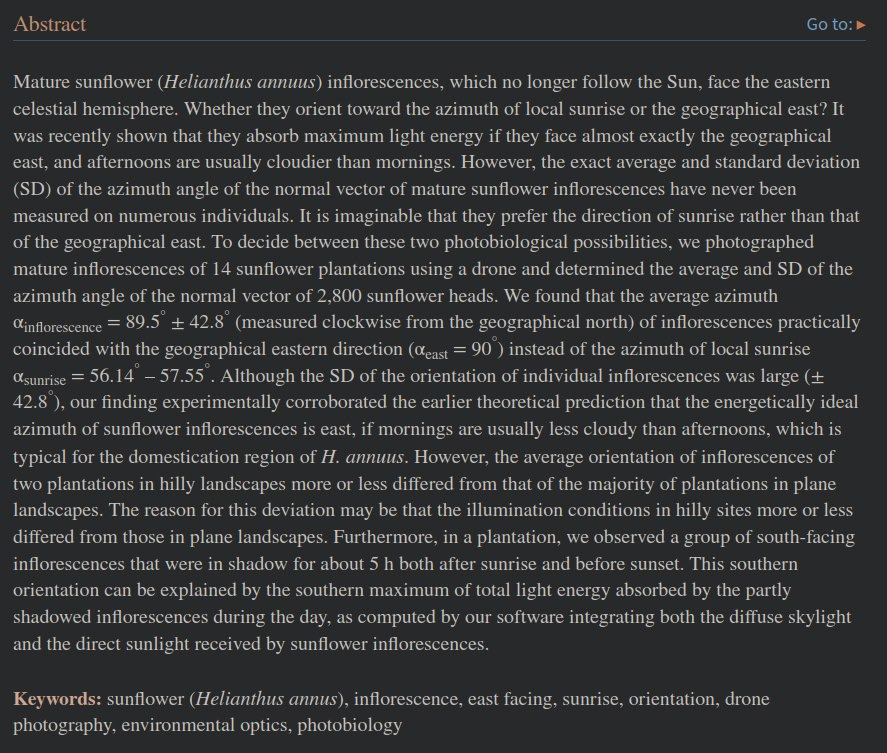

# Sunflowers

## A discussion about sunflower anomalies and magnetic field [1]

https://x.com/mundonuevo00/status/1821119859725373727?s=46

Very odd. We have sunflowers growing in our garden every year. I’ve never seen them do this. Be interested to find out more. Could a localized earth-atmosphere field reversal maybe interfere with the plant’s navigation mechanism, inverting the heliotropic response? …and if a sunflower farmer is finding it strange, then maybe it is pretty rare.

It would appear, at first glance over this, that their overnight reset is almost always to the geographic east, and not towards the actual sunrise location (which varies with season and latitude). Something in their navigation system has to do with the earth and not the sun.
https://www.ncbi.nlm.nih.gov/pmc/articles/PMC8969559/

First and most likely thing I would think is the magnetic field orientation.

If the localized field polarity were to reverse would it cause the flowers to start their day facing the wrong direction? It’s known that photosensitive cells in the flower provide the sun tracking mechanism, but what happens if the flower isn’t facing the sunrise? Could it still acquire the target?

## Skepticism on the above theory

It could just be as simple as they stop following the sun after some time:

"At dawn, all sunflowers will start off the day facing east, getting ready for the sun to emerge over the horizon. As the sun moves across the sky as the day goes on, only the younger sunflowers will follow along and pivot to the west.

Once the sun sets in the western sky, those young sunflowers will slowly turn back to east during the night, waiting for the sun to rise once again.

This sun tracking movement is known as heliotropism, and it happens less as sunflowers grow older. Once the sunflower matures, it stops following the sun and just stays facing east."

## Citations

1. [Craig Stone](https://nobulart.com)