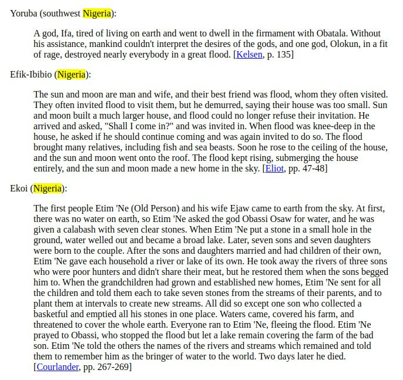
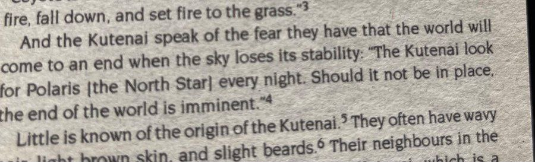
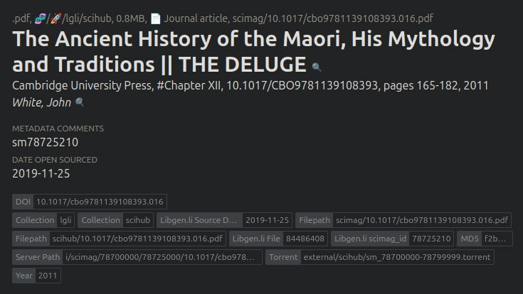

# Cataclysm Chronology

This folder is for compiling a proper chronology of all cataclysms, incorporating myths, stories, and accounts of floods and cataclysms together with history.

## Sources

- Massive flood myth compilation: https://talkorigins.org/faqs/flood-myths.html (Hard copy in `hard-copies`)
- Worlds in Collision, by Velikovsky
- The Bible
- Allan and Dellair's Cataclysm: https://archive.org/details/cataclysmcompell00alla
- Literature (see `LITERATURE`):
	- Uriel's Machine
	- Moons Myths and Man, Bellamy
	- Exodus Lost: An Inquiry into the Genesis of Civilization, Compton
	- Georges Cuvier
	- The Flood Reconsidered, Filby
	- Systeme Du Monde, Laplace
- Ethical Skeptic's original thesis
- https://www.curioustaxonomy.net/home/FloodMyths/

## Talkorigins excerpt

An uncommonly specific description of cataclysmic geological process: "The king of the water demons fell in love with the woman Ngai-ti (Loved One). She rejected him and ran away. He pursued and surrounded the whole human race with water on the hill Phun-lu-buk, said to be in the far northeast. Threatened by waters which continued to rise, the people threw Ngai-ti into the flood, which then receded. **The receding water carved great valleys**; until then, the earth had been level." [Gaster, p. 97]

## Nigeria [1]

## Kutenai North Star

https://x.com/PadrePlyo/status/1837620633582424527 pretty smart way to figure out flood is coming as north star is the only stable thing in space relative to earth

## Stationary Sun

- Great Gun Yu Flood, 10 days, 2000 BC
- Peru, 24 hours, ~1800 BC

## Maori (New Zealand Islands)

"He called to Raki to overturn the earth, and he struck the earth, with his knife (inaipi), and the earth turned upside down, and all the people of the world perished. Puta and his people alone were saved. Thenceforth this has been rehearsed as the overturning of Mata-eho by Puta."

"They thought that some of the people of the world might perhaps still he alive, and that the earth might have the same appearance as it had before the flood came; but on landing they saw that there was not one human being left alive, and the land had materially changed : it had cracked in parts, had been turned upside down, and had been confused by the power of the flood; and they found that they were the only survivors o£ all the tribes of all the earth, and that the earth had completely changed in appearance." (sounds like the account of an observer).

[1] https://sci-hub.ru/10.1017/cbo9781139108393.016

## Citations

1. https://talkorigins.org/faqs/flood-myths.html#Yoruba

# TODO

Chaco canyon and macchu picchu

Lost continent myths: https://www.msn.com/en-gb/news/world/inside-the-atlantis-of-the-sands-which-was-buried-in-storm-and-five-other-lost-worlds/ar-BB1hI3R5?ocid=winp2fptaskbarhoverent&cvid=7eb2de7e28e7479ab75829283da7b2a3&ei=8

- turkey?? i still dont get this one

Dark ages

- Tiahuanaco
	- The Great Idol of Tiahuanaco, 1959, by Arthur Posnansky
- Easter island
	- Island off west coast of SA with many large rock statues

South America:
- Peru, story of the Sun standing still in the sky. (If the Sun was near noon when the rotation started it may have appeared stationary).
- In South America myths of the sun setting in the wrong place.

- The Bible, Egyptian legends and other stories from antiquity describe a solar event, often involving a black sun.
- Altai megafloods
- Hawaiian flood (1000-1500 CE)
- Popol Vuh, Maya flood (500-800 CE)

Malaysian and Sumatran stories describe a long night they feared would never end.
