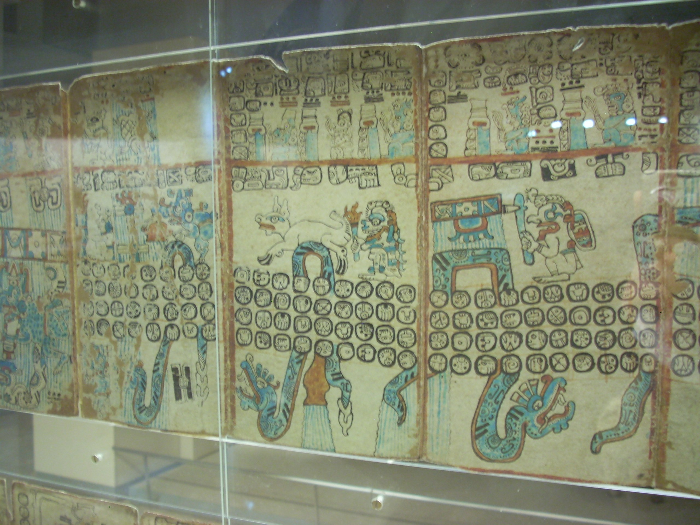

# North and South America Myths

## Makah Indians Account

The Makah Indians, who live at Neah Bay, the northwest corner of the [Washington] Territory, next to the Pacific Ocean, also the Chemakums and Kuilleyutes, whose original residence was near the same region, speak of a very high tide. According to their tradition, "A long time ago, but not at a very remote period, the waters of the Pacific flowed through what is now the swamp and prairie between Waatch village and Neah Bay, making an island of Cape Flattery. The water suddenly receded, leaving Neah Bay perfectly dry. It was four days reaching its lowest ebb, and then rose again without any waves or breakers till it had submerged the Cape, and in fact the whole country except the “tops of the mountains at Clyoquot. The water on its rise became very warm, and as it came up to the houses, those who had canoes put their effects in them, and floated off with the current, “which set very strongly to the north. Some drifted one way, some another; and when the waters assumed their accustomed level, a portion of the tribe found themselves beyond Nootka, where their descendants now reside, and are known by the same name as the Makahs in Classet, or Kwemaitchechat. Many  canoes came down in the trees and were destroyed, and numerous “lives were lost. The water was four days in gaining its accustomed level.” 
- Traditions of the "Deluge" Among the Tribes of the North-West, Eells, published in The American Antiquarian Vol 1:2 (1878)[1].

This looks very much like a description of a State 1 to State 2 rotation [2] from the coastal region to the west of the Scablands[3], including the duration of the trans-Pacific seiche. 

[1] https://archive.org/details/sim_american-antiquarian-and-oriental-journal_1878-07_1_2/page/70/mode/2up
[2] https://theethicalskeptic.com/2024/05/12/exothermic-core-mantle-decoupling-dzhanibekov-oscillation-ecdo-theory/ by @EthicalSkeptic 
[3] https://x.com/search?q=scablands%20from%3Anobulart&src=typed_query
👀 @randallwcarlson

A little further south in Oregon: "The excavation showed a depth from five to six feet of this debris, and the original dist strata had not yet been reached. I stood by the wall of this seemingly unlimited bed, and with a stick dug into the bank, finding shells of various kinds, some of which are not now found on this coast, all bearing evidences of having been used for food, sometimes calcined; also the bones and vertebra of fish, bones of birds, deer, and other animals, and among them the bones of the human body, sometimes the tiny rib of a little child, and sometimes the arm bones or the shoulder blade of an adult; skulls, too, were not infrequent. The horrible suspicion of cannibalism suggested itself to my mind.   

These remains were scattered indiscriminately, just as one might imagine the garbage of a house might be thrown day. by day and so accumulate in a heap. while earth and stones were mixed with the bones. Of the length of this bed I have no knowledge, and can only imagine the age. It was in shore half a mile and must have, in ancient times, been the beach proper."
- Shell Beds of Clatsop Beach in Oregon, Clarke, The American Antiquarian Vol 1:4 (1879)
[1] https://archive.org/details/sim_american-antiquarian-and-oriental-journal_1879-04_1_4/page/210/mode/2up

## Peru Timeline, Inca Mythology - Montesinos (Spaniard, arrived Peru 1628)

*"According to Montesinos, there were three distinct periods in the history of Peru. First, there was a period which began with the origin of civilization, and lasted until the first or second century of the Christian era. Second, there was a period of disintegration, decline, and disorder, introduced by successful invasions from the east and southeast, during which the country was broken up into small states, and many of the arts of civilization were lost; this period lasted more than a thousand years. Third and last came the period of the Incas, who revived civilization and restored the empire."* [2]

*"The Inca tales Montesinos assembled, attested that long before the latest Inca dynasty there had been an ancient empire. After a period of growth and prosperity upheavals suddenly befell the land… wars broke out. The king reigning at the time left Cuzco and led his followers to a secluded refuge place in the mountains called Tampu-Tocco; only a few priests remained in Cuzco to maintain its shrine. It was during that calamitous time that the art of writing was lost."* [1]

*"But he (Montesinos) recorded a version whereby the first of the chosen as a leader was a brother that bore the name of the ancestor who had led the people to the Andes, Pirua Manco (and thus the name Peru)…he had decided to build there a city… one of his half-sisters bore him a son who was called Manco Capac. It was this son who built in Cuzco the Temple of the Great God, Viracocha; and therefore it is from that time that the establishment of the empire is counted and the chronicles of the dynasties begin..."* [1]

*"“In the reign of the twelfth Capac, news reached Cuzco of the disembarking on the coast of “some men of great stature… giants who were settling the whole coast” and, possessing metal implements, were despoiling the land. After a time they began to go into the mountains; fortunately, they provoked the wrath of the Great God and he destroyed them with a heavenly fire."* [1]

*"“Relieved of the dangers, the people forgot the commandments and the rites of worship. “Good laws and customs” were abandoned… In punishment the Creator hid the sun from the land, “there was no dawn for twenty hours.” There was a great outcry among the people and prayers and sacrifices were offered at the temple until the sun reappeared. The king immediately thereafter reintroduced laws of conduct and rites of worship."* [1]

*"The fortieth Capac established the study of astronomy and astrology and determined the equinoxes. The fifth year of his reign, Montesinos calculated, was the twenty-five hundredth from Point Zero, which he assumed, was the Deluge. It was also the two thousandth year since kingship had began in Cuzco."* [1]

*"In the reign of the fifty-eighth monarch, “when the Fourth Sun was completed,” the count was 2,900 years since the Deluge. It was Montesinos calculated, the year in which Jesus Christ was born."* [1]

The wording is unclear, but it seems that in the above quote, the Deluge was 2900 years before Jesus Christ, and Jesus Christ was the time of the 58th monarch. Confirmed by this second source: *"Manco-Capac III., the sixtieth sovereign of this line, is supposed to have reigned at the beginning of the Christian era..."* [2].

### Timeline

- 2900 BC: Assumed to be Deluge
- Reigning king leaves Cuzco and brings followers to Andes (Tampu-Tocco), art of writing lost
- Centuries pass
- 2400 BC: Kingship begins in Cuzco with Manco Capac
- ~1800 BC (twelfth Capac): giant invaders killed by "heavenly fire" in mountains, some extended time later, 24 hours of Sun
- 400 BC: fortieth Capac
- 0 AD: 58th Capac
- 100 - 200 AD: Country falls during a thousand-year period of disintegration, decline, and disorder
- contemporary Inca empire rises

### 24 hours of Sun

It seems like the 24 hours of Sun could have occurred during the rotation from S2 back to S1, since China, which had the great Gun-Yu flood, had 10 days of straight Sun as well, which would seemingly contradict this account.

## 400 BC La Venta abandonment

The pre-Hispanic city of La Venta appears to have been abandoned around 400 BC. https://es.wikipedia.org/wiki/La_Venta#Historia

## Nahua/Aztec Five Suns [3]

4 cataclysms in Aztec mythology: "In creation myths, the term "Five Suns" refers to the belief of certain Nahua cultures and Aztec peoples that the world has gone through five distinct cycles of creation and destruction, with the current era being the fifth."

Second cataclysm: "As a consequence, Tezcatlipoca showcased his dominance and strength as a god of magic and justice by transforming the human-like people into monkeys. Quetzalcoatl, who had held the flawed people in great regard, was greatly distressed and sent away the monkeys with a powerful hurricane. After they were banished, Quetzalcoatl stepped down from his role as the sun and crafted a new, more perfect race of humans."

Third cataclysm: "In a fit of rage, Tlaloc unleashed a rain of fire upon the earth, completely destroying it and leaving nothing but ashes in its wake. Following this cataclysmic event, the gods then worked together to create a new earth, allowing life to be reborn from the seemingly lifeless and barren land."

Fourth cataclysm: "Chalchiuhtlicue was so crushed by these words that she cried blood for the next fifty-two years, causing a horrific flood that drowned everyone on Earth. Humans became fish in order to survive."

## Olmecs

The beginnings of Olmec civilization have traditionally been placed between 1400 BCE and 1200 BCE. [4]

Perfect timeline for a civilization that survived a great cataclysm around 1800 BC.

The first Olmec center, San Lorenzo, was all but abandoned around 900 BCE at about the same time that La Venta rose to prominence.[20] A wholesale destruction of many San Lorenzo monuments also occurred c. 950s BCE, which may indicate an internal uprising or, less likely, an invasion.[21] The latest thinking, however, is that environmental changes may have been responsible for this shift in Olmec centers, with certain important rivers changing course. [4]

So many cataclysms.

## Mexican History

From Researches, Concerning the Institutions and Monuments of the Ancient Inhabitants of America. This is a reference to the famous calendar stone. Note the description of four catastrophes.

[1] https://sci-hub.ru/10.1017/cbo9780511920240.009

## 1800 BC Caral Abandonment

"Caral and its neighboring communities in the Pativilca and Fortaleza valleys were abandoned between 1800 and 1600 BC. Why? We are not sure, but archaeological and geological data point to the relentless onslaught of disrupters and their cumulative effects, which priests could not foresee. Geological data uncovered that an earthquake estimated at 7.2 on the Richter scale took place in about 1820 BC and destroyed much of Caral and Aspero (Sandweiss et all., 2009). This major earthquake was most probably followed by successive tremors of various intensity over the following weeks and months and contributed to more unstable rock and mud slides into the valleys."

https://popular-archaeology.com/article/caral-americas-oldest-city/

## Cherokee Stories

## Pemon

In Pemón mythology, Mt. Roraima is “the stump of a mighty tree that once held all the fruits and tuberous vegetables in the world,” and was “felled by one of their ancestors, the tree crashed to the ground, unleashing a terrible flood” - Naeem (2011)

Roraima is the western pivot in the ECDO model.

https://hot-facts.blogspot.com/2011/04/facts-about-mount-roraima-strangefacts.html

## This is the legend of the Comanches.

"Innumerable moons ago, a race of white men, ten feet high, and far more rich and powerful than any white people now living, here inhabited a large range of country, extending from the rising to the setting sun. 

Their fortifications crowned the summits of the mountains, protecting their populous cities situated in the intervening valleys. They excelled every other nation which has flourished, either before or since"

Book names and links to the full versions👇

Three years among the Comanches: the narrative of Nelson Lee
https://archive.org/details/threeyearsamongc0000leen

To the American Indian: Reminiscences of a Yurok Woman by Lucy Thompson
https://archive.org/details/toamericanindia00thomgoog

## Inuit People on Pole Shift

https://youtu.be/F3DCspAN4Xk?si=0bLSPdvim52XI1r3

## Eskimo Mountain Ice Cap Remnant

"The story is, that the waters rose to the top of the mountains, but after they retired they left the mountains covered with a cap of ice." 
[1] https://archive.org/details/sim_american-antiquarian-and-oriental-journal_1893-11_15_6/page/350/mode/2up

## Mayan account of the destruction of Atlantis

"The year six Kan, on the eleventh Muluc, in the month Zac, there occurred terrible earthquakes, which continued without  intermission until the thirteenth Chuen. The country of the hills of mud, the ‘land of Mu,’ was sacrificed. Being twice upheaved, it suddenly disappeared during the night, the basin being continually shaken by volcanic forces. Being confined, these caused the land to sink and rise several times and in various places. At last, the surface gave way, and the ten countries were torn asunder and scattered into fragments; unable to  withstand the force of the seismic convulsions, they sank with sixty-four millions of inhabitants, eight thousand years before the writing of this book.”  - Maya account of the destruction of Atlantis, from Dr. Augustus Le Plongeon’s rendering of the Troano manuscript (Madrid Codex).
[1] https:// (https://t.co/SWncJTpk1U)en.wikipedia.org/wiki/Madrid_Co (https://t.co/SWncJTpk1U)dex_(Maya) (https://t.co/SWncJTpk1U)
[2] https:// (https://t.co/fkg7pEJlFr)nobulart.com/a-story-of-atl (https://t.co/fkg7pEJlFr)

The Madrid Codex. First image is captioned "Rain-bringing snakes"
https://en.wikipedia.org/wiki/Madrid_Codex_(Maya)

400 years is not far off the 406 year average grand solar minimum interval.

## Citations

1. https://zsitchinindex.wordpress.com/the-earth-chronicles-index/book-4-the-lost-realms/chapter-7-the-day-the-sun-stood-still/
2. https://www.djmcadam.com/scheme-peruvian.html
3. https://en.wikipedia.org/wiki/Five_Suns
4. https://en.wikipedia.org/wiki/Olmecs
5. [Craig Stone](https://nobulart.com)