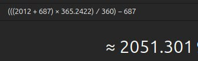

# Mayan Long Count

## Graham Hancock Excerpt

https://x.com/Graham__Hancock/status/1853884543675109513

## Mesoamerican long count calendar

"The Mesoamerican Long Count calendar is a non-repeating base-20 and base-18 calendar used by several pre-Columbian Mesoamerican cultures, most notably the Maya. For this reason, it is often known as the Maya Long Count calendar. Using a modified vigesimal tally, the Long Count calendar identifies a day by counting the number of days passed since a mythical creation date that corresponds to August 11, 3114 BCE in the proleptic Gregorian calendar.[a] The Long Count calendar was widely used on monuments."

"The completion of 13 bʼakʼtuns (August 11, 3114 BCE) marks the Creation of the world of human beings according to the Maya. On this day, Raised-up-Sky-Lord caused three stones to be set by associated gods at Lying-Down-Sky, First-Three-Stone-Place. Because the sky still lay on the primordial sea, it was black. The setting of the three stones centered the cosmos which allowed the sky to be raised, revealing the sun."

"The previous creation ended on a Long Count of 12.19.19.17.19. Another 12.19.19.17.19 occurred on December 20, 2012 (Gregorian Calendar), followed by the start of the 14th bʼakʼtun, 13.0.0.0.0, on December 21, 2012."

https://en.wikipedia.org/wiki/Mesoamerican_Long_Count_calendar

"Known as the GMT correlation, or "correlation # 584283", this was finalized in 1950, and puts the start of the Great Cycle ( day 0.0.0.0.0) on 11th August 3114 BC, and the end-date (known as 13.0.0.0.0.) as 21st December 2012.

The Mayan calendar is divided into Seven Ages of Man. The fourth epoch ended in August 1987. The Mayan calendar comes to an end on Sunday, December 23, 2012. Only a few people will survive the catastrophe that ensues. In the fifth age, humanity will realize its spiritual destiny. In the sixth age, we will realize God within ourselves, and in the seventh age we will become so spiritual that we will be telepathic."

http://www.incamayanaztec.com/inca-calendars.html

### Adjustment

The long count is a day count (it does not count years), so it has to be re-calibrated for the 687 BC calendar change from 360 to 365 days.

[1] https://nobulart.com/360-days/

Using the precise year length

## Mayan count solar year

Interesting that the Mayan count includes a solar year of 360 days.

