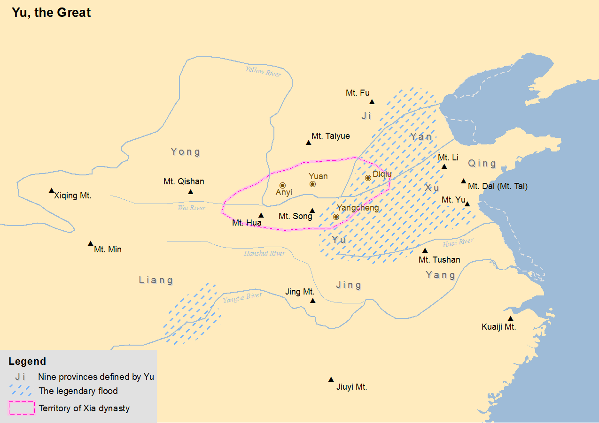

# China

Aside from the Herodotus account, I take China's flood myths to be the most meaningful because they specifically reference the Sun changing its trajectory, and temporary prolonged flooding, which are two surefire markers of our current model of the ECDO.

China's historical timeline here: https://en.wikipedia.org/wiki/Timeline_of_Chinese_history

## Chinese Nuwa Gong Gong Inundation Myth (2810 BC?)

There is a Chinese inundation myth which matches China's expected rotation from S1 to S2.

*"When the water god Gong Gong saw that he was losing, he smashed his head against Mount Buzhou, a pillar holding up the sky. The pillar collapsed and caused the sky to tilt towards the northwest and the earth to shift to the southeast."* [4]

"It is of some interest to note that Chinese myths indicate that the Flood event occurred at the end of the life of Nu Wa, consort of first Chinese emperor Fsu Hsi (2953 - 2838 BC according to standard chronologies), and who herself allegedly lived until about the year 2810 BC." - Bruce Masse

## Great Flood (2300 - 1920 BCE)

Not so much a myth as an account, it lines up with Korea's founding myth, that of Dangun. The best account of this I've found is in WIC by Velikovsky.

*"The Great Flood of Gun-Yu, also known as the Gun-Yu myth, was a major flood in ancient China that allegedly continued for at least two generations, which resulted in great population displacements among other disasters, such as storms and famine. People left their homes to live on the high hills and mountains, or nest on the trees. According to mythological and historical sources, it is traditionally dated to the third millennium BCE, or about 2300–2200 BCE, during the reign of Emperor Yao."* [1]

The flood level depicted is approximately 65m in modern-day China.

Velikovsky's Worlds in Collision (`LITERATURE-MEDIA/velikovsky`), Chapter 4 page 100, has a compilation of the accounts of this flood during Emperor Yao's reign:

*“At that time the miracle is said to have happened that the sun during a span of ten days did not set, the forests were ignited, and a multitude of abominable vermin was brought forth.” 2 “In the life-time of Yao [Yahou] the sun did not set for ten full days and the entire land was flooded.” An immense wave “that reached the sky” fell down on the land of China. “The water was well up on the high mountains, and the foot-hills could not be seen at all.”* [Velikovsky Page 101]

### Sun changing trajectory? (Velikovsky)

"Thereupon Yaou [Yahou] commanded He and Ho, in accordance with the wide heavens, to calculate and movements and appearances of the sun, the moon, the reverent delineate the stars, and the zodiacal spaces; and to deliver respectfully the seasons to the people." The necessity, soon after the flood, of finding anew the four direc- tions and learning anew the movements of the sun and the moon, of delineating the zodiacal signs, of compiling the calendar, of inform- ing the population of China of the sequence of the seasons, creates the impression that during the catastrophe the orbit of the earth and the year, the inclination of the axis and the seasons, the orbit of the moon and the month, changed. We are not told what caused the cataclysm, but it is written in ancient annals that during the reign of Yahou “a brilliant star issued from the constellation Yin.”

### Dating the event: Contemporary to Ogyges? (Velikovsky)

On the dating of this event, Velikovsky has this to say: *"Calculations were undertaken to establish the dates of the Emperor Yahou. On the basis of a remark that the constellation Niao, thought to be the constellation Hydra, culminated at sunset on the day of the vernal equinox in the time of Yahou, it was reckoned that the flood occurred in the twenty-third century before the present era, but this date has been questioned by many.. The flood of Yahou is sometimes regarded as simultaneous with the flood of Ogyges.."* [Velikovsky Page 103]

### 10 Days of the sun not setting

This could be explained by China rotating closer to the Antarctic Circle while the south pole is tilted towards the Sun. However, that alone would not bring China close enough. It's possible that the rotation temporarily overshoots for a few days, bringing China into a 24-hour Sun region, until it adjusts back to the normal S2 state.

### Xia Dynasty dates (established 2070 BC?)

The Xia Dynasty was established by Gun-Yu, who "stopped" the flood. Therefore the flood must have occurred within a lifetime of the establishment of the Xia Dynasty, which is estimated to be established in 2070 BC. That already creates a clear discrepancy with the flood's hypothesized date of 2300 BC.

There is also contention on the dates of the Xia Dynasty:

*"According to the traditional chronology, based upon calculations by Liu Xin, the Xia ruled between 2205 and 1766 BC. According to the chronology based on the "current text" Bamboo Annals, it ruled between 1989 and 1558 BC. Comparing the same text with dates of five-planet conjunctions, David Pankenier, supported by David Nivison, proposed dates of 1953 and 1555 BC. The Xia–Shang–Zhou Chronology Project, commissioned by the Chinese government in 1996, proposed that the Xia existed between 2070 and 1600 BC."* [2]

Still, all the estimates put the flood at 2000 BC at the earliest.

### Length of the flood - 22 years

The flood seemed to have lasted 22 years - 9 years of Gun-Yu's father attempting to stop it, and 13 years until Gun-Yu managed to "stop" the flood.

This could be a potential lead on the length of S2.

### Research paper on Yellow River 1920 BCE flood

There is a research paper which proposes that there is evidence for a 1920 BCE flood of the Yellow River. The researchers estimate that the waters reached an elevation of 240m above current river levels and reached settlements as far as 1,300 miles downstream. They also believe that the dam burst (hypothesized to have caused the flood) would have caused long-lasting flooding on the lower plains.

Source: https://www.science.org/doi/10.1126/science.aaf0842

PDF included in this folder.

## Majiayao culture (3300 - 2000 BC) [5]

Some interesting tidbits suggesting potential changes around 3000 BC:

"Control over the production process and quality declined by the Banshan phase, potentially due to greater demand for pottery to use in funeral rituals, similar to what Hung Ling-yu calls the "modern Wal-Mart syndrome."

Banshan phase is from 2600-2300 BC.

"A group of scholars from Lanzhou University have researched climate changes during the Majiayao culture and the results indicate that the climate was wet during 5830 to 4900 BP, which promoted the development of early and middle Majiayao culture in eastern Qinghai province. However, from 4900 to 4700 BP, the climate underwent droughts in this area, which may be responsible for the decline and eastward movement of prehistoric cultures during the period of transition from early-mid to late Majiayao culture."

## 1200 BC Event?

Would be the Shang dynasty.

Xie is said to have helped Yu the Great to control the Great Flood and for his service to have been granted a place called Shang as a fief... In the Annals of the Yin, Sima Qian writes that the dynasty was founded 13 generations after Xie, when Xie's descendant Tang overthrew the impious and cruel final Xia ruler in the Battle of Mingtiao. [6]

## Yuan Empire Downfall - 1300 AD

This all happened 700 years ago - during the Wolf Minimum. "This is what seems to have happened to the Yuan Empire in the fourteenth century. Historical records of this era are filled with natural disasters, especially between 1300 and 1359. This period witnessed a surge in every imaginable type of natural disaster all over the country: frequent super typhoons along the southeastern coast; recurrent floods of both the Yangtze and Yellow River deltas; locust plagues (associated with droughts) on the central plain; and two significant earthquakes in central China in 1303 and 1305 that caused over 270,000 fatalities. Last but not least, a series of epidemics swept through the region between 1352 and 1362, the worst of which caused two hundred thousand deaths in the capital area alone in 1358. The Chinese scholar He Fuqiang has calculated that, in the 109 years between 1260 and 1368, the empire suffered at least two major disasters per year, with five different disasters occurring in four out of every five years. For more than a third of the Yuan era, the empire experienced at least seven distinct natural calamities within the same year." - this all sounds a lot like what's going on across much of Asia right now. They must have had a lot of livestock to have caused such serious climate change 700 years ago.

1. https://sci-hub.ru/10.1515/9783110660784-008
2. https://en.wikipedia.org/wiki/Solar_cycle

## Citations

1. https://en.wikipedia.org/wiki/Great_Flood_(China)
2. https://en.wikipedia.org/wiki/Xia_dynasty#Gun,_Yu,_and_the_flood
3. https://theculturetrip.com/asia/china/articles/chinas-4000-year-old-great-flood-myth-verified-by-science
4. https://en.wikibooks.org/wiki/Chinese_Stories/N%C3%BCwa
5. https://en.wikipedia.org/wiki/Majiayao_culture
6. https://en.wikipedia.org/wiki/Shang_dynasty

# TODO

"Chinese historian dates exploded supernova to time of legendary Emperor Yao as told in ancient annals": https://www.scmp.com/news/china/science/article/3204241/chinese-historian-dates-exploded-supernova-time-legendary-emperor-yao-told-ancient-annals