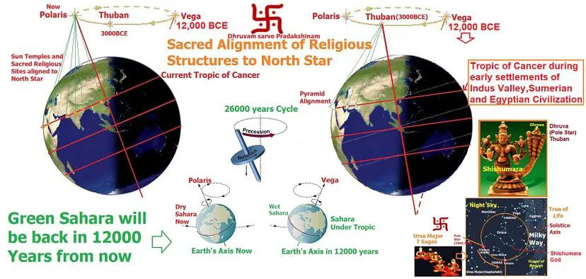

# Indian Flood Myths

There are several Indian flood myths.

Check `img/` for all records.

A summary is as follows:
- Manu flood: 9200 BC
- Dvaravati sinking: 7400 BC
- Dvarka sinking: 3100 BC
- North India deluge remnants: 2000-1900 BC

## Krishna - Mahabharata War 3067 BCE

Stephen Knapp, in "Advancements of Ancient India's Vedic Culture", provides a compelling account for why Krishna can be dated to around 3100 BC, including:
- astronomical analysis to date the Kurukshetra War precisely to 3067 BCE
- Aryabhatta (mathematician) Kali-yuga duration calculation
- Mohenjo-Daro tablet referencing Krishna

## Sinking of Dwarka, Mausala Parva, 3031 BCE

"The Mausala Parva (lit. Episode of Flails)[1][2] is the sixteenth of the eighteen episodes of the ancient Indian epic Mahabharata... the Mausala Parva describes the demise of Krishna in the 36th year after the Kurukshetra War had ended, the submersion of Dvaraka under the sea, the death of Balarama by drowning in the sea, Vasudeva's death, and a civil war fought among the Yadava clan that killed many of them." [8]

36 years after the Kurukshetra War would put the sinking of Dwarka at 3031 BCE.

## The Chronology of India: From Manu to Mahabharata - Vedveer Arya - Manu flood 9200 BC? Dvaravati sinking 7400 BC?

Vedveer Arya seems to have compiled a lengthy and comprehensive chronology of India's history worth looking at. Hard copy in this folder https://independent.academia.edu/VedveerArya

He places the Manu deluge at 9200 BC, and the submergence of Dvaravati (Dwarka) at 7400-7300 BC (Tollman event?). The submergence of the same Dwaraka city, of the Mahabharata era, in 3126 BC.

See page 24 for an overview. Page 74 for Manu dating. Pg 497 for Dvaravati.

"Seemingly, forty-nine descendants of King Dravida reigned at Dvāravatī approximately for 1650 years, from 11050 BCE to 9400 BCE, considering the average reign of 33 years for each king. Dvāravatī was submerged by the sea around 9400-9300 BCE, during the reign of Irunkovel I, the forty-ninth king."

"According to oceanographic studies, sea level suddenly rose 28m in 500 years, about 12000-11500 years ago. This accelerated sea level of 10000- 9400 BCE has been named Meltwater Pulse 1B. Many Yādava families had to migrate eastwards and southwards. It appears that Indian astronomers observed the event of “Rohiṇī Śakaṭa Bheda” (when either Mars or Saturn pass through Rohiṇī Śakaṭa, i.e. the triangle formation of stars in Taurus constellation) several times around 9400-9300 BCE."

"The archaeological site of Bhirrana in Hisar, Haryana has also been dated around 7500 BCE. A submerged structure of the ancient Poompuhar city found close to Kaveripattinam, Tamil Nadu has been dated around 9500" [29]

## North India Flood Remnants (2000 - 1900 BC)

There is a research paper by BB Lal (presented at ICHR) which dates a flood to 2000 - 1900 BC using carbon dating. It ascribes it to the Manu Flood story, but this is unlikely, given the original Manu flood is stated to have started the golden age.

*"It relates to the history the Sarasvatī, which is a river par excellence in the Ṛigveda. She has been eulogized as the best of mothers (ambitame), the best of rivers (nadītame) and the best of goddesses (devitame) [RV 2.41.16]. She originated in the mountains and went all the way down to the sea (yatī giribhya ā samudrāt) [RV 7.95.2]. She was so powerful that she shattered the mountain peaks with her fast and powerful waves (iyam śuṣmebhir bisakhā ivārujat sānu girīṇām taviṣebhirūrmibhiḥ) [RV 6.61.2]."*

Paper in this folder.

## Sinking of Kandam Kumari (Multiple occurrences)

*"Half of the land mass Kumari Kandam, which was south of India, sank in a great flood, destroying the first Tamil Sangam (literary academy). The people moved to the other half and established the second Tamil Sangam there, but the rest of Kumari too sank beneath the sea. The lone survivor was a Tamil prince named Thirumaaran, who managed to rescue some Tamil literary classics and swim with them to present-day Tamil Nadu."* [1]

Seems to be describing two consecutive events - the sinking of the (now submerged) southern land (S1>S2), and then when they’ve just set up shop again the same thing happens again, submerging land further north (S2>S1).

Such might be the map of Kumari Kandam before sinking (mapped with violet boundary).

Those islands on the western part of sunken land suggests those were the older peaks (those islands can be older western ghats). Red curve line is the ECDO flood path.

*"Kumari Kandam as revealed through Bathymetric studies. Sea level at 130 meters lesser than current levels (-130 m) around 19500 BCE at LGM. Besides the sea level changes, the ocean surface elevation changes due to local tectonic activities to the south of Kanyakumari too is considered. The names of rivers and places mentioned in Tamil literature like Tenmaturai, Kapatapuram and the future city Maturai are indicated. The Devasura civilization mentioned in Sanskrit Vedic literature also is indicated. Kusasthali mentioned in Mahabharata and the Submerged city of Varuna mentioned in Bhagavata too are indicated. The locations are currently speculative, but should give impetus for future marine archaeological studies."*

*"Those who count seven stages of submergence place 1st submergence at 16,000 BCE, the 2nd one at 14000 BCE, the third at 9600 to 9500 BCE and the fourth at 5500 BCE to 5200 BCE. They count the fifth submergence as having occurred around 3100 BCE and a sixth at 1800 BCE. The 7th submergence is then dated at 1700 BCE to 700 BCE. Manavuur is a city to the north of Kapatapuram that got submerged in 3100 BCE or in 1800 BCE (most probably in 1800 BCE)."* [2]

## Manu Deluge [4]

During the Manu deluge the flood was probably super high. Only 1 mountain peak in Himalaya was visible called Navabandhana. Current highest peaks are around 8000m. I do suspect there might be changes in between of heights of Himalaya as this happened at the end of golden age.

In the Manu story they mention that the only highest peak of Himalayas was dry called Navabandhan. So, it seems Himalayas were present in previous deluge as well.

## Yuga Cycles [5]

1. Kritayuga (Satya Yuga): The age of truth and virtue (Golden Age).
2. Tretayuga: The age of decline in virtue (Silver Age).
3. Dwaparayuga: Further decline in moral order (Bronze Age).
4. Kaliyuga: The age of darkness and strife (Iron Age).

"According to Puranic sources,[a] Krishna's death marked the end of Dvapara Yuga and the start of Kali Yuga, which is dated to 17/18 February 3102 BCE." [6]

"Pralaya is the concept of cosmic dissolution, often described as a flood or deluge, that ends a Yuga cycle, particularly at the end of a Mahayuga (the full cycle of the four Yugas) or at the end of a Kalpa (a day of Brahma). Each Pralaya wipes out the existing world, which is then re-created at the start of the next cycle." [5]

## Sinking of Dwarka Alternative Timeline – 5525 BCE

Sinking of the city of Dwarka might have been due to great flood. 5525 BCE is pretty close to the Noahic event 5401 BCE. 

*"Dwarka of Krishna, on the west coast of India, was destroyed by flood 36 years after the Mahabharata War. I defined time interval of 6500 years for the plausible year of Mahabharata War based on AV (Arundhati-Vasistha) observation of Mahabharata text. Further I could validate 18 day timeline and year of 5561 BCE, proposed by Dr. P V Vartak. I validated 5561 BCE as the year of Mahabharata War based on consistent interpretation of 200+ astronomy observations of Mahabharata text."*

*"This would lead us to the timing of flooding of Dwarka as follows: 5561 BCE + 36 years = 5525 BCE"*

*"Thus flooding and Destruction of Krishna’s Dwarka occurred in 5525 BCE."* [3]

## Sri Yukteswar Yuga Dating

Kali Yuga of 1000 years has two sandhis of 100 years for a total of 1200 years. Dwapara Yuga of 2000 years has two sandhis of 200 years for a total of 2400 years. Treta Yuga of 3000 years has two sandhis of 300 years for a total of 3600 years. Satya Yuga of 4000 years has two sandhis of 400 years for a total of 4800 years. This makes for a total of 12,000 years for the cycle of the four yugas.

https://www.vedanet.com/keys-to-the-yugas-or-cycles-of-the-ages-subyugas-in-the-sri-yukteswar-yuga-cycle/

Aligned to a 3100 BC Kali Yuga start date, this places the end of Satya Yuga at 9100 BC. Still, Sri doesn't date Krishna to 3100 BC so I don't take this to be very substantial.

## 300 BC event?

"The ancient city of Puhar was destroyed by the sea around 300 BC. Marine archeologists from the National Institute of Oceanography have established that this could have been the effects of sediment erosion and periodic tsunamis. Such a tsunami is mentioned in the Tamil poem Manimekhalai (see below), which relates that the town Kāveripattinam or Puhār was swallowed up by the sea. This event is supported by archeological finds of submerged ruins off the coast of modern Poompuhar.[3][4] The town of Kāveripattinam is believed to have disappeared around 300 BC due to this tsunami"

https://en.wikipedia.org/wiki/Poombuhar

## Vedic astrologers referring to precession of the equinoxes?

Further we have Earth’s axial precession which is a gravity-induced, slow, and continuous change in the orientation of an astronomical body’s rotational axis. It can refer to the gradual shift in the orientation of Earth’s axis of rotation in a cycle of approximately 25,772 years. This is like the precession of a spinning-top, with the axis tracing out a pair of cones joined at their apices. It was same calculation which ancient Vedic astrologers referred as Yugas with cycle of 26000 years that includes two Sandhis or Sandhyās (connecting periods) ⁠ — Sandhyā (dawn) and Sandhyāṃśa or Sandhyānśa (dusk)⁠ — where each Sandhi lasts for 1/10th (10%) of the main period. Dhruva(Pole Star) is Polaris and Axis Mundane has changed to Polaris now due to earth’s axial precession with 7 Sages (Big Dipper), the Sun, Moon, planets and constellations paying obeisance while circumambulating the Lord in Mount Meru(Virtual Mountain).

https://arvind-bhagwath.medium.com/mythology-of-nakshatras-ccac027e24c9

## 5500 BC event?

In Hindu astronomy, Aldebaran is Rohini nakshatra and Planet Saturn is referred as Shani. The particular mention of ‘Rohini Sakata Bhedanam’ in Indian literature is an event of great significance. This event occurs when Saturn or Mars is near Rohini Nakshatra. These events are mentioned in Ramayana and during great Mahabharata wars. Destruction happened every time this peculiar phenomenon appeared in the sky and below is mention in Ramayana.

"It forebodes evil and destruction
When Saturn leaves Krittika and nears Rohini
Sages call this “Breaking of Rohini’s wain”
It brings great sorrow and misery"

I think its mars or saturn cross with aldebaran rather and all three being in alignment, but yeah if all three are in alignment that would be very rare event.

Author did got two dates 3066 BCE and 5500 BCE, Vedveer Arya also cites 7400 as one of the dates.

Link for the whole article: https://arvind-bhagwath.medium.com/3000-bce-great-flood-and-rohini-sakata-bhedanam-406f8e810427

This alignment comes back in 2030.

## Rohini Sakata Bhedanam

In the article on rohini it was mentioned comet crossing rohini also applies as possible trigger.

Now,let us look into the definition of 'Rohini Sakata Bhedanam' as described in the famous astronomical work -'Surya Siddhantha'

"When an object with a south declination of slightly more than 2 degrees passes through Vrishabha Rasi at 17 degrees,then it breaks the wain of Rohini".

The celebrated ancient astrologer VarahaMihira described Rohini Sakata Bhedanam' in his magnum opus 'The Brihat Samhitha',two thousand years ago,thus:

"When the wain of Rohini is broken by Saturn or Mars or Sikhi,then alas,the world is drowned in a sea of sorrows".

Now,the star cluster 'Rohini' has 5 stars forming a triangle shaped thing in the centre.When Saturn or Mars or Sikhi(a mateor or Ketu) passes through this triangle near Alpha,Epsilon and Gama Tauri,then it is called 'Breaking of Rohini's wain'.

It might not be possible for Saturn,due to its distance from this area,to pass exactly at 17 degrees Vrisha with 2 degrees south declination.However,he touches the star Rohini once in every 30 years approximately.

https://prajnasurabhi.blogspot.com/2014/09/rohini-sakata-bhedanam-world-wide.html?m=1

2060 alignment of this, see `solar-system`.

## Bhagavata Purana

"Appearance of the Varaha avatar to lift the Earth out of the depths of the Cosmic Ocean (Garbhodakasayi) and destroy Hiranyaksa" [9]

## Saraswati River Drying Up circa 2000 BC [10]

"The Indus Valley Civilisation prospered when the monsoons that fed the rivers diminished around 5,000 years ago.[11][13][14][e] and ISRO has observed that major Indus Valley civilization sites at Kalibangan (Rajasthan), Banawali and Rakhigarhi (Haryana), Dholavira and Lothal (Gujarat) lay along this course.[15][web 1] When the monsoons that fed the rivers further diminished, the Hakra dried-up some 4,000 years ago, becoming an intermittent river, and the urban Harappan civilisation declined, becoming localized in smaller agricultural communities."

### Was this river actually just the Pacific Ocean splashing over the Himalayas?

"The Sarasvati River (IAST: Sárasvatī-nadī́) is a mythologized and deified ancient river first mentioned in the Rigveda[1] and later in Vedic and post-Vedic texts... As the goddess Sarasvati, the other referent for the term "Sarasvati" which developed into an independent identity in post-Vedic times.[4] The river is also described as a powerful river and mighty flood." [10]

Recall this quote from BB Lal's 2000 BC flood paper:

"It relates to the history the Sarasvatī, which is a river par excellence in the Ṛigveda. She has been eulogized as the best of mothers (ambitame), the best of rivers (nadītame) and the best of goddesses (devitame) [RV 2.41.16]. She originated in the mountains and went all the way down to the sea (yatī giribhya ā samudrāt) [RV 7.95.2]. She was so powerful that she shattered the mountain peaks with her fast and powerful waves (iyam śuṣmebhir bisakhā ivārujat sānu girīṇām taviṣebhirūrmibhiḥ) [RV 6.61.2]."

## Indra vs Vritra [11]

"Vritra (Sanskrit: वृत्र, lit. 'enveloper', IAST: Vṛtrá, Sanskrit pronunciation: [ʋr̩.ˈtrɐ]) is a danava in Hinduism. He serves as the personification of drought, and is an adversary of the king of the devas, Indra... He appears as a human-like serpent blocking the course of the Rigvedic rivers, and is slain by Indra with his newly forged vajra."

"Indra as a deity had a presence in northeastern Asia minor, as evidenced by the inscriptions on the Boghaz-köi clay tablets dated to about 1400 BCE."

"Indra is praised as the highest god in 250 hymns of the Rigveda – a Hindu scripture dated to have been composed sometime between 1700 and 1100 BCE. He is co-praised as the supreme in another 50 hymns, thus making him one of the most celebrated Vedic deities."

"Over a quarter of the 1,028 hymns of the Rigveda mention Indra, making him the most referred to deity.[32][57] These hymns present a complex picture of Indra, but some aspects of Indra are often repeated. Of these, the most common theme is where he as the god with thunderbolt kills the evil serpent Vritra that held back rains, and thus released rains and land nourishing rivers."

## Early Vedic Period (1500 - 1000 BC)

### GPT: Vedic Cataclysms

There are no definitive historical or archaeological records of a major cataclysmic event that can be directly tied to the Vedic period in India, which is generally dated to around 1500–500 BCE. However, some scholars have speculated that certain Vedic texts, particularly the Rigveda, contain references that could hint at ancient natural disasters or significant environmental changes. These mentions are often symbolic or mythological, making it challenging to interpret them as records of real events.

Here are a few theories and interpretations:

#### 1. Saraswati River Drying Up:

Many references in the Vedas mention the Saraswati River, described as a mighty and sacred river. Geological and archaeological studies have suggested that a river, likely the Saraswati, did indeed flow through northwestern India but began drying up or changing course due to tectonic activity or climatic changes around the end of the Vedic period.
The drying of the river could have had a significant impact on the civilizations that depended on it, leading to migrations and shifts in settlement patterns. This event could be considered a form of ecological cataclysm for the people of that time.

#### 2. Climatic and Environmental Changes:

Some researchers believe that references in the Vedic texts to battles between gods (such as Indra and Vritra) or cosmic struggles could symbolize natural phenomena, such as earthquakes, floods, or droughts. However, these interpretations are speculative and are not universally accepted by scholars.
The end of the Harappan Civilization (Indus Valley Civilization), which some link to the early Vedic period, has been attributed to climate change, possibly linked to the drying of the Saraswati or shifting monsoon patterns.

#### 3. Mythological and Symbolic Interpretations:

Vedic texts are highly symbolic and often mythological, containing stories of cosmic battles, natural forces, and cycles of creation and destruction. For example, the battles between Indra (the storm god) and Vritra (a dragon or demon associated with drought) could be seen as metaphors for seasonal changes or environmental challenges, although this is a symbolic interpretation rather than a historical record of events.

## GPT: Indian Mythological Stories Timeline

1. **Indra vs. Vritra** - *c. 1500–1200 BCE*  
   Indra, the Vedic storm god, battles Vritra, a serpent demon that holds back the waters, causing drought. Indra slays Vritra with his thunderbolt, releasing the waters and restoring fertility to the land. This myth is found in the *Rigveda*.

2. **Varuna and the Asuras** - *c. 1500–1000 BCE*  
   Varuna, the god of cosmic order and water, battles various demons (Asuras) who threaten the balance of the cosmos. While less prominent than Indra’s stories, Varuna’s tales emphasize his role in upholding moral and natural order in early Vedic texts.

3. **The Churning of the Ocean (Samudra Manthan)** - *c. 1000–800 BCE*  
   The gods (Devas) and demons (Asuras) churn the cosmic ocean to obtain the nectar of immortality. The process releases both beneficial items and a deadly poison, which Shiva consumes. This story appears in the *Shatapatha Brahmana*, and later in the *Mahabharata* and *Puranas*.

4. **Vishnu as Varaha and Narasimha** - *c. 800–400 BCE*  
   Vishnu, in his third avatar as Varaha (boar), rescues the Earth from the demon Hiranyaksha. In his fourth avatar, Narasimha (man-lion), he destroys the tyrant Hiranyakashipu, symbolizing the protection of cosmic balance. These stories emerge in the *Puranas* and early *Mahabharata* texts.

5. **Krishna and Kaliya** - *c. 500–200 BCE*  
   Krishna battles the multi-headed serpent Kaliya, who poisons the Yamuna River. Krishna subdues Kaliya by dancing on his heads, restoring the river’s purity. This story is found in the *Bhagavata Purana* and the *Harivamsa*.

6. **Rama vs. Ravana (Ramayana)** - *c. 500–100 BCE*  
   In the *Ramayana*, Rama, the prince of Ayodhya, battles the demon king Ravana, who has kidnapped his wife Sita. After a climactic battle, Rama defeats Ravana, symbolizing the victory of dharma (righteousness) over adharma (unrighteousness). The epic is attributed to the sage Valmiki.

7. **Durga vs. Mahishasura** - *c. 400 BCE–300 CE*  
   Goddess Durga battles Mahishasura, a powerful demon who takes the form of a buffalo. After a fierce fight, Durga slays Mahishasura, restoring cosmic order. This story appears in the *Devi Mahatmya*, part of the *Markandeya Purana*.

8. **Parashurama vs. the Kshatriyas** - *c. 400 BCE–300 CE*  
   Parashurama, the sixth avatar of Vishnu, combats the Kshatriya (warrior) class repeatedly when they become corrupt and oppressive. This myth, found in the *Puranas* and the *Mahabharata*, emphasizes divine justice and the restoration of dharma.

## Citations

1. https://talkorigins.org/faqs/flood-myths.html#Tamil
2. http://ancientvoice.wikidot.com/article:kumari-kandam (Hard PDF copies in `hard-copies`)
3. https://nileshoak.wordpress.com/2014/01/06/flooding-destruction-of-dwarka-5525-bce
4. [aa-hermit](https://github.com/aa-hermit)
5. ChatGPT
6. https://en.wikipedia.org/wiki/Kali_Yuga
7. https://en.wikipedia.org/wiki/Kurukshetra_War
8. https://en.wikipedia.org/wiki/Mausala_Parva
9. https://en.wikipedia.org/wiki/Bhagavata_Purana#Content_and_structure
10. https://en.wikipedia.org/wiki/Sarasvati_River
11. https://en.wikipedia.org/wiki/Indra

# TODO (much from chatgpt)

I'd actually like to put Buddha in the mega timeline somewhere

Complete vedic timeline
https://www.myindiamyglory.com/2021/02/07/outline-of-indian-chronology-manu-14500-bce-to-vikramaditya-1-bce/

3000 BC flood: https://arvind-bhagwath.medium.com/3000-bce-great-flood-and-rohini-sakata-bhedanam-406f8e810427

- Prabhasa Kshetra, another sacred site near Dwaraka, is also said to have been partially submerged after Krishna’s departure.
- The city of Shonitapura, ruled by the demon king Bana, was destroyed during the battles between Krishna and Bana.

The Ramayana describes the destruction of Lanka, the kingdom of Ravana, after Rama's victory. While this does not involve a flood in the traditional sense, parts of Lanka are said to have been engulfed by the sea after Ravana’s defeat.

Pataliputra sinking

The Bhagavata Purana describes the destruction of the city of Shonitapura, the capital of the demon king Bana.

In some versions of the Mahabharata and the Bhagavata Purana, the region of Prabhasa Kshetra, near the coast of Gujarat, is said to have been partially submerged by the sea after the death of Lord Krishna.

Submersion of the Kingdom of Hiranyaksha
The Varaha Avatar (Boar incarnation) of Lord Vishnu is associated with the myth of the submersion of the Earth.

The Vayu Purana, one of the 18 major Puranas, also describes floods and the submersion of ancient cities due to the decline of morality and the spread of unrighteousness. It recounts that in earlier Yugas, cities that were centers of moral corruption were often flooded and submerged by divine forces as a form of cosmic justice.

The ancient port city of Poompuhar (also known as Kaveripattinam) in Tamil Nadu is associated with a flood myth.

Though not explicitly a flood, the Ramayana describes the eventual destruction of Lanka, the kingdom of the demon king Ravana. After Ravana is defeated by Rama, his city is destroyed in the ensuing battle, and there are some variations where parts of the city are said to have been swallowed by the ocean.