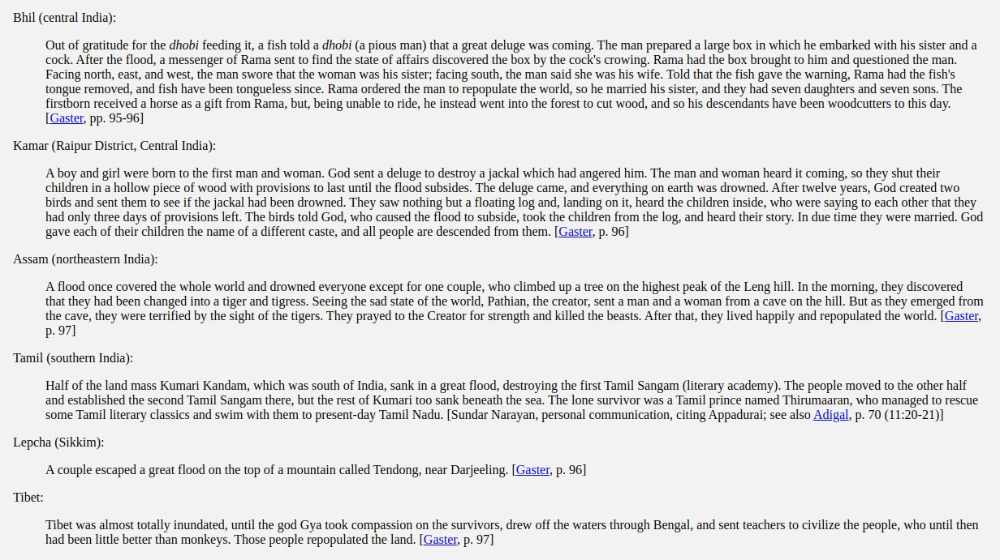
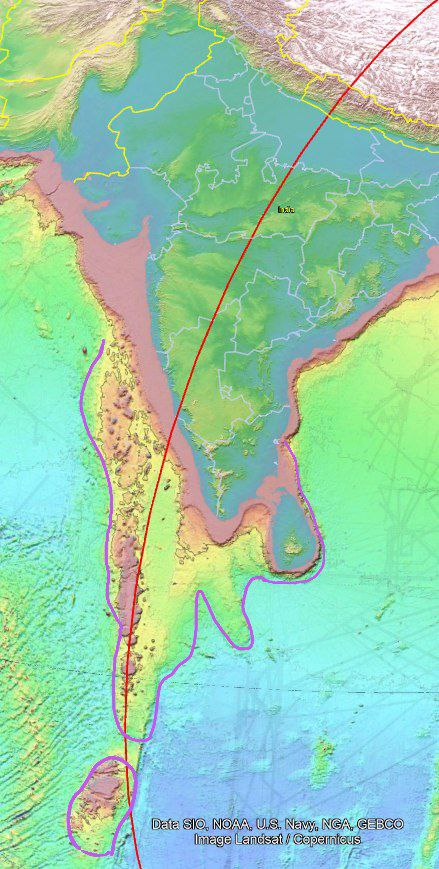
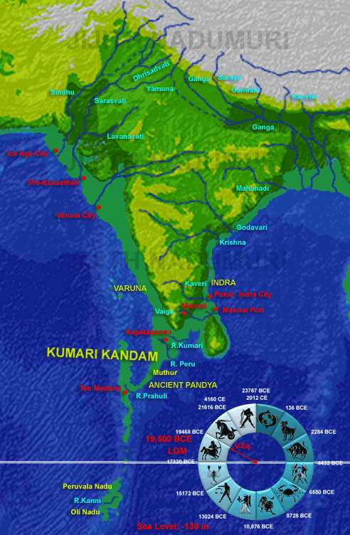
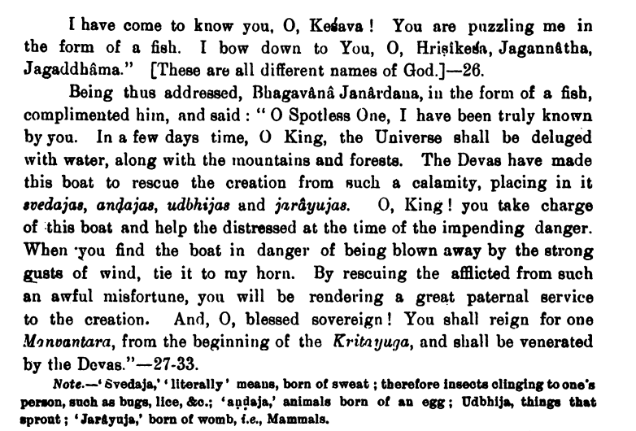
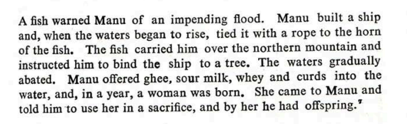
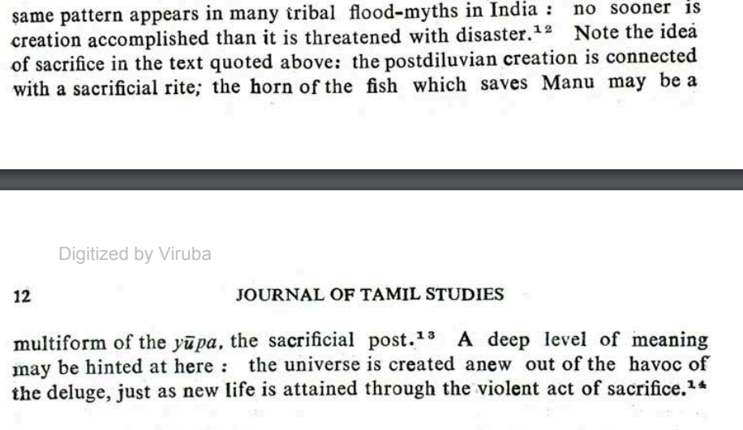

# Indian Flood Myths

There are several Indian flood myths.

Check `img/` for all records.

A summary is as follows:
- Manu flood: 9200 BC
- Dvaravati sinking: 7400 BC
- Dvarka sinking: 3100 BC
- North India deluge remnants: 2000-1900 BC

## Krishna - Mahabharata War 3067 BCE

Stephen Knapp, in "Advancements of Ancient India's Vedic Culture", provides a compelling account for why Krishna can be dated to around 3100 BC, including:
- astronomical analysis to date the Kurukshetra War precisely to 3067 BCE
- Aryabhatta (mathematician) Kali-yuga duration calculation
- Mohenjo-Daro tablet referencing Krishna

## Sinking of Dwarka, Mausala Parva, 3031 BCE

"The Mausala Parva (lit. Episode of Flails)[1][2] is the sixteenth of the eighteen episodes of the ancient Indian epic Mahabharata... the Mausala Parva describes the demise of Krishna in the 36th year after the Kurukshetra War had ended, the submersion of Dvaraka under the sea, the death of Balarama by drowning in the sea, Vasudeva's death, and a civil war fought among the Yadava clan that killed many of them." [8]

36 years after the Kurukshetra War would put the sinking of Dwarka at 3031 BCE.

## Vedveer Arya - Manu flood 9200 BC? Dvaravati sinking 7400 BC?

Vedveer Arya seems to have compiled a lengthy and comprehensive chronology of India's history worth looking at. Hard copy in this folder https://independent.academia.edu/VedveerArya

He places the Manu deluge at 9200 BC, and the submergence of Dvaravati (Dwarka) at 7400 BC (Tollman event?). The submergence of the same Dwaraka city, of the Mahabharata era, in 3126 BC.

See page 24 for an overview. Page 74 for Manu dating. Pg 497 for Dvaravati.

"Seemingly, forty-nine descendants of King Dravida reigned at Dvāravatī approximately for 1650 years, from 11050 BCE to 9400 BCE, considering the average reign of 33 years for each king. Dvāravatī was submerged by the sea around 9400-9300 BCE, during the reign of Irunkovel I, the forty-ninth king."

"The archaeological site of Bhirrana in Hisar, Haryana has also been dated around 7500 BCE. A submerged structure of the ancient Poompuhar city found close to Kaveripattinam, Tamil Nadu has been dated around 9500" [29]

## Sinking of Kandam Kumari (Multiple occurrences)

*"Half of the land mass Kumari Kandam, which was south of India, sank in a great flood, destroying the first Tamil Sangam (literary academy). The people moved to the other half and established the second Tamil Sangam there, but the rest of Kumari too sank beneath the sea. The lone survivor was a Tamil prince named Thirumaaran, who managed to rescue some Tamil literary classics and swim with them to present-day Tamil Nadu."* [1]

Seems to be describing two consecutive events - the sinking of the (now submerged) southern land (S1>S2), and then when they’ve just set up shop again the same thing happens again, submerging land further north (S2>S1).

Such might be the map of Kumari Kandam before sinking (mapped with violet boundary).

Those islands on the western part of sunken land suggests those were the older peaks (those islands can be older western ghats). Red curve line is the ECDO flood path.

*"Kumari Kandam as revealed through Bathymetric studies. Sea level at 130 meters lesser than current levels (-130 m) around 19500 BCE at LGM. Besides the sea level changes, the ocean surface elevation changes due to local tectonic activities to the south of Kanyakumari too is considered. The names of rivers and places mentioned in Tamil literature like Tenmaturai, Kapatapuram and the future city Maturai are indicated. The Devasura civilization mentioned in Sanskrit Vedic literature also is indicated. Kusasthali mentioned in Mahabharata and the Submerged city of Varuna mentioned in Bhagavata too are indicated. The locations are currently speculative, but should give impetus for future marine archaeological studies."*

*"Those who count seven stages of submergence place 1st submergence at 16,000 BCE, the 2nd one at 14000 BCE, the third at 9600 to 9500 BCE and the fourth at 5500 BCE to 5200 BCE. They count the fifth submergence as having occurred around 3100 BCE and a sixth at 1800 BCE. The 7th submergence is then dated at 1700 BCE to 700 BCE. Manavuur is a city to the north of Kapatapuram that got submerged in 3100 BCE or in 1800 BCE (most probably in 1800 BCE)."* [2]

## Manu Deluge [4]

During the Manu deluge the flood was probably super high. Only 1 mountain peak in Himalaya was visible called Navabandhana. Current highest peaks are around 8000m. I do suspect there might be changes in between of heights of Himalaya as this happened at the end of golden age.

In the Manu story they mention that the only highest peak of Himalayas was dry called Navabandhan. So, it seems Himalayas were present in previous deluge as well.

## Yuga Cycles [5]

1. Kritayuga (Satya Yuga): The age of truth and virtue (Golden Age).
2. Tretayuga: The age of decline in virtue (Silver Age).
3. Dwaparayuga: Further decline in moral order (Bronze Age).
4. Kaliyuga: The age of darkness and strife (Iron Age).

"According to Puranic sources,[a] Krishna's death marked the end of Dvapara Yuga and the start of Kali Yuga, which is dated to 17/18 February 3102 BCE." [6]

"Pralaya is the concept of cosmic dissolution, often described as a flood or deluge, that ends a Yuga cycle, particularly at the end of a Mahayuga (the full cycle of the four Yugas) or at the end of a Kalpa (a day of Brahma). Each Pralaya wipes out the existing world, which is then re-created at the start of the next cycle." [5]

## Sinking of Dwarka Alternative Timeline – 5525 BCE

Sinking of the city of Dwarka might have been due to great flood. 5525 BCE is pretty close to the Noahic event 5401 BCE. 

*"Dwarka of Krishna, on the west coast of India, was destroyed by flood 36 years after the Mahabharata War. I defined time interval of 6500 years for the plausible year of Mahabharata War based on AV (Arundhati-Vasistha) observation of Mahabharata text. Further I could validate 18 day timeline and year of 5561 BCE, proposed by Dr. P V Vartak. I validated 5561 BCE as the year of Mahabharata War based on consistent interpretation of 200+ astronomy observations of Mahabharata text."*

*"This would lead us to the timing of flooding of Dwarka as follows: 5561 BCE + 36 years = 5525 BCE"*

*"Thus flooding and Destruction of Krishna’s Dwarka occurred in 5525 BCE."* [3]

## Sri Yukteswar Yuga Dating

Kali Yuga of 1000 years has two sandhis of 100 years for a total of 1200 years. Dwapara Yuga of 2000 years has two sandhis of 200 years for a total of 2400 years. Treta Yuga of 3000 years has two sandhis of 300 years for a total of 3600 years. Satya Yuga of 4000 years has two sandhis of 400 years for a total of 4800 years. This makes for a total of 12,000 years for the cycle of the four yugas.

https://www.vedanet.com/keys-to-the-yugas-or-cycles-of-the-ages-subyugas-in-the-sri-yukteswar-yuga-cycle/

Aligned to a 3100 BC Kali Yuga start date, this places the end of Satya Yuga at 9100 BC. Still, Sri doesn't date Krishna to 3100 BC so I don't take this to be very substantial.

## 300 BC event?

"The ancient city of Puhar was destroyed by the sea around 300 BC. Marine archeologists from the National Institute of Oceanography have established that this could have been the effects of sediment erosion and periodic tsunamis. Such a tsunami is mentioned in the Tamil poem Manimekhalai (see below), which relates that the town Kāveripattinam or Puhār was swallowed up by the sea. This event is supported by archeological finds of submerged ruins off the coast of modern Poompuhar.[3][4] The town of Kāveripattinam is believed to have disappeared around 300 BC due to this tsunami"

https://en.wikipedia.org/wiki/Poombuhar

## Citations

1. https://talkorigins.org/faqs/flood-myths.html#Tamil
2. http://ancientvoice.wikidot.com/article:kumari-kandam (Hard PDF copies in `hard-copies`)
3. https://nileshoak.wordpress.com/2014/01/06/flooding-destruction-of-dwarka-5525-bce
4. [aa-hermit](https://github.com/aa-hermit)
5. ChatGPT
6. https://en.wikipedia.org/wiki/Kali_Yuga
7. https://en.wikipedia.org/wiki/Kurukshetra_War
8. https://en.wikipedia.org/wiki/Mausala_Parva

# TODO (much from chatgpt)

- Prabhasa Kshetra, another sacred site near Dwaraka, is also said to have been partially submerged after Krishna’s departure.
- The city of Shonitapura, ruled by the demon king Bana, was destroyed during the battles between Krishna and Bana.

The Ramayana describes the destruction of Lanka, the kingdom of Ravana, after Rama's victory. While this does not involve a flood in the traditional sense, parts of Lanka are said to have been engulfed by the sea after Ravana’s defeat.

Pataliputra sinking

The Bhagavata Purana describes the destruction of the city of Shonitapura, the capital of the demon king Bana.

In some versions of the Mahabharata and the Bhagavata Purana, the region of Prabhasa Kshetra, near the coast of Gujarat, is said to have been partially submerged by the sea after the death of Lord Krishna.

Submersion of the Kingdom of Hiranyaksha
The Varaha Avatar (Boar incarnation) of Lord Vishnu is associated with the myth of the submersion of the Earth.

The Vayu Purana, one of the 18 major Puranas, also describes floods and the submersion of ancient cities due to the decline of morality and the spread of unrighteousness. It recounts that in earlier Yugas, cities that were centers of moral corruption were often flooded and submerged by divine forces as a form of cosmic justice.

The ancient port city of Poompuhar (also known as Kaveripattinam) in Tamil Nadu is associated with a flood myth.

Though not explicitly a flood, the Ramayana describes the eventual destruction of Lanka, the kingdom of the demon king Ravana. After Ravana is defeated by Rama, his city is destroyed in the ensuing battle, and there are some variations where parts of the city are said to have been swallowed by the ocean.