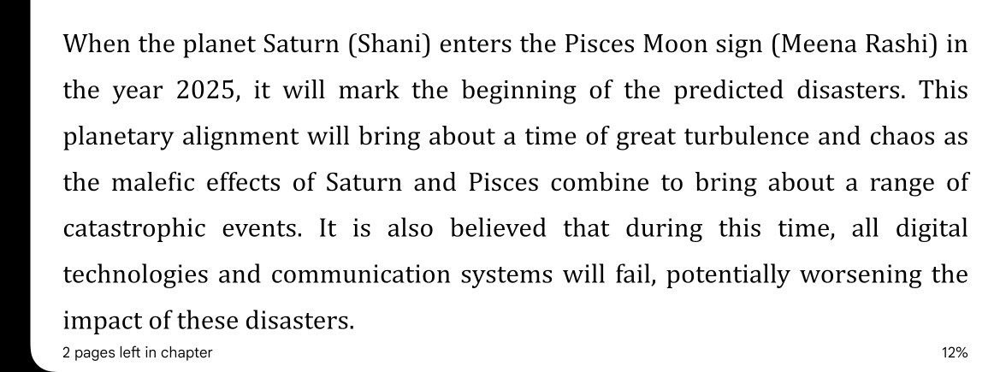

# Indian Astronomy

## Rohini Sakata Bhedanam

In the article on rohini it was mentioned comet crossing rohini also applies as possible trigger.

Now,let us look into the definition of 'Rohini Sakata Bhedanam' as described in the famous astronomical work -'Surya Siddhantha'

"When an object with a south declination of slightly more than 2 degrees passes through Vrishabha Rasi at 17 degrees,then it breaks the wain of Rohini".

The celebrated ancient astrologer VarahaMihira described Rohini Sakata Bhedanam' in his magnum opus 'The Brihat Samhitha',two thousand years ago,thus:

"When the wain of Rohini is broken by Saturn or Mars or Sikhi,then alas,the world is drowned in a sea of sorrows".

Now,the star cluster 'Rohini' has 5 stars forming a triangle shaped thing in the centre.When Saturn or Mars or Sikhi(a mateor or Ketu) passes through this triangle near Alpha,Epsilon and Gama Tauri,then it is called 'Breaking of Rohini's wain'.

It might not be possible for Saturn,due to its distance from this area,to pass exactly at 17 degrees Vrisha with 2 degrees south declination.However,he touches the star Rohini once in every 30 years approximately.

https://prajnasurabhi.blogspot.com/2014/09/rohini-sakata-bhedanam-world-wide.html?m=1

2060 alignment of this, see `solar-system`.

## 2025 Alignment Prediction

From bhavinshya malika(vedic future prediction). 
Disasters from 2025, starts with end of technological era.

Bhavishya extensively details that the eastern coast of India would be inundated and the Jaganath would have water