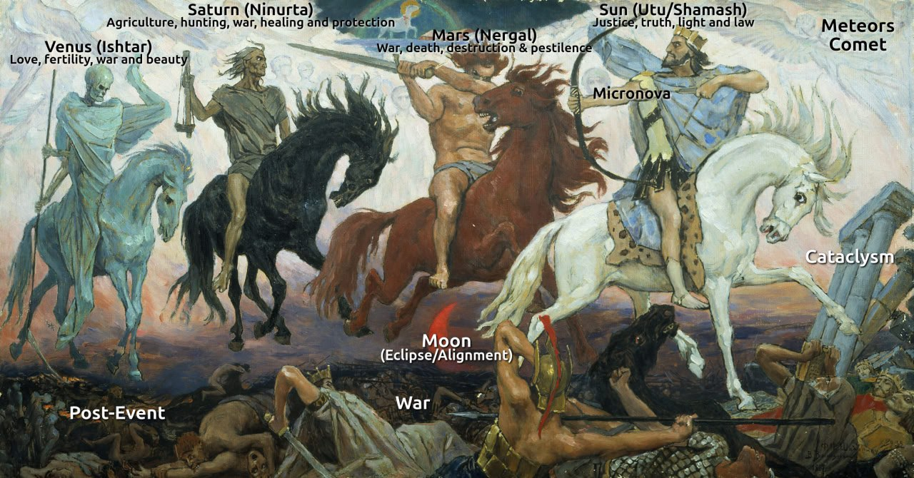
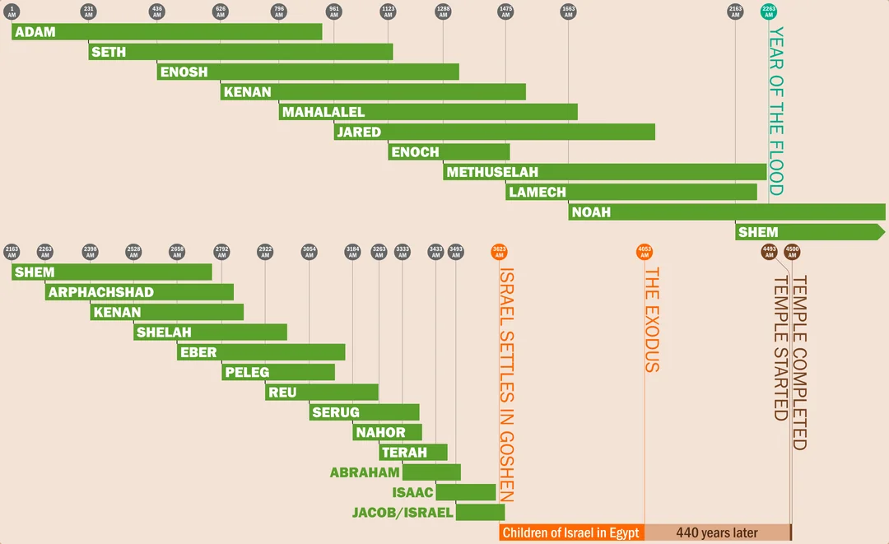

# Bible Myths

Major events (in order):
- Adam and Eve flood
- Noah's flood
- Tower of Babel
- Catastrophe of Sodom and Gomorrah
- Exodus (Red Sea Crossing), Moses
    - Destruction of Nadab and Abihu
    - Destruction of Korah and his followers
    - Joshua

Also:
- Enoch

## Bible dating

The earliest archaelogical dating of Bible chronology seems to be the Merneptah Stele.

"The Merneptah Stele, also known as the Israel Stele or the Victory Stele of Merneptah, is an inscription by Merneptah, a pharaoh in ancient Egypt who reigned from 1213 to 1203 BCE... The text is largely an account of Merneptah's victory over the ancient Libyans and their allies, but the last three of the 28 lines deal with a separate campaign in Canaan, then part of Egypt's imperial possessions. It is sometimes referred to as the "Israel Stele" because a majority of scholars translate a set of hieroglyphs in line 27 as "Israel". Alternative translations have been advanced but are not widely accepted." [5]

## Bible Cataclysms, per GPT [6]

### 1. The Flood of Noah
- **Biblical Reference**: Genesis 6–9
- **Estimated Date**: Around 2300–2400 BCE (depending on the chronology and textual tradition)
- **Event**: God floods the entire earth, sparing only **Noah**, his family, and the animals on the **Ark**.
- **Significance**: A global judgment on human wickedness, marking a new beginning for humanity.

### 2. The Destruction of the Tower of Babel
- **Biblical Reference**: Genesis 11:1–9
- **Estimated Date**: Around 2200–2000 BCE
- **Event**: People attempt to build a tower to the heavens. God confuses their language, causing them to **scatter** across the earth.
- **Significance**: This event explains the **diversification of languages** and the dispersion of people groups.

### 3. The Destruction of Sodom and Gomorrah
- **Biblical Reference**: Genesis 18–19
- **Estimated Date**: Around 2000–1700 BCE (during the time of **Abraham**)
- **Event**: God destroys the cities of **Sodom and Gomorrah** with **fire and brimstone** due to their extreme wickedness.
- **Significance**: A warning against immorality and a demonstration of God’s judgment on sin.

### 4. The Plagues of Egypt and the Crossing of the Red Sea
- **Biblical Reference**: Exodus 7–12 (plagues), Exodus 14 (Red Sea)
- **Estimated Date**: Around 1446 BCE (early date) or 1270–1250 BCE (late date)
- **Event**: A series of **ten plagues** strike Egypt, culminating in the **death of the firstborn**. The **Red Sea** parts for the Israelites to escape but closes on the pursuing Egyptian army.
- **Significance**: God’s deliverance of Israel from slavery and His demonstration of power over Egyptian gods.

### 5. The Destruction of Nadab and Abihu
- **Biblical Reference**: Leviticus 10:1–2
- **Estimated Date**: About one year after the Exodus, around 1445 BCE (early date) or 1269–1249 BCE (late date)
- **Event**: **Nadab and Abihu**, sons of **Aaron**, offer unauthorized fire in the Tabernacle. Fire from God consumes them.
- **Significance**: Highlights the importance of **obedience** and **proper worship** in the Tabernacle.

### 6. The Destruction of Korah and His Followers
- **Biblical Reference**: Numbers 16
- **Estimated Date**: Early in the 40-year wilderness period, likely around 1444–1440 BCE (early date) or 1268–1260 BCE (late date)
- **Event**: **Korah, Dathan, and Abiram** rebel against **Moses**. The ground opens up to swallow the rebels, and **fire** consumes others offering unauthorized incense.
- **Significance**: A judgment on rebellion, emphasizing God’s authority and the leadership of Moses and Aaron.

### 7. The Collapse of the Walls of Jericho
- **Biblical Reference**: Joshua 6
- **Estimated Date**: Around 1406 BCE (early date) or 1230–1200 BCE (late date)
- **Event**: Under Joshua’s leadership, the **walls of Jericho** fall after the Israelites march around the city for seven days.
- **Significance**: Symbolizes God’s provision for Israel in the conquest of Canaan, marking the start of Israel’s settlement in the Promised Land.

### 8. The Destruction of the Philistine Temple of Dagon by Samson
- **Biblical Reference**: Judges 16:23–31
- **Estimated Date**: Around 1100 BCE (during the **Period of the Judges**)
- **Event**: **Samson** is brought to the Philistine temple. He prays for strength, brings down the pillars, and collapses the temple, killing himself and the Philistines.
- **Significance**: Demonstrates God’s power through a flawed individual and retribution on the enemies of Israel.

### 9. The Destruction of the Assyrian Army
- **Biblical Reference**: 2 Kings 19:35; Isaiah 37:36
- **Estimated Date**: Around 701 BCE (during the reign of **King Hezekiah**)
- **Event**: **185,000 Assyrian soldiers** are struck down by an angel of the Lord outside Jerusalem as they besiege the city.
- **Significance**: Illustrates God’s protection over Jerusalem and deliverance from foreign threats.

### 10. The Earthquake During King Uzziah’s Reign
- **Biblical Reference**: Amos 1:1; Zechariah 14:5
- **Estimated Date**: Around 760 BCE (during the reign of **King Uzziah** of Judah)
- **Event**: A significant earthquake occurs during **Uzziah’s reign**. The exact details are sparse, but it is noted by later prophets.
- **Significance**: Seen as a sign of divine judgment, referenced in prophetic literature as a reminder of God’s power.

### 11. The Plague Sent on Jerusalem During David’s Census
- **Biblical Reference**: 2 Samuel 24; 1 Chronicles 21
- **Estimated Date**: Around 970–960 BCE (during **King David’s** reign)
- **Event**: After **David** conducts a census, God sends a **plague** that kills **70,000** people. The plague stops when David builds an **altar** on the future site of the Temple.
- **Significance**: Serves as a warning against **pride** and reliance on human power, leading to the future location of **Solomon’s Temple**.

### 12. The Destruction of Jerusalem and Solomon’s Temple
- **Biblical Reference**: 2 Kings 25; 2 Chronicles 36; Jeremiah 52
- **Estimated Date**: 586 BCE
- **Event**: The **Babylonians** capture **Jerusalem**, destroy **Solomon’s Temple**, and carry many Israelites into exile.
- **Significance**: Marks the end of the **Kingdom of Judah** and the beginning of the **Babylonian Exile**, a pivotal moment of judgment for persistent idolatry and disobedience.

## "catastrophe of Sodom and Gomorrah"

"two daughters of Lot, who hid with him in a cave after the catastrophe of Sodom and Gomorrah, believed that they
and their father were the only survivors in the land" Velikovsky pg 148 WIC

## Chan - 3 cataclysms?

Chan believe there are 3 cataclysms recorded in the Bible: *"Did you understand that there are three cataclysms recorded in the Bible? Noah’s, Adam and Eve’s, and the one before that? If you missed it, check Genesis II."* [2]

See `LITERATURE-MEDIA/chan-thomas`.

## Two Bible Floods

Hard copy `TwoFloods_Web.pdf` in this folder.

## Adam and Eve Flood

The opening verses of the bible begin with:

"1) In the beginning God created the heavens and the earth. 2) Now the earth was formless and void, and darkness was over the surface of the deep. And the Spirit of God was hovering over the surface of the waters."

The second verse may refer to a cataclysm flood event.

## Isaiah 24

17Terror and the pit and the snared
are upon you, O inhabitant of the earth!
18He who flees at the sound of the terror
shall fall into the pit,
and he who climbs out of the pit
shall be caught in the snare.
For the windows of heaven are opened,
and the foundations of the earth tremble.
19The earth is utterly broken,
the earth is split apart,
the earth is violently shaken.
20The earth staggers like a drunken man;
it sways like a hut;
its transgression lies heavy upon it,
and it falls, and will not rise again.

## Psalms

Psalm 104: “The waters stood above the mountains... they go up by the mountains” and Psalm 107 “The waves mount up to the heaven.”

## Four Horsemen of Revelations [3]

I've been pondering the four horseman and that part of Revelation. Could they be representations of the ancient Sumerian gods - the planets? 

https://chatgpt.com/share/66e956f9-6ecc-8005-ac2b-61537acbd613

## Septuagint Dating Scheme

https://www.reddit.com/r/UsefulCharts/comments/14bqxtw/biblical_chronology_according_to_the_septuagint/

## Citations

1. https://en.wikipedia.org/wiki/Genesis_flood_narrative
2. https://nobulart.com/the-story-and-the-event/
3. [Craig Stone](https://nobulart.com)
4. https://bibletopicexpo.wordpress.com/2017/01/03/chronology-septuagint-versus-masoretic-text/
5. https://en.wikipedia.org/wiki/Merneptah_Stele
6. GPT

# TODO

## biblical chronologies noahs flood dating

The Biblical chronologies cited here are anchored to dates such as Jesus Christ, the Fall of Jerusalem in 587 BC, and "Solomon" building a temple in 967 BC.
- Yes, and this is based on the Babylonian astrological tablets associated with the reigns of their kings.

This was a great resource I bought a few years ago that compares and contrasts various sources:

https://books.google.com/books?id=42-tAwAAQBAJ&printsec=copyright#v=onepage&q&f=false

This guy is a mashup of catastophism, bible, and electric universe theory.

He dates the flood at 2484 BC

https://creationism.org/patten/PattenCatOT/PattenCatOtCh03.html

## other

Research Paper "Noah's Flood: The New Scientific Discoveries About the Event that Changed History" by William Ryan and Walter Pitman

Look at:
- Worlds in Collision and Earth in Upheaval

Combining astrology with certain Bible passages
- https://www.die2live.online/asteroid-child-and-the-great-sign-t-w-tramm/

Podcast discussing Noah's flood dating: https://www.biblicalchronologist.org/store/archives/BCM_April_2023.html
