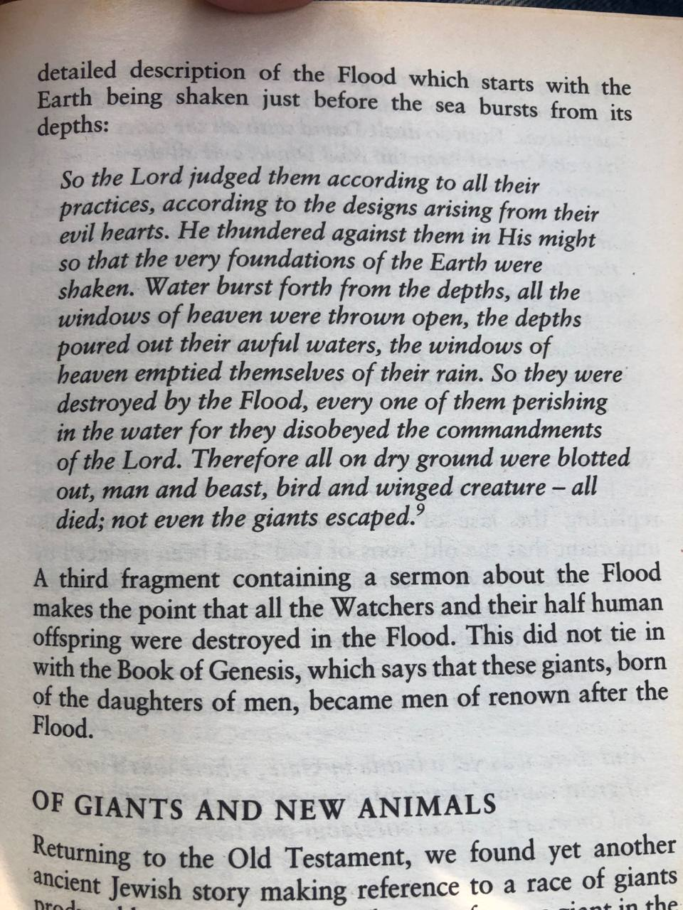
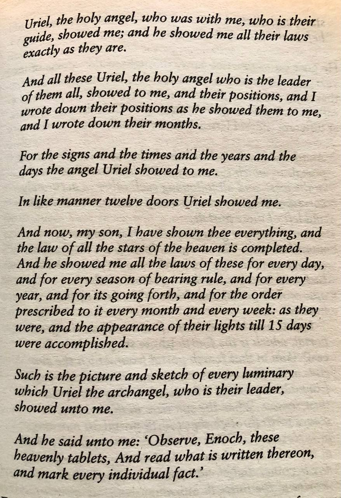

# Enoch

## Dead Sea scrolls - Uriel's Machine Excerpt

From the Dead Sea scrolls as described in Uriel’s Machine. Uriel teaching Enoch about the cycles of the cosmos.

## Overview

https://openlibrary.org/books/OL7185848M/The_Ethiopic_Version_of_the_Book_of_Enoch

"The Book of Enoch is one of the most important of the apocalyptic works, dating from the period of the Second Temple. 

The Second Temple period or post-exilic period in Jewish history denotes the approximately 600 years (516 BCE - 70 CE) during which the Second Temple stood in the city of Jerusalem.

Jesus Christ predicted the destruction of the Second Temple in Luke 21:5-38 and it was destroyed in 70 AD.

The book is named after the biblical Enoch, son of Jared, about whom it is stated in Genesis 5:24 that he "walked with God; then he was no more, for God took him," which was understood to mean that he ascended to heaven during his lifetime.

This link is to the 1906 Ethiopic version by Robert Henry Charles.  Edited from Twenty-Three MSS. Together with the Fragmentary Greek and Latin Versions.

Robert Henry Charles, an eminent British theologian and scholar, was instrumental in bringing the Book of Enoch to the English-speaking world.    Born in 1855, Charles was a leading figure in the study of ancient religious texts and textual criticism. His meticulous translation of the Book of Enoch in 1893 remains a seminal work, providing valuable insights into the apocryphal books and pseudepigrapha."  He's buried in Westminster Abbey.

https://www.encyclopedia.com/religion/encyclopedias-almanacs-transcripts-and-maps/enoch-ethiopic-book