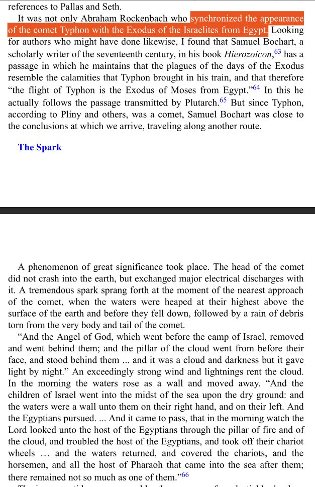
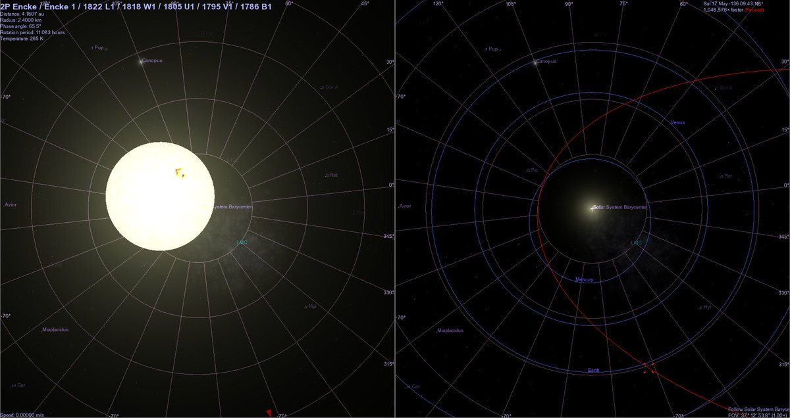

# Exodus

The dating of this event is of high concern to me in constructing a cataclysm mega-timeline.

## Dating (1800 - 1400 BC)

This biblical chronology places Exodus anywhere from 1600 - 1400 BC: https://biblicalhistoricalcontext.com/exodus/the-biblical-dates-of-the-exodus/

Exodus is dated through temporal dependency of ~480 years to the building of the temple of Solomon, which seems well dated to around 950 BC. It's also dated by Joshua's conquest of Canaan.

Africanus dated Ogyges as a contemporary of Moses and the Exodus, and he dated Ogyges to 1800 BC. See Europe flood myths.

Exodus seems to be placed about 900 - 1100 years after Noah's Flood. See the folder about Noah's flood.

## Africanus Dating

Dates Exodus to approximately 1800 BC using Biblical chronology going back from Cyrus, anchored to Greek Olympiads, and also dates Ogyges to the same time.

### Solomon's Temple

"1 Kings 6:1 states that the Exodus occurred 480 years before the construction of Solomon’s Temple in Jerusalem. If the construction of the temple is dated to around 966 BCE, this places the Exodus around 1446 BCE." [1]

"Solomon (/ˈsɒləmən/),[a] also called Jedidiah,[b] was a monarch of ancient Israel and the son and successor of King David, according to the Hebrew Bible or Old Testament.[4][5] He is described as having been the penultimate ruler of an amalgamated Israel and Judah. The hypothesized dates of Solomon's reign are from 970 to 931 BCE." [2]

### The United Kingdom of Israel [3]

"According to the Deuteronomistic history in the Hebrew Bible, a United Monarchy or United Kingdom of Israel[7] existed under the reigns of Saul, Eshbaal, David, and Solomon, encompassing the territories of both the later kingdoms of Judah and Israel."

## How the Red Sea "parted" - Compton

Compton describes the dual canal setup in Egypt at that time, and proposes that the Israelites were able to pass a gap between them at low tide, a feat which was replicated multiple times by people including Napoleon.

Happened in the spring, according to Velikovsky. "It was on the thirteenth day of the spring month ( Aviv)
that the great planetary contact occurred which preceded by a few
hours the Exodus of the Israelites from Egypt."

## Time of the year - Spring [1]

According to the biblical account, the Exodus is traditionally believed to have occurred in the spring, around the time of Passover, which is observed on the 15th day of the Hebrew month of Nisan. In the Gregorian calendar, this generally falls between March and April, depending on the year.

## Events described in the book...

Events described in the book of Exodus are estimated to have occurred somewhere around 1446 BCW thru 1213 BCE. Earth once again was positioned for a possible pass through Encke's tail during a lesser gravitational lull in 1346 BCE [text from Velikovsky] https://t.co/gQK0aaCSyB https://t.co/8kVbyfaSA3

## Citations

1. GPT
2. https://en.wikipedia.org/wiki/Solomon
3. https://en.wikipedia.org/wiki/Kingdom_of_Israel_(united_monarchy)